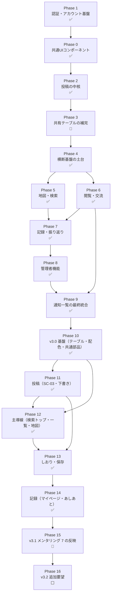

# 開発順序

`docs/user-stories/`・`docs/tasks/`配下の全ストーリーを、テーブル依存関係と共通コンポーネントの再利用関係に基づいて開発順に並べたもの。各ストーリーの`00-index.md`に記載された「依存」欄を根拠としている。

**2026-09-11 改訂**（2026-09-14 状態更新、2026-09-16 に Phase 10〜14 を追加、2026-09-18 に Phase 10〜14 を PR 中に更新、2026-09-19 に Phase 10〜14 をマージ済みにし Phase 15・16 を追加）：当初の計画順（Phase 0 → 1 → 2 → …）に対し、実際の実装は Phase 1 から着手し、前提となるテーブルを後続Phaseから先取りする形で進んだ。本ファイルは**実際に実装した順**に並べ直し、各ストーリーの実装状況を併記する。Phase番号は他ドキュメント・Issue・PRから参照されているため**識別子として維持**し、並び順だけを変えている（番号順＝実装順ではない）。

**読み方**：上から順が実装順。「状態」列の凡例は以下。

| 表記 | 意味 |
|---|---|
| ✅ 実装済み | 実装内容・成果物が揃い、mainにマージ済み。E2Eタスクは除く（テスト基盤の節を参照） |
| 🔶 一部実装 | 一部タスクが後続Phaseの画面・機能を待っている |
| 🔷 PR中 | 実装済みだが未マージ |
| ⬜ 未着手 | — |

---

## Phase 1 — 認証・アカウント基盤 ✅

全機能がログイン必須（3.5.4）のため最初に着手した。計画では Phase 0 の後だったが、F-AC-01〜04 のタスクは shared-ui のコンポーネントに依存していなかったため、先に進めて問題なかった。

| # | ストーリー | 状態 | 備考 |
|---|---|---|---|
| 1 | F-AC-01 サインアップ・ログイン | ✅ | Task1（OAuthプロバイダ設定）はGoogle Cloud側の作業。**v2.8でSC-20（新規作成画面）を分離**し、同意欄はそちらへ移動 |
| 2 | F-AC-02 セッション管理 | ✅ | `src/proxy.ts`で全ルートのセッション検証・自動リフレッシュ。30日失効の閾値はSupabase側の設定 |
| 3 | F-AC-03 ログアウト | ✅ | |
| 4 | F-AC-04 プロフィール編集 | ✅ | 画像処理共通モジュール（`src/lib/image/process-upload.ts`）をここで実装し、Phase 2 の投稿写真が再利用 |

**この時点で先取りしたもの**（依存を満たすため、後続Phaseから引き上げた）：

- Phase 3 の `trips`・`spots`・`posts`・`post_photos`・`album_members`・`notifications`・`comments`・`likes`・`wishlist`・`blocks`・`rate_limits`
- Phase 4 の **F-AC-05 退会**（全タスク実装済み）
- Phase 8 の **F-AD-01 Task1**（管理画面の`is_admin`判定）と **F-AD-02 管理者ダッシュボード**

これらは最初に依頼された Issue #1〜#10（F-AD-02・F-AC-05）を動かすために必要だったもの。

**Phase 0/1 完了後の監査**で、RLSだけでは防げない権限昇格2件（`deactivate_user`の公開実行、`is_admin`の自己更新）が見つかり修正した。詳細は要件定義書v2.7の5.3および[design-principles](user-stories/data-model/design-principles.md)。

## Phase 0 — 共通UIコンポーネント基盤 ✅

| # | ストーリー | 状態 | 備考 |
|---|---|---|---|
| 1 | ピンの表示ルール | ✅ | `MapPin`/`PinIcon`。地図への組み込みは Phase 5・7 |
| 2 | 共通エラー表示 | ✅ | `ErrorNotice`。4箇所の障害表示は Phase 2 の spot-selection で残り2箇所が入り完了 |
| 3 | 写真・動画レイアウト | ✅ | `MediaGrid`。表示画面（SC-04/05/13）への組み込みは Phase 5・6 |
| 4 | 投稿時の注意喚起表示 | ✅ | `UploadNotice`。Phase 2 の SC-03 に組み込み済み |

計画では「他のどのストーリーにも依存しない土台」としていたが、実際には upload-notice の組み込み先（SC-03）が Phase 2、error-display の障害表示先が Phase 2/5 にあり、**Phase 0 単独では完了できないタスクが含まれていた**。いずれも Phase 2 の実装で完了した。

## Phase 2 — 投稿の中核 ✅

ストーリーの順序を計画から変更した。計画は post-creation を先頭に置いていたが、その理由（`posts`テーブルの定義）は Phase 1 で先取り済みだった。投稿フォーム（SC-03）は旅行タイトル入力とスポット入力を内包するため、**部品を先に作る順**に並べ直した。

| # | ストーリー | 状態 | 備考 |
|---|---|---|---|
| 1 | F-PO-01 旅行タイトル仕様 | ✅ | Task5（表示範囲の制御）は対象画面が Phase 5〜7 のため保留 |
| 2 | F-PO-01 スポット指定仕様 | ✅ | Google Maps ローダー（`use-google-maps.ts`）をここで新設。Phase 5・7 が再利用する |
| 3 | F-PO-01 投稿作成 | ✅ | **動画は未対応**（下記）。Task3 の入力検証は post-edit（PR #233）で `validatePostInput` として共通化 |
| 4 | F-PO-02 投稿編集 | ✅ | PR #233 |
| 5 | F-PO-03 投稿削除 | ✅ | PR #234。Task2（投稿0件アルバム非表示）は Phase 7、Task3（バッジ回帰テスト）は F-BG 実装後の結合テスト待ち |

**動画対応（post-creation Task4 の半分）は見送り**。要件定義書9章#5「ffmpegのVercelサーバーレス関数上での動作検証」が実装着手前の未決定事項のまま。写真のみで先行している。

## Phase 3 — 共有テーブルの補完 🔶

7タスク中4テーブルは Phase 1 で先取り済み。残りをここで実装。

| # | ストーリー | 状態 | 備考 |
|---|---|---|---|
| 1 | データテーブル一覧の整合性確保 | 🔶 | Task4（badges）・Task6（operation_logs）はマージ済。Task7（回帰確認）は結合テストのためローカルSupabase待ち |

`operation_logs` への書き込み呼び出しは「各機能ストーリー側のタスク」とされているが、**どの機能ストーリーのタスクファイルにも含まれていない**（タスク分割の抜け）。ログイン成否・投稿の作成/編集/削除・アカウント登録/退会・通報は組み込み済み（PR #237、#241）。残りはコメント（Phase 6）・管理者操作（Phase 8）で、各ハンドラ実装時に `recordOperation` を呼ぶ。組み込み状況の一覧は [06-operation-logs-table.md](tasks/data-model/table-catalog/06-operation-logs-table.md)。

## Phase 4 — 横断基盤・独立機能の土台 ✅

| # | ストーリー | 状態 | 備考 |
|---|---|---|---|
| 1 | F-AC-05 退会 | ✅ | Phase 1 で先取り済み |
| 2 | 共通メニューバー | ✅ | session-managementに依存（済）。未読バッジのデータ連携は Phase 9 |
| 3 | F-NT-01 通知の発生条件 | ✅ | `notifications`テーブルは済。共通の通知作成ヘルパーをここで作り、Phase 6・7・8 が呼ぶ |
| 4 | F-SF-02 ブロック | ✅ | 投稿一覧・コメント・検索へのフィルタ適用は各機能実装時に `getBlockedUserIds` を組み込む |
| 5 | F-SF-01 通報 | ✅ | `reports`テーブル定義済。導線は現状プロフィールのみ。投稿詳細・コメント・スポット・アルバム画面の実装時に `ReportLink` を置く |
| 6 | F-RC-05 「行きたい」保存 | ✅ | `POST/GET /api/wishlist`・`DELETE /api/wishlist/[spotId]`、SC-08（/wishlist）、`WishlistButton`。ボタンの SC-04/SC-05 への組み込みは Phase 5・6、SC-06 からの導線は Phase 7 my-page Task4。地図上の「行きたい」ピンは Phase 5 が `wishlist` を参照 |
| 7 | F-BG ステータスバッジ | ✅ | カタログ（`src/lib/badges/catalog.ts`）、投稿作成時の判定（`POST /api/posts` → `evaluatePostBadges`）、SC-10（/badges）、`GET /api/badges`、獲得トースト（投稿後にトップページへクエリで受け渡し）。いいね数バッジの関数 `awardLikeCountBadgeIfEligible` は実装済みで、呼び出しは Phase 6 likes Task1 が行う（組み込みガイドを同タスクに追記） |

## Phase 5 — 地図・検索（F-MP） ✅

Phase 4 の wishlist、Phase 0 の pin-display-rules、Phase 2 の Google Maps ローダーが揃って全体マップが組めた。5ストーリーを1ブランチ（`feature/map-search`）でまとめて実装した（SC-04 を pin-interaction・post-filter・spot-photo-gallery が共有し、分けると画面が成立しないため）。

| # | ストーリー | 状態 | 備考 |
|---|---|---|---|
| 1 | F-MP-01 地図表示 | ✅ | SC-02（`/map`）。共通地図コンポーネント `GoogleMap`（`src/components/map/`）はマイマップ（Phase 7）が再利用する。クラスタリングは `@googlemaps/markerclusterer`。**トップページはログイン済みなら `/map` へ転送**し、投稿完了等のフラッシュとバッジトーストも `/map` が表示する |
| 2 | F-MP-03 ピン操作 | ✅ | SC-04（`/spots/[id]`）。並び替えはいいね数の集計を含むためサーバー側でスポット単位に取ってから並べる（上限500件） |
| 3 | F-MP-02 地名検索 | ✅ | `GET /api/geocode`（サーバー側キーのみ）＋ SC-02 の検索バー。地図の移動のみ |
| 4 | F-MP-04 投稿検索・絞り込み | ✅ | SC-04 の検索モード（`/search?lat&lng`）。距離は矩形で DB を絞ってから Haversine で円判定し、落ちた分は次の行を読み足す |
| 5 | F-MP-05 スポット写真一覧 | ✅ | SC-13（`/spots/[id]/photos`）。`MediaThumbnail` を MediaGrid から切り出して再利用 |

投稿詳細（SC-05）への遷移導線（pin-interaction Task3・spot-photo-gallery Task4）は `/posts/[id]` へのリンクとして置いてあり、画面本体は Phase 6 が実装する。

## Phase 6 — 閲覧・交流（F-VW） ✅

3ストーリーを1ブランチ（`feature/browsing`、Phase 5 の上に積む）で実装した。SC-05 がいいね・コメント欄を内包するため。

| # | ストーリー | 状態 | 備考 |
|---|---|---|---|
| 1 | F-VW-01 投稿詳細閲覧 | ✅ | SC-05（`/posts/[id]`）、`GET /api/posts/[id]`。非公開投稿の閲覧可否（本人・アルバムメンバー）を Route Handler と RLS（`can_view_post()`、20260914000001）の両方で判定。post-delete Task4 の削除ボタンと編集導線を本人にのみ設置。Task3（ログイン誘導・復帰）は F-AC-02 Task3 の `requireUserOrRedirect` ＋ F-AC-01 のコールバックで既に実現済みで、単体テストだけ追加 |
| 2 | F-VW-02 いいね | ✅ | `POST/DELETE /api/posts/[id]/like`（冪等）。付与時に `like` 通知と F-BG Task3（いいね数バッジ）を統合。`LikeButton` を SC-04 のカードと SC-05 に設置 |
| 3 | F-VW-03 コメント | ✅ | `GET/POST /api/posts/[id]/comments`、`DELETE /api/comments/[id]`。本文は保存前に HTML エスケープ（表示時に戻して React のテキストとして描画）。レート制限（1分5件）、`comment` 通知、`operation_logs` を組み込み |

**要件定義書3.3.6 に従い、いいね・コメントは公開投稿にしか付けられない**（アルバムメンバー間でも不可）。comments Task1 の「閲覧権限があれば非公開投稿にもコメント可」という記述より要件定義書を優先した。RLS の `with check` にも同じ条件を入れてある。

## Phase 7 — 記録・振り返り（F-RC）残り ✅

4ストーリーを1ブランチ（`feature/records`、Phase 6 の上に積む）で実装した。

| # | ストーリー | 状態 | 備考 |
|---|---|---|---|
| 1 | F-RC-02 アルバム | ✅ | `/albums`（一覧）・`/albums/[id]`（SC-09）、`GET /api/trips?view=albums`・`GET /api/trips/[id]`・`GET /api/trips/[id]/members`。**post-delete Task2（投稿0件アルバム非表示）を `filterAlbumsWithPosts` で実装**。名称変更UIはオーナーのみ |
| 2 | F-RC-03 アルバムの共同編集・招待 | ✅ | `album_invitations` テーブル＋**trips の INSERT でオーナーの `album_members` 行を自動作成するトリガー（既存分も補完）**（20260914000002）。招待発行／無効化／受諾、権限変更／削除／退出、`album_join`・`role_change`・`member_removed` 通知。編集者がアルバムに投稿できるよう `resolveTripId`・`GET /api/trips` を「本人がオーナー／編集者のアルバムの旅行」まで広げた。退会時のオーナー継承で旧オーナーを閲覧者へ降格する扱い（v2.7）はそのまま |
| 3 | F-RC-06 マイマップ | ✅ | `/mymap`（SC-12）、`GET /api/users/me/map-spots?mode&bounds`。SC-02 の `GoogleMap` を再利用し、posted / wishlist ピンで描画。投稿済みピン→自分の最新投稿（SC-05）、行きたいピン→SC-04 |
| 4 | F-RC-01 マイページ | ✅ | `/mypage`（SC-06）、`GET /api/users/me/summary`・`GET /api/users/me/posts?trip_id`。**trip-title Task5（表示範囲の制御）**: 旅行タイトルはマイページとアルバムだけが表示し、SC-04/05/13 のカード型（`PostCardData`）には項目自体を持たせていない |

## Phase 8 — 管理者機能（F-AD） ✅

残り4ストーリー分を1ブランチ（`feature/admin`、Phase 7 の上に積む）で実装した。

| # | ストーリー | 状態 | 備考 |
|---|---|---|---|
| 1 | F-AD-01 管理者ログイン | ✅ | Task1 は Phase 1 で先取り済み。Task2: SC-15 は SC-01 を `/login?admin=1` で開いたもの（4.1「ログイン導線は一般と共通」）。その導線から来た `is_admin` ユーザーはコールバックで `/admin` へ（`resolvePostLoginRedirect`）。`/api/admin` 配下は proxy の対象外なので `requireAdminUser` で各ハンドラが判定（非管理者は404） |
| 2 | F-AD-02 管理者ダッシュボード | ✅ | Phase 1 で先取り済み |
| 3 | F-AD-03 お知らせ管理 | ✅ | `system_announcements`（20260914000003）、`GET/POST /api/admin/announcements`・`PATCH/DELETE .../[id]`、SC-17 `/admin/announcements` |
| 4 | F-AD-04 通報一覧 | ✅ | `GET /api/admin/reports?status&reason&target_type&from&to`・`GET .../[id]`（対象の内容を種別ごとに取得）、SC-18 `/admin/reports`・`/admin/reports/[id]` |
| 5 | F-AD-05 通報対応操作 | ✅ | `POST /api/admin/reports/[id]/action`（hide / delete / no_issue）。非公開化は `hidden_at`（投稿・写真・コメント・スポット・アルバム）／`review_hidden_at`（感想）、ユーザーは `suspended_at`（一時停止＝ログイン拒否＋既存セッション破棄）。削除時のみ通報者へ `report_resolved` 通知。`operation_logs` の `admin_action` を記録 |

**非公開化の反映先**: 地図ピン・スポット別一覧・検索・スポット写真一覧・投稿詳細（本人以外）・コメント一覧・アルバム（一覧・詳細）・スポット候補検索から除外し、RLS（`posts_select_visible`・`comments_select_visible_post`）にも `hidden_at is null or 本人` を追加した。`hidden_at`・`suspended_at` を本人が書き換えられないよう、`posts`・`trips`・`post_photos` の `authenticated` への UPDATE を列単位に絞り直した（`comments` は編集不可なので UPDATE 権限自体を外した）。

## Phase 9 — 通知一覧の最終統合（F-NT-02） ✅

| # | ストーリー | 状態 | 備考 |
|---|---|---|---|
| 1 | F-NT-02 通知一覧画面 | ✅ | `feature/notification-list`（Phase 8 の上に積む）。`GET /api/notifications?offset`（`notifications` 90日以内＋公開済み `system_announcements` をメモリ上でマージして20件ずつ）、`PATCH /api/notifications/read`（本人の個人通知のみ）、SC-14 `/notifications`。既読化後は `tabikoe:notifications-read` イベントでメニューバーの未読バッジ（Phase 4 menu-bar Task2）を取り直す。タップ先は `resolveNotificationHref`（コメント→投稿、いいね→投稿、アルバム系→アルバム、通報対応→対象が残っていれば投稿、消えていればその旨）。お知らせは画面内モーダル、公開7日以内は NEW アイコン＋文字で強調 |

Phase 5〜9 の PR（#243 → #245 → #246 → #247 → #248 → #249）は 2026-09-14 にすべて main にマージ済み。修正 PR #253（検索の埋め込み・編集時のバッジ）も同日にマージ。

---

## v3.0（2026-09-16〜）

要求定義書 v2・要件定義書 v3.0 に対応する 30 ストーリー・107 タスク（Epic #274〜#411、Project 2 に登録済み）。**2026-09-19 時点**: Phase 10〜14 の実装は PR #413（Phase 10）→ #414（Phase 11）→ #415（Phase 12）→ #416（Phase 13）→ #417（Phase 14）の積み上げ（#412 の初心者向けコメント PR が土台）で**すべて main にマージ済み**。実装済みの Task Issue は手で閉じ、受入テスト（E2E）の Task と Epic は「後回し」として一旦閉じた（要件定義書 9 章 #12）。書き換えストーリーのタスクフォルダは `docs/tasks/<category>/<story>-v3/`、Epic のタイトル末尾は「（v3.0）」。v1 の Epic は触らない。各タスクの「依存」欄が優先で、Phase は目安。優先度は要求定義書 3-1-11 の A（Phase 10〜12）→ B（Phase 13）→ C（下書き・報告は 11・12 に含む）。

## Phase 10 — v3.0 基盤（テーブル・配色・共通部品） ✅

他のすべての v3.0 ストーリーがここに依存する。theme を最初に着手し、色を CSS 変数に集約してから画面を作る。

| # | ストーリー | Epic | 状態 | 備考 |
|---|---|---|---|---|
| 1 | 配色とダークモード（theme） | #274 | ✅ | `globals.css` の変数化 → ダーク変数と地図スタイル → 直書き色の置き換え（400 箇所超）。OS 追従のみ、アプリ内切替なし |
| 2 | データテーブル一覧の整合性確保（table-catalog-v3） | #280 | ✅ | posts に status・lat・lng・published_at、カテゴリ 7 値への移行、itineraries・itinerary_spots・itinerary_members・itinerary_invitations・spot_status_reports、rate_limits の action 追加。Task 1〜4 は並行可 |
| 3 | 共通メニューバー（menu-bar-v3） | #287 | ✅ | ホーム（家のアイコン）・しおり・通知・マイページの 4 項目。PC は左サイドバー。しおりの遷移先 `/itineraries` は Phase 13 まで 404 でよい |
| 4 | ピンの表示ルール（pin-display-rules-v3） | #291 | ✅ | 8 種別（青＝みんなの投稿・赤＝保存済み・投稿済み・下書き・フォーカス・番号・クラスタ・現在地）と凡例部品。theme Task 3 の後 |
| 5 | 写真・動画のモーダルと投稿フォームのサムネイル（media-layout-v3） | #295 | ✅ | `MediaModal`（全画面共通）と `PostForm` のサムネイル。Task 1・2 は独立 |

## Phase 11 — 投稿（SC-03・下書き） ✅

投稿画面を「上 1/3 地図＋下 2/3 フォーム」に作り替え、SC-19 を廃止する。post-creation-v3 Task 1（API の検証）→ spot-selection-v3 → draft の順。

| # | ストーリー | Epic | 状態 | 備考 |
|---|---|---|---|---|
| 1 | F-PO-01 投稿作成（post-creation-v3） | #302 | ✅ | Task 1（カテゴリ 7・日付必須・位置・状態）が土台。Task 2（配置）・Task 3（1：2 レイアウト）・Task 4（MP4／MOV、ffmpeg 検証。動かなければ要件定義書 9 章 #8 へ） |
| 2 | F-PO-01 位置とスポットの指定（spot-selection-v3） | #308 | ✅ | `ManualSpotRegistrationModal` の地図部分を `PostLocationMap` に切り出し、50m 解決 API、投稿時のスポット確定、「変更」からの候補検索、「この付近の新しい場所」、自宅の保護の確認（受入条件 70） |
| 3 | F-PO-01 旅行タイトル（trip-title-v3） | #323 | ✅ | 候補にアルバム・しおりの旅行、仮タイトル「今日の投稿（M/D）」 |
| 4 | F-PO-04 下書き（draft） | #314 | ✅ | 保存・自動保存・上限 20 件・取得と公開処理（published_at・バッジ・通知・自動チェックの呼び出し） |
| 5 | F-PO-02 投稿編集（post-edit-v3） | #327 | ✅ | 編集も `PostComposeScreen` に載せ替え |
| 6 | F-PO-01 投稿の起点（post-entry-points）Task 1 | #319 | ✅ | `/posts/new` のクエリ解釈。Task 2（各入口の配線）は Phase 13 |

## Phase 12 — 主導線（検索トップ・タイムライン・地図） ✅

着地点を検索トップに変え、投稿一覧をタイムラインに、地図をタブ無しにする。search-top Task 4（位置情報フック）と map-display-v3 Task 1（`/api/spots` の種別付与）が土台。

| # | ストーリー | Epic | 状態 | 備考 |
|---|---|---|---|---|
| 1 | F-MP-02 検索トップ（search-top） | #330 | ✅ | 都道府県リスト・Places Autocomplete・スポット名の候補 API、SC-00 画面、決定時の座標化、位置情報フック。v1 の `PlaceSearchBar`・地図上の検索バーは撤去 |
| 2 | ログイン後の着地点（signup-login-v3） | #299 | ✅ | `post-login-redirect` を `/` に、`proxy.ts` のログイン必須判定から `/` を外す。search-top Task 2 と同時 |
| 3 | F-MP-04 投稿一覧（post-timeline） | #336 | ✅ | 検索 API の行き先対応（都道府県／周辺 5km／スポット）、徒歩分・まだあった・ラベルの埋め込み、縦一列カード、並び替え 1 ボタン、絞り込みシート、スクロール位置の保持 |
| 4 | F-MP-01 地図表示（map-display-v3） | #342 | ✅ | `/api/spots` に保存済み・下書き、`MapScreen` からタブ・検索バーを撤去、凡例・戻る・ここに投稿、表示情報削減スタイル |
| 5 | F-MP-03 ピン操作と地図からの投稿（pin-interaction-v3） | #347 | ✅ | 吹き出し（一覧・投稿する）、長押し（500ms／右クリック）、下書きピン |
| 6 | F-MP-05 写真の切替（photo-view） | #352 | ✅ | `SpotPhotoGalleryScreen` を検索条件対応にして SC-04 の `?view=photos` に統合。`/spots/[id]/photos` はリダイレクト |
| 7 | F-MP-06 探すモード（explore-mode） | #356 | ✅ | `/api/posts/nearby`、`/map?mode=explore` の近くの声（下 1/3 横並び、徒歩圏切替、ピン連動） |
| 8 | F-VW-04 「まだあった」報告（spot-status-report） | #363 | ✅ | 報告 API（UPSERT・1 日 50 件）、投稿詳細の 2 ボタン、一覧・吹き出しへの埋め込み |

## Phase 13 — しおり・保存 ✅

itinerary-basics Task 1（API）・Task 3（詳細画面の骨格）が土台。wishlist-v3 の保存先シートは add-spots Task 1 の後。

| # | ストーリー | Epic | 状態 | 備考 |
|---|---|---|---|---|
| 1 | F-IT-01 しおりの作成・一覧・削除（itinerary-basics） | #379 | ✅ | 旅行 ID と 1 対 1、旅行のオーナーだけが作成、SC-22・SC-23 の骨格、アルバム画面の「しおりを見る」 |
| 2 | F-IT-02 期間と Day（itinerary-days） | #385 | ✅ | 期間更新で Day 再計算（消えた日は未定へ）、Day タブ・移動ドロップダウン・トースト |
| 3 | F-IT-04 スポットの追加と追加モード（add-spots） | #394 | ✅ | 追加・削除 API（冪等）、`?itinerary=&day=` の追加モード（バナー・＋の直接追加・完了） |
| 4 | F-RC-05 保存先の 2 択と「行きたい」（wishlist-v3） | #372 | ✅ | `SaveSheet`（行きたい＋しおり＋Day）、`SaveButton`、SC-08 の一覧／地図切替としおりへ振り分け |
| 5 | F-IT-03 到着予定時刻と並び順・メモ（arrival-time） | #389 | ✅ | 10 分刻みピッカー、時刻順の自動整列、行 UI。提出に間に合わなければ後回し可 |
| 6 | F-IT-05 チェック（itinerary-check） | #398 | ✅ | 手動チェック API、投稿公開時の自動チェック（しおりのメンバーの投稿）、取り消し線表示と番号ピンの灰色 |
| 7 | F-IT-06 しおりの地図表示と投稿（itinerary-map-and-post） | #403 | ✅ | `/map?itinerary=&day=` の番号ピン・Day タブ・すべて、「投稿一覧」「投稿する」「投稿済み」 |
| 8 | F-IT-07 しおりの共有・招待（itinerary-sharing） | #407 | ✅ | アルバムと同型の招待リンク・受諾画面、メンバー管理・退出・通知 2 種、権限制御とオーナー継承。提出に間に合わなければ後回し可 |
| 9 | F-VW-01 投稿詳細（post-detail-view-v3） | #360 | ✅ | 見出し＝スポット名、「地図で見る」「＋」「自分も投稿する」、本人の「⋯」。wishlist-v3 Task 1 の後 |
| 10 | F-PO-01 投稿の起点（post-entry-points）Task 2 | #319 | ✅ | SC-00・地図・詳細・しおり・下書きからの配線。メニューの「投稿」を削除 |

## Phase 14 — 記録（マイページ・あしあと） ✅

draft Task 3・map-display-v3 Task 1 の後。

| # | ストーリー | Epic | 状態 | 備考 |
|---|---|---|---|---|
| 1 | F-RC-01 マイページ（my-page-v3） | #368 | ✅ | 先頭に下書き、遷移メニュー 4 つ（しおりは外す）、仮タイトルの付け直し促し |
| 2 | F-RC-06 マイマップ（my-map-v3） | #376 | ✅ | 投稿済み・保存済み（行きたい＋しおり）・下書きの 3 種別、切替と遷移先 |

提出日（2026-10-07）までに全 Phase が終わらない場合は、Phase 10〜12 を完了させたうえで、Phase 13 は itinerary-basics・itinerary-days・add-spots・wishlist-v3・itinerary-check・itinerary-map-and-post を優先し、arrival-time・itinerary-sharing・Phase 14 を後回しにする。

## Phase 15 — メンタリング 7 回目の反映（v3.1） 🔶

Phase 10〜14 のマージ後に着手（2026-09-19〜）。出典は要求定義書 v2「v2 改訂（2026-09-18）」・要件定義書 v3.1・[mentoring-7.md](user-stories/shared-ui/mentoring-7.md)、タスクは [docs/tasks/shared-ui/mentoring-7/](tasks/shared-ui/mentoring-7/)。Epic は #421。**Task 単位で 1 ブランチ・1 PR**（`feature/v3.1-taskN-<slug>`）にし、前の PR が未マージなら積む。PR 本文に `Closes #N` を書いて Issue を自動で閉じる。

順番は各タスクの「依存」欄のとおり: **1 → 2・3 → 4・5・6 → 7・8・9 → 11 → 10**。

| # | Task | Issue | 状態 | 依存 | 内容 |
|---|---|---|---|---|---|
| 1 | 用語の統一と細かな文言・表示の変更 | #422 | ✅ | なし | 旅行タイトル→アルバム、マイマップ→あしあと、近くの声→近くのスポット、いまいる場所に投稿する→ここを投稿、未定→日付なし。検索トップの案内文を削除、行きたいの「解除」をゴミ箱、下書き 3 件＋「すべて見る」（`/mypage/drafts`）。PR #443 |
| 2 | 「日常」アルバム（仮タイトルの廃止） | #423 | ⬜ | 1 | `trips.is_daily`（1 人 1 つ）、アルバム欄が空なら「日常」へ、仮タイトル「今日の投稿（M/D）」と付け直し促し（`RenameTripDialog`）を廃止、アルバム一覧の先頭に固定、名前変更・削除・招待・しおり不可 |
| 3 | 検索結果のスポット単位化（スポットカード・並び替え） | #424 | ⬜ | 1 | `GET /api/posts/search` の pref／nearby をスポット単位に集約（★の平均・投稿件数・代表写真・最新の感想）、`SpotCard`、並び替え 新着順／評価順／投稿数順 |
| 4 | スポット別一覧・投稿詳細の上 1/3 地図（1：2 のシート） | #425 | ⬜ | 3 | `StaticSpotMap`（見るだけの地図）、`MapSheetLayout`（SC-03 のシート構成を共通化）、`SpotPostListScreen`・`PostDetailScreen` を 1：2 に。「地図で見る」ボタンを削除 |
| 5 | 写真タブの上限と写真からの遷移 | #426 | ⬜ | 3 | 検索結果は 1 スポット 5 枚まで、写真のタップは投稿詳細へ直接（`MediaModal` は投稿詳細内のみ）。※Phase 16 Task 3 でモーダルに戻す |
| 6 | 地図の吹き出しと戻り先名の戻る | #427 | ⬜ | 1 | 吹き出しの「一覧」を廃止して本体タップで一覧へ、戻るは戻り先の画面名（`?back=` から解決） |
| 7 | 地図の状態の復元 | #428 | ⬜ | 6 | 中心・ズーム・モード・徒歩圏を sessionStorage に保存し、地図 → 詳細 → 地図で復元（左上の戻る・ブラウザの戻るの両方） |
| 8 | しおり詳細の操作の簡略化 | #429 | ⬜ | 1、4 | ALL タブ（左端。日付なしは ALL にだけ）、年つきの期間、期間・タイトルはタップで編集、値段の表示を削除、ドラッグで並べ替え、「地図で見る」は上 1/3 地図＋下 2/3 一覧 |
| 9 | しおり一覧の「済」と行きたいの入口、アルバムの名前変更の廃止 | #430 | ⬜ | 2 | 終わったしおりは薄くせず「済」、一覧の先頭に行きたいの入口、アルバム画面の「名前を変更」ボタンを廃止（タイトルのタップ。しおりがあればしおり側） |
| 11 | シートのドラッグ（1：2 ⇄ 全画面、2 段階スナップ）の共通部品 | #432 | ⬜ | 4、8 | `MapSheetLayout` に指の操作（上で全画面・先頭で下に引くと 1：2・離すと近い方に吸い付く）を入れ、SC-03・SC-04 スポット別・SC-05・SC-23 で使う。2026-09-19 に追加（要件定義書 v3.2 4.5.6） |
| 10 | 受入テスト（E2E） | #431 | ⬜（後回し） | 1〜9、11 | E2E の土台ができてから再オープン（要件定義書 9 章 #12） |

## Phase 16 — 画面遷移マップの見直しで出た追加要望（v3.2） ⬜

Phase 15 の後。出典は要求定義書 v2「v2 改訂（2026-09-19）」・要件定義書 v3.2・[feedback-0919.md](user-stories/shared-ui/feedback-0919.md)、タスクは [docs/tasks/shared-ui/feedback-0919/](tasks/shared-ui/feedback-0919/)。Epic は #433。進め方は Phase 15 と同じ（Task 単位で 1 PR、`feature/v3.2-taskN-<slug>`）。

順番: **1・2・4・6 は独立（この順）→ 5 は 4 の後 → 3 は Phase 15 Task 5 の後 → 7 は Phase 15 Task 7 の後 → 8**。テーブルの変更（Task 1・2・4・6）は 1 本ずつマイグレーションを足し、`scripts/apply_v3_*.sql` にまとめて SQL エディタで当てる。

| # | Task | Issue | 状態 | 依存 | 内容 |
|---|---|---|---|---|---|
| 1 | 滞在時間の 7 択と「宿泊施設」の自動入力 | #434 | ⬜ | なし | `POST_DURATIONS` を 30分以内／1時間以内／2時間以内／3時間以内／半日／1日／宿泊 に、CHECK 制約は旧「それ以上」も許す 8 値、カテゴリ「宿泊施設」で未選択なら「宿泊」、絞り込みも 7 択（半日以上の束に「それ以上」を含める） |
| 2 | スポット登録バッジ（spots.created_by） | #435 | ⬜ | なし | `spots.created_by` の追加と既存行の埋め合わせ、manual スポットへの初投稿で記録、バッジ種別 `spot_registration`（1／3／5／10／20／30／50）、SC-10 の段 |
| 3 | 写真タブのモーダル（情報バー＋この投稿を見る） | #436 | ⬜ | Phase 15 Task 5 | `PhotoGrid` のタップでモーダルを開き（09-18 の「投稿詳細へ直接」を戻す）、下部に情報バー（スポット名・★・滞在・費用・投稿者・訪問日）と「この投稿を見る →」。投稿詳細内のモーダルは拡大だけ |
| 4 | コメントへの返信（parent_id・表示・通知・削除の枠） | #437 | ⬜ | なし | `comments.parent_id`・`deleted_at`、返信 API・取得（親 20 件＋返信）、`CommentSection` の返信モード（@名前）と 1 段の字下げ・3 件超の折りたたみ、`comment_replied` 通知、親削除は「削除されたコメント」の枠 |
| 5 | 投稿カードのコメントプレビュー | #438 | ⬜ | 4 | `post-cards.ts` に最新コメント 1 件と返信込みの件数、`PostCard` に「〈名前〉 冒頭 1 行」と「コメント N 件をすべて見る」 |
| 6 | しおり・アルバムのアプリ内招待（候補・検索・通知） | #439 | ⬜ | なし | 招待テーブルに `invitee_user_id`・`status`・`responded_at`、ユーザー名検索 API（1 分 30 回）、「一緒だった人」の候補 API、送信・受諾・辞退・取り消し、`album_invited`／`itinerary_invited` 通知と通知一覧の「参加する」「辞退」、`InviteDialog`・`AlbumScreen`・`MembersDialog` |
| 7 | 探すモードの移動手段（徒歩／自転車／車） | #440 | ⬜ | Phase 15 Task 7 | `lib/geo/travel-time.ts`（半径 1km／3km／10km、80／250／500 m/分）、`/api/posts/nearby?mode=`、`NearbyVoices` の「移動手段 ▾」、地図の状態の復元に `travel` を含める |
| 8 | 受入テスト（E2E） | #441 | ⬜（後回し） | 1〜7 | E2E の土台ができてから再オープン |

**Phase 15・16 の後に残るもの**: E2E の土台（Playwright＋Docker のローカル Supabase＋テスト専用ログイン＋Google マップのスタブ）と各ストーリーの E2E タスクの再オープン、v1 の #25（セッションの 30 日失効）、しおりとアルバムの画面統合（要件定義書 9 章 #10。次回メンタリング）。

---

## 計画と実際の順序が異なった理由

| 差異 | 理由 |
|---|---|
| Phase 1 を Phase 0 より先に | 最初の依頼が F-AD-02・F-AC-05（Issue #1〜#10）で、その依存を辿ると認証基盤が必要だった。F-AC 系は shared-ui に依存していなかったため、順序を変えても問題なかった |
| Phase 3・4・8 の一部を Phase 1 で先取り | 同じ理由。`deactivate_user` が `album_members`・`notifications` を、`/admin` ガードがセッション検証を必要とした |
| Phase 2 のストーリー順を変更 | post-creation を先頭に置く理由（テーブル定義）が先取りで消えており、フォームが内包する部品（旅行タイトル・スポット）を先に作る方が手戻りが無かった |
| Phase 0 が Phase 0 単独で完了しなかった | upload-notice・error-display の一部は、組み込み先の画面が Phase 2/5 にあった。「他に依存しない」という前提が正確でなかった |

## テスト基盤について

単体テスト（Vitest）は PR #235 で導入し、Phase 0〜2 の既存コードの単体テスト要件をコード化した。以降のストーリーは実装と同じPRで単体テストを書いている（Route Handler も `vi.mock` で Supabase を差し替えて分岐を検証する。例: `src/app/api/wishlist/route.test.ts`）。結合テスト（ローカルSupabase）・E2E（Playwright）は未整備。**各ストーリーの「受入テスト（E2E）」タスクはすべて未着手**で、2026-09-19 に「後回し」として一旦閉じた（E2E の土台ができてから再オープン。要件定義書 9 章 #12）。画面確認用のダミーデータは `scripts/seed/seed-tokyo.mjs`（消すのは `clean-seed.mjs`）。詳細は[development-process.md](development-process.md)。

## 補足

- 各フェーズ内のストーリーは基本的に並行着手可能。表中の「備考」に他フェーズへの依存が書かれていないストーリー同士は同時進行してよい。
- ここに挙げた順序はドキュメント間の論理依存に基づくものであり、[受入条件の優先度や工数見積もりは含まない](requirement.md)。提出日（2026年10月7日）に対して全Phaseは完了しない見込みのため、要件定義書8章の受入条件のうちMVPとして外せないものを別途選定すること。
- 全体像・カテゴリごとのストーリー一覧は[README.md](README.md)を参照。
