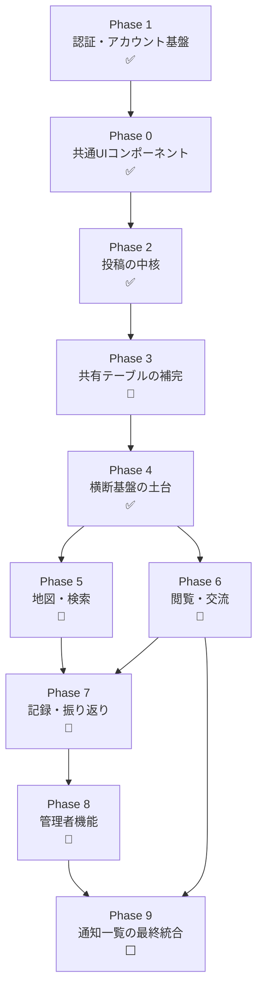

# 開発順序

`docs/user-stories/`・`docs/tasks/`配下の全ストーリーを、テーブル依存関係と共通コンポーネントの再利用関係に基づいて開発順に並べたもの。各ストーリーの`00-index.md`に記載された「依存」欄を根拠としている。

**2026-09-11 改訂**（2026-09-14 状態更新）：当初の計画順（Phase 0 → 1 → 2 → …）に対し、実際の実装は Phase 1 から着手し、前提となるテーブルを後続Phaseから先取りする形で進んだ。本ファイルは**実際に実装した順**に並べ直し、各ストーリーの実装状況を併記する。Phase番号は他ドキュメント・Issue・PRから参照されているため**識別子として維持**し、並び順だけを変えている（番号順＝実装順ではない）。

**読み方**：上から順が実装順。「状態」列の凡例は以下。

| 表記 | 意味 |
|---|---|
| ✅ 実装済み | 実装内容・成果物が揃い、mainにマージ済み。E2Eタスクは除く（テスト基盤の節を参照） |
| 🔶 一部実装 | 一部タスクが後続Phaseの画面・機能を待っている |
| 🔷 PR中 | 実装済みだが未マージ |
| ⬜ 未着手 | — |

---

## Phase 1 — 認証・アカウント基盤 ✅

全機能がログイン必須（3.5.4）のため最初に着手した。計画では Phase 0 の後だったが、F-AC-01〜04 のタスクは shared-ui のコンポーネントに依存していなかったため、先に進めて問題なかった。

| # | ストーリー | 状態 | 備考 |
|---|---|---|---|
| 1 | F-AC-01 サインアップ・ログイン | ✅ | Task1（OAuthプロバイダ設定）はGoogle Cloud側の作業。**v2.8でSC-20（新規作成画面）を分離**し、同意欄はそちらへ移動 |
| 2 | F-AC-02 セッション管理 | ✅ | `src/proxy.ts`で全ルートのセッション検証・自動リフレッシュ。30日失効の閾値はSupabase側の設定 |
| 3 | F-AC-03 ログアウト | ✅ | |
| 4 | F-AC-04 プロフィール編集 | ✅ | 画像処理共通モジュール（`src/lib/image/process-upload.ts`）をここで実装し、Phase 2 の投稿写真が再利用 |

**この時点で先取りしたもの**（依存を満たすため、後続Phaseから引き上げた）：

- Phase 3 の `trips`・`spots`・`posts`・`post_photos`・`album_members`・`notifications`・`comments`・`likes`・`wishlist`・`blocks`・`rate_limits`
- Phase 4 の **F-AC-05 退会**（全タスク実装済み）
- Phase 8 の **F-AD-01 Task1**（管理画面の`is_admin`判定）と **F-AD-02 管理者ダッシュボード**

これらは最初に依頼された Issue #1〜#10（F-AD-02・F-AC-05）を動かすために必要だったもの。

**Phase 0/1 完了後の監査**で、RLSだけでは防げない権限昇格2件（`deactivate_user`の公開実行、`is_admin`の自己更新）が見つかり修正した。詳細は要件定義書v2.7の5.3および[design-principles](user-stories/data-model/design-principles.md)。

## Phase 0 — 共通UIコンポーネント基盤 ✅

| # | ストーリー | 状態 | 備考 |
|---|---|---|---|
| 1 | ピンの表示ルール | ✅ | `MapPin`/`PinIcon`。地図への組み込みは Phase 5・7 |
| 2 | 共通エラー表示 | ✅ | `ErrorNotice`。4箇所の障害表示は Phase 2 の spot-selection で残り2箇所が入り完了 |
| 3 | 写真・動画レイアウト | ✅ | `MediaGrid`。表示画面（SC-04/05/13）への組み込みは Phase 5・6 |
| 4 | 投稿時の注意喚起表示 | ✅ | `UploadNotice`。Phase 2 の SC-03 に組み込み済み |

計画では「他のどのストーリーにも依存しない土台」としていたが、実際には upload-notice の組み込み先（SC-03）が Phase 2、error-display の障害表示先が Phase 2/5 にあり、**Phase 0 単独では完了できないタスクが含まれていた**。いずれも Phase 2 の実装で完了した。

## Phase 2 — 投稿の中核 ✅

ストーリーの順序を計画から変更した。計画は post-creation を先頭に置いていたが、その理由（`posts`テーブルの定義）は Phase 1 で先取り済みだった。投稿フォーム（SC-03）は旅行タイトル入力とスポット入力を内包するため、**部品を先に作る順**に並べ直した。

| # | ストーリー | 状態 | 備考 |
|---|---|---|---|
| 1 | F-PO-01 旅行タイトル仕様 | ✅ | Task5（表示範囲の制御）は対象画面が Phase 5〜7 のため保留 |
| 2 | F-PO-01 スポット指定仕様 | ✅ | Google Maps ローダー（`use-google-maps.ts`）をここで新設。Phase 5・7 が再利用する |
| 3 | F-PO-01 投稿作成 | ✅ | **動画は未対応**（下記）。Task3 の入力検証は post-edit（PR #233）で `validatePostInput` として共通化 |
| 4 | F-PO-02 投稿編集 | ✅ | PR #233 |
| 5 | F-PO-03 投稿削除 | ✅ | PR #234。Task2（投稿0件アルバム非表示）は Phase 7、Task3（バッジ回帰テスト）は F-BG 実装後の結合テスト待ち |

**動画対応（post-creation Task4 の半分）は見送り**。要件定義書9章#5「ffmpegのVercelサーバーレス関数上での動作検証」が実装着手前の未決定事項のまま。写真のみで先行している。

## Phase 3 — 共有テーブルの補完 🔶

7タスク中4テーブルは Phase 1 で先取り済み。残りをここで実装。

| # | ストーリー | 状態 | 備考 |
|---|---|---|---|
| 1 | データテーブル一覧の整合性確保 | 🔶 | Task4（badges）・Task6（operation_logs）はマージ済。Task7（回帰確認）は結合テストのためローカルSupabase待ち |

`operation_logs` への書き込み呼び出しは「各機能ストーリー側のタスク」とされているが、**どの機能ストーリーのタスクファイルにも含まれていない**（タスク分割の抜け）。ログイン成否・投稿の作成/編集/削除・アカウント登録/退会・通報は組み込み済み（PR #237、#241）。残りはコメント（Phase 6）・管理者操作（Phase 8）で、各ハンドラ実装時に `recordOperation` を呼ぶ。組み込み状況の一覧は [06-operation-logs-table.md](tasks/data-model/table-catalog/06-operation-logs-table.md)。

## Phase 4 — 横断基盤・独立機能の土台 ✅

| # | ストーリー | 状態 | 備考 |
|---|---|---|---|
| 1 | F-AC-05 退会 | ✅ | Phase 1 で先取り済み |
| 2 | 共通メニューバー | ✅ | session-managementに依存（済）。未読バッジのデータ連携は Phase 9 |
| 3 | F-NT-01 通知の発生条件 | ✅ | `notifications`テーブルは済。共通の通知作成ヘルパーをここで作り、Phase 6・7・8 が呼ぶ |
| 4 | F-SF-02 ブロック | ✅ | 投稿一覧・コメント・検索へのフィルタ適用は各機能実装時に `getBlockedUserIds` を組み込む |
| 5 | F-SF-01 通報 | ✅ | `reports`テーブル定義済。導線は現状プロフィールのみ。投稿詳細・コメント・スポット・アルバム画面の実装時に `ReportLink` を置く |
| 6 | F-RC-05 「行きたい」保存 | ✅ | `POST/GET /api/wishlist`・`DELETE /api/wishlist/[spotId]`、SC-08（/wishlist）、`WishlistButton`。ボタンの SC-04/SC-05 への組み込みは Phase 5・6、SC-06 からの導線は Phase 7 my-page Task4。地図上の「行きたい」ピンは Phase 5 が `wishlist` を参照 |
| 7 | F-BG ステータスバッジ | ✅ | カタログ（`src/lib/badges/catalog.ts`）、投稿作成時の判定（`POST /api/posts` → `evaluatePostBadges`）、SC-10（/badges）、`GET /api/badges`、獲得トースト（投稿後にトップページへクエリで受け渡し）。いいね数バッジの関数 `awardLikeCountBadgeIfEligible` は実装済みで、呼び出しは Phase 6 likes Task1 が行う（組み込みガイドを同タスクに追記） |

## Phase 5 — 地図・検索（F-MP） 🔷

Phase 4 の wishlist、Phase 0 の pin-display-rules、Phase 2 の Google Maps ローダーが揃って全体マップが組めた。5ストーリーを1ブランチ（`feature/map-search`）でまとめて実装した（SC-04 を pin-interaction・post-filter・spot-photo-gallery が共有し、分けると画面が成立しないため）。

| # | ストーリー | 状態 | 備考 |
|---|---|---|---|
| 1 | F-MP-01 地図表示 | 🔷 | SC-02（`/map`）。共通地図コンポーネント `GoogleMap`（`src/components/map/`）はマイマップ（Phase 7）が再利用する。クラスタリングは `@googlemaps/markerclusterer`。**トップページはログイン済みなら `/map` へ転送**し、投稿完了等のフラッシュとバッジトーストも `/map` が表示する |
| 2 | F-MP-03 ピン操作 | 🔷 | SC-04（`/spots/[id]`）。並び替えはいいね数の集計を含むためサーバー側でスポット単位に取ってから並べる（上限500件） |
| 3 | F-MP-02 地名検索 | 🔷 | `GET /api/geocode`（サーバー側キーのみ）＋ SC-02 の検索バー。地図の移動のみ |
| 4 | F-MP-04 投稿検索・絞り込み | 🔷 | SC-04 の検索モード（`/search?lat&lng`）。距離は矩形で DB を絞ってから Haversine で円判定し、落ちた分は次の行を読み足す |
| 5 | F-MP-05 スポット写真一覧 | 🔷 | SC-13（`/spots/[id]/photos`）。`MediaThumbnail` を MediaGrid から切り出して再利用 |

投稿詳細（SC-05）への遷移導線（pin-interaction Task3・spot-photo-gallery Task4）は `/posts/[id]` へのリンクとして置いてあり、画面本体は Phase 6 が実装する。

## Phase 6 — 閲覧・交流（F-VW） 🔷

3ストーリーを1ブランチ（`feature/browsing`、Phase 5 の上に積む）で実装した。SC-05 がいいね・コメント欄を内包するため。

| # | ストーリー | 状態 | 備考 |
|---|---|---|---|
| 1 | F-VW-01 投稿詳細閲覧 | 🔷 | SC-05（`/posts/[id]`）、`GET /api/posts/[id]`。非公開投稿の閲覧可否（本人・アルバムメンバー）を Route Handler と RLS（`can_view_post()`、20260914000001）の両方で判定。post-delete Task4 の削除ボタンと編集導線を本人にのみ設置。Task3（ログイン誘導・復帰）は F-AC-02 Task3 の `requireUserOrRedirect` ＋ F-AC-01 のコールバックで既に実現済みで、単体テストだけ追加 |
| 2 | F-VW-02 いいね | 🔷 | `POST/DELETE /api/posts/[id]/like`（冪等）。付与時に `like` 通知と F-BG Task3（いいね数バッジ）を統合。`LikeButton` を SC-04 のカードと SC-05 に設置 |
| 3 | F-VW-03 コメント | 🔷 | `GET/POST /api/posts/[id]/comments`、`DELETE /api/comments/[id]`。本文は保存前に HTML エスケープ（表示時に戻して React のテキストとして描画）。レート制限（1分5件）、`comment` 通知、`operation_logs` を組み込み |

**要件定義書3.3.6 に従い、いいね・コメントは公開投稿にしか付けられない**（アルバムメンバー間でも不可）。comments Task1 の「閲覧権限があれば非公開投稿にもコメント可」という記述より要件定義書を優先した。RLS の `with check` にも同じ条件を入れてある。

## Phase 7 — 記録・振り返り（F-RC）残り 🔷

4ストーリーを1ブランチ（`feature/records`、Phase 6 の上に積む）で実装した。

| # | ストーリー | 状態 | 備考 |
|---|---|---|---|
| 1 | F-RC-02 アルバム | 🔷 | `/albums`（一覧）・`/albums/[id]`（SC-09）、`GET /api/trips?view=albums`・`GET /api/trips/[id]`・`GET /api/trips/[id]/members`。**post-delete Task2（投稿0件アルバム非表示）を `filterAlbumsWithPosts` で実装**。名称変更UIはオーナーのみ |
| 2 | F-RC-03 アルバムの共同編集・招待 | 🔷 | `album_invitations` テーブル＋**trips の INSERT でオーナーの `album_members` 行を自動作成するトリガー（既存分も補完）**（20260914000002）。招待発行／無効化／受諾、権限変更／削除／退出、`album_join`・`role_change`・`member_removed` 通知。編集者がアルバムに投稿できるよう `resolveTripId`・`GET /api/trips` を「本人がオーナー／編集者のアルバムの旅行」まで広げた。退会時のオーナー継承で旧オーナーを閲覧者へ降格する扱い（v2.7）はそのまま |
| 3 | F-RC-06 マイマップ | 🔷 | `/mymap`（SC-12）、`GET /api/users/me/map-spots?mode&bounds`。SC-02 の `GoogleMap` を再利用し、posted / wishlist ピンで描画。投稿済みピン→自分の最新投稿（SC-05）、行きたいピン→SC-04 |
| 4 | F-RC-01 マイページ | 🔷 | `/mypage`（SC-06）、`GET /api/users/me/summary`・`GET /api/users/me/posts?trip_id`。**trip-title Task5（表示範囲の制御）**: 旅行タイトルはマイページとアルバムだけが表示し、SC-04/05/13 のカード型（`PostCardData`）には項目自体を持たせていない |

## Phase 8 — 管理者機能（F-AD） 🔶

| # | ストーリー | 状態 | 備考 |
|---|---|---|---|
| 1 | F-AD-01 管理者ログイン | 🔶 | Task1（`/admin`の`is_admin`判定）は Phase 1 で先取り済み。Task2（ログイン後遷移）は未着手 |
| 2 | F-AD-02 管理者ダッシュボード | ✅ | Phase 1 で先取り済み |
| 3 | F-AD-03 お知らせ管理 | ⬜ | |
| 4 | F-AD-04 通報一覧 | ⬜ | `reports`テーブルは Phase 4 で済 |
| 5 | F-AD-05 通報対応操作 | ⬜ | `reports`の status 更新と `report_resolved` 通知（`createNotification`）、`operation_logs` の `admin_action` を組み込む |

## Phase 9 — 通知一覧の最終統合（F-NT-02） ⬜

| # | ストーリー | 備考 |
|---|---|---|
| 1 | F-NT-02 通知一覧画面 | `notifications`（済）＋`system_announcements`（Phase 8）の統合読み取り |

---

## 計画と実際の順序が異なった理由

| 差異 | 理由 |
|---|---|
| Phase 1 を Phase 0 より先に | 最初の依頼が F-AD-02・F-AC-05（Issue #1〜#10）で、その依存を辿ると認証基盤が必要だった。F-AC 系は shared-ui に依存していなかったため、順序を変えても問題なかった |
| Phase 3・4・8 の一部を Phase 1 で先取り | 同じ理由。`deactivate_user` が `album_members`・`notifications` を、`/admin` ガードがセッション検証を必要とした |
| Phase 2 のストーリー順を変更 | post-creation を先頭に置く理由（テーブル定義）が先取りで消えており、フォームが内包する部品（旅行タイトル・スポット）を先に作る方が手戻りが無かった |
| Phase 0 が Phase 0 単独で完了しなかった | upload-notice・error-display の一部は、組み込み先の画面が Phase 2/5 にあった。「他に依存しない」という前提が正確でなかった |

## テスト基盤について

単体テスト（Vitest）は PR #235 で導入し、Phase 0〜2 の既存コードの単体テスト要件をコード化した。以降のストーリーは実装と同じPRで単体テストを書いている（Route Handler も `vi.mock` で Supabase を差し替えて分岐を検証する。例: `src/app/api/wishlist/route.test.ts`）。結合テスト（ローカルSupabase）・E2E（Playwright）は未整備。**各ストーリーの「受入テスト（E2E）」タスクはすべて未着手**で、E2E環境を入れるまで完了しない。詳細は[development-process.md](development-process.md)。

## 補足

- 各フェーズ内のストーリーは基本的に並行着手可能。表中の「備考」に他フェーズへの依存が書かれていないストーリー同士は同時進行してよい。
- ここに挙げた順序はドキュメント間の論理依存に基づくものであり、[受入条件の優先度や工数見積もりは含まない](requirement.md)。提出日（2026年10月7日）に対して全Phaseは完了しない見込みのため、要件定義書8章の受入条件のうちMVPとして外せないものを別途選定すること。
- 全体像・カテゴリごとのストーリー一覧は[README.md](README.md)を参照。
