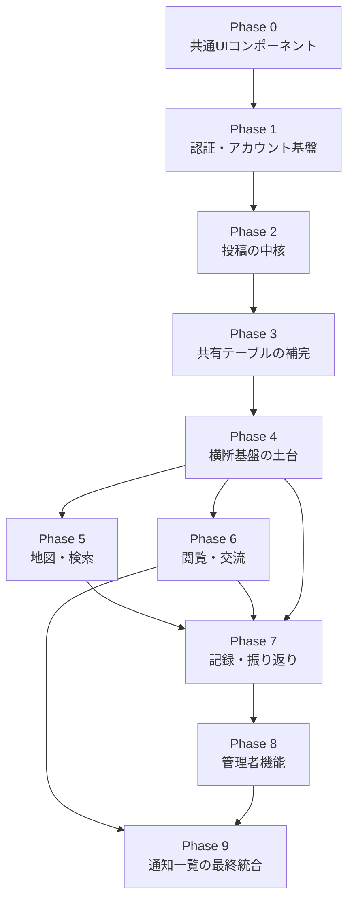

# 開発順序

`docs/user-stories/`・`docs/tasks/`配下の全32ストーリーを、テーブル依存関係（どのテーブルをどのストーリーが定義し、どのストーリーが参照するか）と共通コンポーネントの再利用関係（どのストーリーが先に部品を作り、どのストーリーがそれを組み込むか）に基づいて開発順に並べたものです。各ストーリーの`00-index.md`に記載された「依存」欄を根拠としています。

**読み方**：フェーズは上から順に着手する。同一フェーズ内のストーリーは基本的に並行着手可能（例外は各フェーズの note に明記）。フェーズをまたぐ依存は「なぜこの順番か」に記載の根拠に従うこと。タスク単位の詳細な依存関係は各ストーリーの`00-index.md`を参照。

## Phase 0 — 共通UIコンポーネント基盤

他のどのストーリーにも依存しない土台。先に作ることで、後続の各画面が車輪の再発明をしなくて済む。

| # | ストーリー | ドキュメント |
|---|---|---|
| 1 | ピンの表示ルール | [shared-ui/pin-display-rules](tasks/shared-ui/pin-display-rules/00-index.md) |
| 2 | 共通エラー表示 | [shared-ui/error-display](tasks/shared-ui/error-display/00-index.md) |
| 3 | 写真・動画レイアウト | [shared-ui/media-layout](tasks/shared-ui/media-layout/00-index.md) |
| 4 | 投稿時の注意喚起表示 | [shared-ui/upload-notice](tasks/shared-ui/upload-notice/00-index.md) |

## Phase 1 — 認証・アカウント基盤

全機能がログイン必須（3.5.4）のため、最初に着手する。

| # | ストーリー | ドキュメント | なぜこの順番か |
|---|---|---|---|
| 1 | F-AC-01 サインアップ・ログイン | [account/signup-login](tasks/account/signup-login/00-index.md) | `users`テーブルを定義する土台。他の全ストーリーがログイン状態を前提とする |
| 2 | F-AC-02 セッション管理 | [account/session-management](tasks/account/session-management/00-index.md) | signup-loginの認証結果を前提にMiddlewareを実装。以降ほぼ全画面がこのMiddlewareに依存 |
| 3 | F-AC-03 ログアウト | [account/logout](tasks/account/logout/00-index.md) | session-managementのセッション破棄処理を利用 |
| 4 | F-AC-04 プロフィール編集 | [account/profile-edit](tasks/account/profile-edit/00-index.md) | 画像アップロード共通処理（EXIF除去・縮小画像生成）をここで実装し、投稿機能（Phase 2）が再利用する |

## Phase 2 — 投稿の中核

`trips`・`spots`・`posts`・`post_photos`テーブルを定義する、アプリの中心機能。

| # | ストーリー | ドキュメント | なぜこの順番か |
|---|---|---|---|
| 1 | F-PO-01 投稿作成 | [posts/post-creation](tasks/posts/post-creation/00-index.md) | `posts`・`post_photos`テーブルを定義。profile-editの画像処理を再利用 |
| 2 | F-PO-01 旅行タイトル仕様 | [posts/trip-title](tasks/posts/trip-title/00-index.md) | `trips`テーブルを定義。post-creationのフォームに統合される |
| 3 | F-PO-01 スポット指定仕様 | [posts/spot-selection](tasks/posts/spot-selection/00-index.md) | `spots`テーブルを定義。都道府県逆ジオコーディングも含む（Phase 4のバッジ機能が利用） |
| 4 | F-PO-02 投稿編集 | [posts/post-edit](tasks/posts/post-edit/00-index.md) | post-creationの成果物を編集対象とする |
| 5 | F-PO-03 投稿削除 | [posts/post-delete](tasks/posts/post-delete/00-index.md) | post-creationの成果物を削除対象とする |

## Phase 3 — 共有テーブルの補完

`users`・`trips`・`posts`・`spots`が揃って初めて定義できる、複数機能から参照される横断テーブル群。

| # | ストーリー | ドキュメント | 定義するテーブル |
|---|---|---|---|
| 1 | データテーブル一覧の整合性確保 | [data-model/table-catalog](tasks/data-model/table-catalog/00-index.md) | rate_limits, album_members, notifications, badges, comments/likes/wishlist/blocks, operation_logs |

## Phase 4 — 横断基盤・独立機能の土台

Phase 3のテーブルにのみ依存し、互いにはほぼ依存しないため並行着手できる。ここで「共通ヘルパー」を用意しておくことで、Phase 5以降の各機能が車輪の再発明をせずに済む。

| # | ストーリー | ドキュメント | なぜここか |
|---|---|---|---|
| 1 | F-AC-05 退会 | [account/account-deletion](tasks/account/account-deletion/00-index.md) | `album_members`・`notifications`テーブルに依存。オーナー継承ロジックをここで実装（records/album-collaborationが後で参照） |
| 2 | 共通メニューバー | [shared-ui/menu-bar](tasks/shared-ui/menu-bar/00-index.md) | session-managementに依存。未読バッジのデータ連携は後でnotification-listが行う |
| 3 | F-NT-01 通知の発生条件 | [notifications/notification-triggers](tasks/notifications/notification-triggers/00-index.md) | `notifications`テーブルに依存する共通の通知作成ヘルパー。Phase 6・7・8の各機能がこれを呼び出す |
| 4 | F-SF-02 ブロック | [safety/blocking](tasks/safety/blocking/00-index.md) | `blocks`テーブルに依存する共通の除外フィルタ。Phase 5〜7の各機能が任意で組み込む |
| 5 | F-SF-01 通報 | [safety/reporting](tasks/safety/reporting/00-index.md) | `reports`テーブルを自ら新規定義。Phase 8の管理者機能（通報対応）が消費する |
| 6 | F-RC-05 「行きたい」保存 | [records/wishlist](tasks/records/wishlist/00-index.md) | `wishlist`テーブルのみに依存。Phase 5の地図表示（「行きたい」タブ）が消費する |
| 7 | F-BG ステータスバッジ | [badges/status-badges](tasks/badges/status-badges/00-index.md) | `badges`テーブル・spot-selectionの都道府県判定に依存。**いいね数バッジ判定（Task3）のみPhase 6のbrowsing/likes完了後に統合**（他のタスクはここで完了可） |

## Phase 5 — 地図・検索（F-MP）

Phase 4のwishlist・pin-display-rulesが揃って初めて全体マップが組める。

| # | ストーリー | ドキュメント | なぜこの順番か |
|---|---|---|---|
| 1 | F-MP-01 地図表示 | [map-search/map-display](tasks/map-search/map-display/00-index.md) | spot-selection・pin-display-rules・session-management・records/wishlistに依存する基盤画面（SC-02） |
| 2 | F-MP-03 ピン操作 | [map-search/pin-interaction](tasks/map-search/pin-interaction/00-index.md) | map-displayのピンタップ動作として実装 |
| 3 | F-MP-02 地名検索 | [map-search/place-search](tasks/map-search/place-search/00-index.md) | map-displayの検索バーUIを再利用 |
| 4 | F-MP-04 投稿検索・絞り込み | [map-search/post-filter](tasks/map-search/post-filter/00-index.md) | pin-interactionの投稿一覧UIを再利用 |
| 5 | F-MP-05 スポット写真一覧 | [map-search/spot-photo-gallery](tasks/map-search/spot-photo-gallery/00-index.md) | pin-interaction・media-layoutに依存 |

## Phase 6 — 閲覧・交流（F-VW）

Phase 4の通知ヘルパーが揃って初めて、いいね・コメントの通知連携まで完成できる。

| # | ストーリー | ドキュメント | なぜこの順番か |
|---|---|---|---|
| 1 | F-VW-01 投稿詳細閲覧 | [browsing/post-detail-view](tasks/browsing/post-detail-view/00-index.md) | posts・wishlistの保存導線を統合する詳細画面（SC-05） |
| 2 | F-VW-02 いいね | [browsing/likes](tasks/browsing/likes/00-index.md) | interaction-tables・notification-triggersに依存。完了後、Phase 4のbadges Task3（いいね数バッジ）を統合する |
| 3 | F-VW-03 コメント | [browsing/comments](tasks/browsing/comments/00-index.md) | interaction-tables・notification-triggersに依存 |

## Phase 7 — 記録・振り返り（F-RC）残り

wishlist以外の4ストーリー。album-collaborationはaccount-deletionのオーナー継承ロジックとnotification-triggersに、my-mapはmap-displayの地図コンポーネントに依存する。

| # | ストーリー | ドキュメント | なぜこの順番か |
|---|---|---|---|
| 1 | F-RC-02 アルバム | [records/album](tasks/records/album/00-index.md) | trip-titleのリネーム機能・post-deleteの空アルバム非表示ロジックを再利用 |
| 2 | F-RC-03 アルバムの共同編集・招待 | [records/album-collaboration](tasks/records/album-collaboration/00-index.md) | album_members・account-deletionのオーナー継承・notification-triggersに依存 |
| 3 | F-RC-06 マイマップ | [records/my-map](tasks/records/my-map/00-index.md) | map-search/map-displayの地図コンポーネントとpin-display-rulesを再利用 |
| 4 | F-RC-01 マイページ | [records/my-page](tasks/records/my-page/00-index.md) | 投稿一覧・アルバム・バッジへの導線をまとめるハブ画面のため、参照先が揃った最後に実装 |

## Phase 8 — 管理者機能（F-AD）

一般ユーザー向け機能が一通り揃った後、安全機能（Phase 4）と通知基盤（Phase 4）を消費する形で実装する。

| # | ストーリー | ドキュメント | なぜこの順番か |
|---|---|---|---|
| 1 | F-AD-01 管理者ログイン | [admin/admin-login](tasks/admin/admin-login/00-index.md) | session-managementのMiddlewareを拡張。認証自体はF-AC-01を流用 |
| 2 | F-AD-02 管理者ダッシュボード | [admin/admin-dashboard](tasks/admin/admin-dashboard/00-index.md) | admin-loginのログイン後遷移先 |
| 3 | F-AD-03 お知らせ管理 | [admin/announcement-management](tasks/admin/announcement-management/00-index.md) | `system_announcements`テーブルを自ら新規定義（Phase 9のnotification-listが読み取る） |
| 4 | F-AD-04 通報一覧 | [admin/report-list](tasks/admin/report-list/00-index.md) | safety/reportingが定義した`reports`テーブルを参照 |
| 5 | F-AD-05 通報対応操作 | [admin/report-handling](tasks/admin/report-handling/00-index.md) | report-listの一覧から遷移。notification-triggersを使い「削除」対応時のみ通報者へ通知 |

## Phase 9 — 通知一覧の最終統合（F-NT-02）

`notifications`と`system_announcements`の両方を統合表示するため、Phase 8（お知らせ管理）が完了して初めて全機能テストが可能になる。

| # | ストーリー | ドキュメント | なぜ最後か |
|---|---|---|---|
| 1 | F-NT-02 通知一覧画面 | [notifications/notification-list](tasks/notifications/notification-list/00-index.md) | `notifications`（Phase3）＋`system_announcements`（Phase8のannouncement-management）の統合読み取りが必要。加えてPhase6・7で発生する各種通知（コメント・いいね・アルバム招待等）が出揃った状態でE2E検証するのが最も効率的 |

## 補足

- 各フェーズ内のストーリーは基本的に並行着手可能。表中の「なぜこの順番か」列に他フェーズへの依存が書かれていないストーリー同士は、チーム体制が許せば同時進行してよい。
- ここに挙げた順序はドキュメント間の論理依存（テーブル・共通コンポーネント）に基づくものであり、[受入条件の優先度や工数見積もりは含まない](requirement.md)。実際のスプリント計画では、要件定義書8章の受入条件のうちMVPとして外せないものを別途選定すること。
- 全体像・カテゴリごとのストーリー一覧は[README.md](README.md)を参照。
