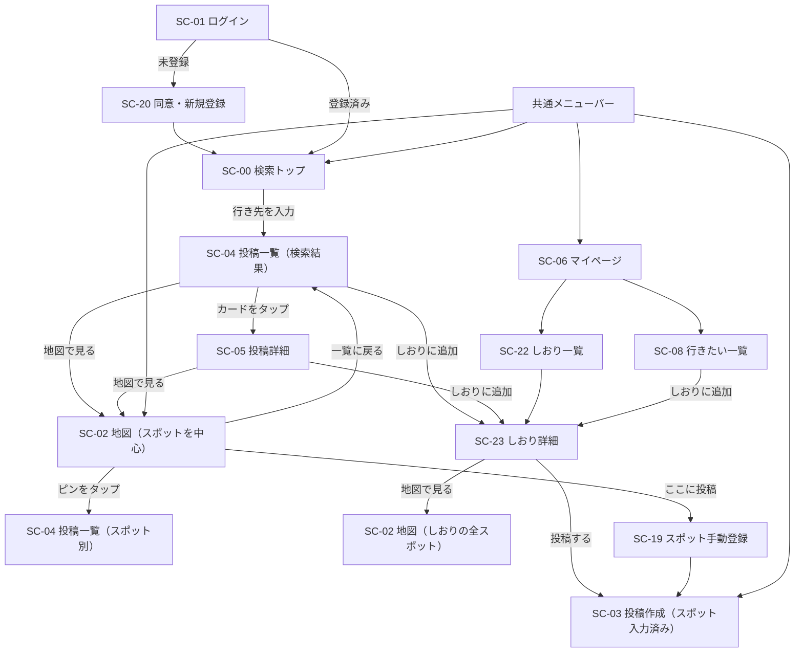

<!-- markdownlint-disable MD013 -->

# ワイヤーフレーム「タビコエ（tabikoe）」v2

> 出典: [request.md](request.md) v2（0章 主導線・画面一覧、3-1 機能要求、3-1-10 UI共通ルール）
> 位置づけ: 要件定義書 4.3「画面遷移図」・4.4「画面項目定義」の**別紙**。要件定義書 v3 改訂時に本書を参照する。

スマートフォン幅（約 390px）を基準に描く。パソコン幅では、メニューバーが左サイドバーになり、投稿一覧・しおりは中央 520px 幅に収める（地図は全幅）。画面 ID は要件定義書 4.1 に揃える。

凡例: `[ボタン]` 押せる要素、`( )` ラジオ／タブ、`▢` 写真・サムネイル、`★☆` 星評価（黄色）、`…` 省略、`→ SC-xx` 遷移先。

---

## 0. 画面遷移図（主導線）



---

## 共通メニューバー（全画面下部。SC-00 未ログイン・SC-01・SC-20・管理画面では非表示）

```
┌──────────────────────────────────────┐
│  🔍       🗺        ＋        🔔¹      👤  │
│ さがす    地図     投稿      通知    マイページ│
└──────────────────────────────────────┘
   SC-00     SC-02    SC-03    SC-14     SC-06
```

- v1 の「全体マップ」を「さがす」（SC-00）に置き換え、**地図は 2 番目**に下げる
- 「通知」には未読件数バッジ（¹）。パソコンでは同じ 5 項目を左サイドバーに縦に並べる

---

## SC-00 検索トップ（ログイン後の着地点）

### ログイン後

```
┌──────────────────────────────────────┐
│                                      │
│                                      │
│              (ロゴ)                   │
│             タビコエ                  │
│                                      │
│  ┌──────────────────────────────┐    │
│  │ 🔍 どこへ行く？                │    │
│  └──────────────────────────────┘    │
│                                      │
│                                      │
│                                      │
│                                      │
│                                      │
│                                      │
├──────────────────────────────────────┤
│  🔍   🗺   ＋   🔔   👤              │
└──────────────────────────────────────┘
```

### 入力中（候補表示）

```
┌──────────────────────────────────────┐
│  ┌──────────────────────────────┐    │
│  │ 🔍 おおさ|                    │    │
│  └──────────────────────────────┘    │
│  ┌──────────────────────────────┐    │
│  │ 📍 大阪府            都道府県  │ → SC-04（都道府県一致）
│  │ 📍 大阪駅            駅        │ → SC-04（周辺 5km）
│  │ 🏷 大阪城            スポット   │ → SC-04（スポット別）
│  │ 🏷 大阪たこ焼き〇〇   スポット   │
│  └──────────────────────────────┘    │
│                                      │
│                                      │
└──────────────────────────────────────┘
```

- 候補は「都道府県 → 駅・市区町村（Geocoding）→ 登録済みスポット」の順、最大 8 件
- 候補を選ばず決定した場合は、都道府県に一致すれば都道府県、それ以外は Geocoding の結果を基準点にする

### 未ログイン

```
┌──────────────────────────────────────┐
│                                      │
│              (ロゴ)                   │
│             タビコエ                  │
│   行き先を入れると、行った人の         │
│   投稿が地図つきで見つかる            │
│                                      │
│      [ Google でログイン ]           │ → SC-01
│                                      │
└──────────────────────────────────────┘
```

---

## SC-01 ログイン ／ SC-20 同意・新規登録

```
SC-01                                    SC-20（SC-01 で未登録と判定された時のみ）
┌──────────────────────────────┐         ┌──────────────────────────────┐
│          (ロゴ)               │         │  ← 戻る                       │
│         タビコエ              │         │                              │
│                              │         │  アカウントを作成します        │
│   [ Google でログイン ]      │  未登録  │  Google: yamada@…            │
│                              │ ──────▶ │                              │
│  エラー時のみ:               │         │  ☐ 利用規約 と                │
│  「ログインに失敗しました…」  │         │    個人情報保護方針 に同意する │
│                              │         │                              │
└──────────────────────────────┘         │   [ 同意してはじめる ]        │ → SC-00
                                         └──────────────────────────────┘
```

- SC-01 に「新規登録」ボタンは**置かない**（3-1-1）。ログイン後にアカウントが無ければ自動で SC-20 へ
- SC-20 で同意しなければアカウントは作らず、SC-01 に戻す

---

## SC-04 投稿一覧（タイムライン形式）

### 検索結果（行き先：大阪府）

```
┌──────────────────────────────────────┐
│ ← さがす      大阪府           [絞り込み ²]│
│ 新着順 ▾                       128件 │
├──────────────────────────────────────┤
│ ┌──────────────────────────────────┐ │
│ │ 👤 たろう            9/3（訪問日） │ │
│ │ たこ焼き〇〇                      │ │  ← スポット名（タップで SC-05）
│ │ ★★★★☆ 星4   ¥1,200/人   グルメ  │ │  ← 星は黄色、予算、カテゴリ
│ │ ┌────────────┬───────────┐       │ │
│ │ │            │   ▢       │       │ │  ← 写真レイアウト（1〜4枚＋"+N"）
│ │ │    ▢       ├───────────┤       │ │
│ │ │            │   ▢  +2   │       │ │
│ │ └────────────┴───────────┘       │ │
│ │ 外はカリッと中はとろとろ。行列は  │ │  ← 感想の冒頭 2 行
│ │ 15 分ほどで…                     │ │
│ │ ♥ 12   💬 3      [🗺 地図で見る] [＋しおり] │  ← 主要ボタン 2 つ
│ └──────────────────────────────────┘ │
│ ┌──────────────────────────────────┐ │
│ │ 👤 みさき            8/28         │ │
│ │ 中之島 △△カフェ                  │ │
│ │ ★★★☆☆ 星3   ¥900/人   グルメ    │ │
│ │ ┌──────────────────────────────┐ │ │
│ │ │              ▢               │ │ │
│ │ └──────────────────────────────┘ │ │
│ │ ♥ 4    💬 0      [🗺 地図で見る] [＋しおり] │
│ └──────────────────────────────────┘ │
│ …（スクロールで 20 件ずつ追加）        │
├──────────────────────────────────────┤
│  🔍   🗺   ＋   🔔   👤              │
└──────────────────────────────────────┘
```

- 1 画面に 1〜2 件が見える大きさ（3-1-10）。横並びのカードグリッドにはしない
- 「地図で見る」→ SC-02（そのスポットを中心）。「＋しおり」→ しおり選択シート（下記）
- 「💬 3」を押すと**カードの直下にコメント欄が展開**する（下記）

### 絞り込みパネル（² を押すと下からシート表示）

```
┌──────────────────────────────────────┐
│ 絞り込み                        [閉じる]│
│                                      │
│ 予算（1人あたり）                     │
│  ( ) 指定なし  ( ) 〜1,000円          │
│  ( ) 〜3,000円 ( ) 〜5,000円 ( ) 5,000円〜│
│                                      │
│ 期間（訪問日）                        │
│  ( ) 指定なし ( ) 今月 ( ) 先月       │
│  ( ) 日付指定  [2026/09/01]〜[2026/09/30]│
│                                      │
│ カテゴリ（複数選択）                  │
│  ☐ グルメ ☐ 観光スポット ☐ 体験       │
│  ☐ 宿泊施設 ☐ イベント会場            │
│                                      │
│ 滞在時間                              │
│  ( ) 指定なし ( ) 30分以内 ( ) 1時間以内 …│
│                                      │
│ 距離（駅・スポット検索のときのみ表示）│
│  ( ) 500m ( ) 1km ( ) 3km ( ) 5km    │
│                                      │
│  [条件をクリア]        [この条件で表示]│
└──────────────────────────────────────┘
```

### スポット別（地図のピン・スポット名検索から）

```
┌──────────────────────────────────────┐
│ ← 地図      たこ焼き〇〇        [絞り込み]│
│ 大阪府 ・ 投稿 7 件                   │
│ [🗺 地図で見る] [＋しおり] [行きたい] [写真 ³]│
│ 新着順 ▾                             │
├──────────────────────────────────────┤
│ （以下、検索結果と同じカード）        │
```

- ³「写真」→ SC-13 スポット写真一覧。「← 地図」は地図から来た時だけ表示（それ以外は「← さがす」）

### カード上のコメント展開（「💬 3」を押した状態）

```
│ │ ♥ 12   💬 3 ▴     [🗺 地図で見る] [＋しおり] │
│ ├──────────────────────────────────┤ │
│ │  👤 けんた  9/4  「行列すごかった」   [削除]│  ← 自分のコメントだけ右端に削除
│ │  👤 あい    9/5  「昼前が空いてる」        │
│ │  [もっと見る]                       │ │
│ │ ┌────────────────────────┐[投稿]  │ │
│ │ │ コメントを書く…         │        │ │
│ │ └────────────────────────┘        │ │
│ └──────────────────────────────────┘ │
```

### しおり選択シート（「＋しおり」を押した時）

```
┌──────────────────────────────────────┐
│ しおりに追加                    [閉じる]│
│  ( ) 大阪 2泊3日        5 スポット     │
│  ( ) 金沢 日帰り        2 スポット     │
│  ( ) ＋ 新しいしおりを作る            │
│      ┌────────────────────────┐      │
│      │ しおりのタイトル         │      │
│      └────────────────────────┘      │
│                       [追加する]      │
└──────────────────────────────────────┘
```

- 追加すると「大阪 2泊3日 に追加しました [しおりを見る]」のトーストを出す。行きたいにも自動保存

---

## SC-02 地図

### メニューバーから開いた通常表示

```
┌──────────────────────────────────────┐
│   (みんなの投稿)  ( 行きたい )   凡例 ⓘ │  ← タブ。選択中を塗りつぶし
│                                      │
│        ●3                            │  ← クラスタ
│                 ●        ◆           │  ● みんなの投稿  ◆ 行きたい
│                                      │
│    ●                                 │
│                        ●5            │
│                                      │
│                              [◎現在地]│
│                                      │
│                          [＋ ここに投稿]│  ← 地図中心で SC-19 → SC-03
├──────────────────────────────────────┤
│  🔍   🗺   ＋   🔔   👤              │
└──────────────────────────────────────┘
```

- 置くのはタブ・凡例・現在地・「ここに投稿」だけ。検索窓・絞り込みは置かない（3-1-4）
- ピンをタップ → SC-04（スポット別）。クラスタをタップ → ズームイン

### 投稿一覧の「地図で見る」から開いた表示

```
┌──────────────────────────────────────┐
│ ← 一覧に戻る                          │  ← 直前の SC-04 に位置・条件を保って戻る
│   (みんなの投稿)  ( 行きたい )   凡例 ⓘ │
│                                      │
│                ┌───────────────┐     │
│                │ たこ焼き〇〇    │     │  ← 対象スポットを中心に、吹き出しで強調
│                │ ★4 ・ 7件 [一覧]│     │
│                └───────┬───────┘     │
│                        ●             │
│         ●                    ●       │
│                              [◎現在地]│
│                          [＋ ここに投稿]│
└──────────────────────────────────────┘
```

### しおりの「地図で見る」から開いた表示

```
┌──────────────────────────────────────┐
│ ← しおりに戻る    大阪 2泊3日          │
│                                      │
│        ①                             │  ← しおりの全スポットに訪問順の番号
│                    ②                 │     全体が収まる範囲で表示
│                                      │
│              ③          ④           │
│                                      │
│                    ⑤                 │
│                              [◎現在地]│
└──────────────────────────────────────┘
```

- 番号ピンをタップ → そのスポットの名前・メモを吹き出しで表示、「一覧」で SC-04

---

## SC-05 投稿詳細

```
┌──────────────────────────────────────┐
│ ← 戻る                    [通報] [⋯ ⁴]│  ← ⁴ 本人のみ: 編集／削除（削除は右端）
│ たこ焼き〇〇                          │  ← タップで SC-04（スポット別）
│ 大阪府 ・ グルメ                      │
│ ★★★★☆ 星4                           │
│ 訪問日 2026/9/3 ・ 滞在 30分以内 ・ ¥1,200/人│
├──────────────────────────────────────┤
│ ┌────────────┬───────────┐           │
│ │    ▢       │   ▢       │           │  ← タップでモーダル（← → で前後、動画はここで再生）
│ │            ├───────────┤           │
│ │            │   ▢  +2   │           │
│ └────────────┴───────────┘           │
│ 外はカリッと中はとろとろ。行列は15分  │
│ ほどで入れた。ソース多めがおすすめ。  │
├──────────────────────────────────────┤
│ 👤 たろう                 2026/9/4 投稿│
│ [♥ 12 いいね] [＋しおり] [行きたい] [🗺 地図で見る]│
├──────────────────────────────────────┤
│ コメント 3件                          │
│ ┌────────────────────────┐[投稿]      │
│ │ コメントを書く…         │           │
│ └────────────────────────┘ 残り4,000文字│
│ 👤 けんた 9/4 「行列すごかった」   [削除]│
│ 👤 あい   9/5 「昼前が空いてる」  [通報]│
│ [もっと見る]                          │
├──────────────────────────────────────┤
│  🔍   🗺   ＋   🔔   👤              │
└──────────────────────────────────────┘
```

- 旅行タイトルは表示しない（要件 3.3.4）。非公開投稿はいいね・コメント欄なし
- 写真モーダルでは写真の下に「写真の説明」を表示

---

## SC-03 投稿作成・編集

```
┌──────────────────────────────────────┐
│ ← 戻る        投稿する                │
│                                      │
│ 旅行タイトル *                        │
│ ┌──────────────────────────────┐     │
│ │ 大阪 2泊3日            ▾     │     │  ← しおりから来た場合は入力済み
│ └──────────────────────────────┘     │
│ スポット *                            │
│ ┌──────────────────────────────┐     │
│ │ たこ焼き〇〇（大阪府）  [変更] │     │  ← しおり／地図から来た場合は入力済み
│ └──────────────────────────────┘     │
│ カテゴリ *  (グルメ)( 観光 )( 体験 )( 宿泊 )( イベント )│
│ 訪問日 *    [2026/09/03 ▾]            │  ← v2 で必須
│ 滞在時間 *  ( 30分 )(1時間)(2時間)(3時間)(それ以上)│
│ 費用（1人あたり） [ 1200 ] 円         │
│ 星評価 *    ★★★★☆                    │  ← 黄色
│                                      │
│ 写真・動画 *                          │
│ ┌────┐┌────┐┌────┐┌ ─ ─┐            │
│ │ ▢  ││ ▢  ││ ▢  │  ＋  │            │
│ │[説明]││[説明]││[説明]│      │            │  ← 写真ごとに説明（100字）を編集
│ └────┘└────┘└────┘└ ─ ─┘            │
│ ⚠ 他人が写り込んだ写真は本人の同意を… │
│                                      │
│ 感想                                  │
│ ┌──────────────────────────────┐     │
│ │                              │     │
│ └──────────────────────────────┘ 残り4,000文字│
│ 公開設定  (● 公開)( ○ 非公開 )        │
│                                      │
│           [ 投稿する ]                │
│                              [この投稿を削除]│  ← 編集時のみ、右下
└──────────────────────────────────────┘
```

---

## SC-22 しおり一覧 ／ SC-23 しおり詳細

```
SC-22                                     SC-23
┌──────────────────────────────┐          ┌──────────────────────────────────────┐
│ ← マイページ  しおり  [＋新規] │          │ ← しおり一覧   大阪 2泊3日   [🗺 地図で見る]│
│                              │          │ 5 スポット ・ 予算合計 ¥6,400 ・ [名前を変更]│
│ ┌──────────────────────────┐ │          ├──────────────────────────────────────┤
│ │ 大阪 2泊3日              │ │ ───────▶ │ ① たこ焼き〇〇          ★4 ¥1,200   │
│ │ 5 スポット ・ 更新 9/14   │ │          │    メモ: 昼前に行く              [▲▼]│
│ │ ▢ ▢ ▢ ▢ ▢               │ │          │    [投稿一覧] [投稿する] [削除]      │
│ └──────────────────────────┘ │          │ ② 大阪城                 ★5 ¥600    │
│ ┌──────────────────────────┐ │          │    メモ: （なし）                 [▲▼]│
│ │ 金沢 日帰り              │ │          │    [投稿一覧] [投稿する] [削除]      │
│ │ 2 スポット ・ 更新 9/10   │ │          │ ③ 中之島 △△カフェ       ★3 ¥900    │
│ │ ▢ ▢                     │ │          │    …                                 │
│ └──────────────────────────┘ │          │                                      │
│                              │          │           [＋ スポットを追加 ⁵]        │
│ しおりがありません（0件時）   │          │                              [しおりを削除]│
│ 投稿一覧の「＋しおり」から    │          ├──────────────────────────────────────┤
│ 作れます                     │          │  🔍   🗺   ＋   🔔   👤              │
└──────────────────────────────┘          └──────────────────────────────────────┘
```

- ⁵「スポットを追加」→ 行きたい一覧（SC-08）から選ぶ、または検索トップ（SC-00）へ
- 「▲▼」で訪問順を並び替え（パソコンではドラッグも可）。メモはタップでその場編集
- 「投稿する」→ SC-03（スポット・旅行タイトル入力済み）。投稿済みのスポットには「投稿済み ✓」を出す
- 「しおりを削除」は右下（3-1-10）。削除しても行きたい保存は残す旨を確認ダイアログに書く

---

## SC-06 マイページ ／ SC-08 行きたい一覧

```
SC-06                                     SC-08
┌──────────────────────────────────────┐  ┌──────────────────────────────────────┐
│ ┌──┐ たろう                          │  │ ← マイページ   行きたいスポット       │
│ │👤│ [プロフィールを編集]              │  │                                      │
│ └──┘                                 │  │ ┌──┐ たこ焼き〇〇       [＋しおり][解除]│
│ ┌──────────┐ ┌──────────┐            │  │ │▢ │ 大阪府 ・ 投稿 7 件              │
│ │ 投稿 12  │ │ いいね 48 │            │  │ └──┘                                 │
│ └──────────┘ └──────────┘            │  │ ┌──┐ 〇〇温泉           [＋しおり][解除]│
│ [しおり] [アルバム]                   │  │ │  │ 石川県 ・ 投稿なし               │
│ [行きたい] [バッジ]                   │  │ └──┘                                 │
│                                      │  │ …                                    │
│ 自分の投稿      すべての旅行 ▾        │  └──────────────────────────────────────┘
│ ┌──┐ 大阪 2泊3日                     │
│ │▢ │ たこ焼き〇〇 ・ グルメ ・ 9/3 ・ ♥12│  ← マイページとアルバムだけ旅行タイトルを表示
│ └──┘                                 │
│ ┌──┐ 大阪 2泊3日                     │
│ │▢ │ 大阪城 ・ 観光 ・ 9/4 ・ 非公開   │
│ └──┘                                 │
└──────────────────────────────────────┘
```

- マイページの遷移メニューは 4 つ（しおり・アルバム・行きたい・バッジ）。マイマップへは「アルバム」「行きたい」の各画面から
- 管理者には「プロフィールを編集」の横に「管理画面」を出す（メニューバーには出さない）

---

## パソコン幅での配置

```
┌──────────┬───────────────────────────────────────────────────┐
│ タビコエ  │                                                   │
│          │   （投稿一覧・しおり・マイページは中央 520px に収める）│
│ 🔍 さがす │   ┌──────────────────────────────┐                │
│ 🗺 地図   │   │                              │                │
│ ＋ 投稿   │   │         投稿カード            │                │
│ 🔔 通知 ¹ │   │                              │                │
│ 👤 マイ   │   └──────────────────────────────┘                │
│   ページ  │                                                   │
│          │   （地図・管理画面は全幅）                          │
└──────────┴───────────────────────────────────────────────────┘
```

---

## v1 からの主な変更（実装への影響）

| 画面 | v1 | v2 | 影響 |
| --- | --- | --- | --- |
| 着地点 | SC-02 地図 | SC-00 検索トップ | `/` を検索トップに、メニューバー 1 項目目を「さがす」に |
| SC-04 | カード＋絞り込み＋検索窓 | タイムライン。検索窓は SC-00 へ、絞り込みはシートに | `/search` を行き先検索に作り替え、カードを縦一列に |
| SC-02 | タブ・検索バー・「投稿を検索」 | タブ・凡例・現在地・「ここに投稿」のみ | 検索バー撤去、`?spot=` で中心指定、「一覧に戻る」 |
| SC-03 | 起点はメニューのみ | しおり・地図からも、写真の説明、訪問日必須 | `post_photos.caption` 追加、`visit_date` 必須化 |
| SC-05 | 詳細のみ | 「地図で見る」「＋しおり」を追加 | ボタン追加 |
| SC-06 | メニュー 4 つ（アルバム・マイマップ・行きたい・バッジ） | しおり・アルバム・行きたい・バッジ | マイマップの導線を移動 |
| 新設 | — | SC-22 しおり一覧、SC-23 しおり詳細 | `itineraries`・`itinerary_spots` テーブル、API、画面 |
| 共通 | — | 戻る左・削除右、星は黄色 | 全画面の配置・色を調整 |
