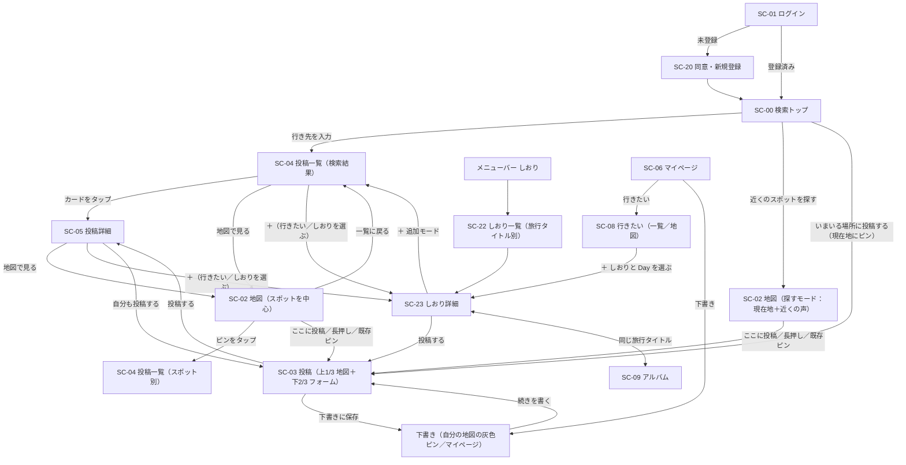

<!-- markdownlint-disable MD013 -->

# ワイヤーフレーム「タビコエ（tabikoe）」v2

> 出典: [request.md](request.md) v2（0章 主導線・画面一覧、3-1 機能要求、3-1-10 UI共通ルール）
> 位置づけ: 要件定義書 4.3「画面遷移図」・4.4「画面項目定義」の**別紙**。要件定義書 v3 改訂時に本書を参照する。
> 2026-09-16 更新: 検討中の変更（下記「本版で先行して描いた内容」）を含む。要求定義書 v2 への反映は未了。

スマートフォン幅（約 390px）を基準に描く。パソコン幅では、メニューバーが左サイドバーになり、投稿一覧・しおりは中央 520px 幅に収める（地図は全幅）。画面 ID は要件定義書 4.1 に揃える。

凡例: `[ボタン]` 押せる要素、`( )` ラジオ／タブ、`▢` 写真・サムネイル、`★☆` 星評価（黄色）、`…` 省略、`→ SC-xx` 遷移先。

## 配色（2026-09-16 決定）

「旅＝空」のイメージで、**空の青**をメインにする。検討した 3 案（青メイン／青下地＋暖色アクセント／空のグラデーション＋青）のうち「空のグラデーション＋青」を採用。

| 役割 | 色 | 使う場所 |
| --- | --- | --- |
| 下地 | `#F3F8FD`（空色寄りの白） | 全画面の背景 |
| 空のグラデーション | `#BFDDF7` → `#E4F1FC` → `#F3F8FD`（上から下へ、画面の上 6 割まで） | **検索トップ（SC-00）のみ**。他の画面は下地の単色 |
| 面 | `#FFFFFF` | カード・入力欄・シート・メニューバー |
| 文字 | `#1E2A38`（紺） | 本文・見出し |
| 薄い文字 | `#7B8794` | 補足・プレースホルダ・非選択のメニュー |
| 罫線 | `#D9E4EF` | カードの枠・区切り線 |
| アクセント | `#2F7FD8`（空の青）、押下時 `#1F65B8` | 主ボタン（「いまいる場所に投稿する」「投稿する」「地図で見る」）、「＋」ボタン、リンク、通知バッジ、選択中のタブ・メニュー、行きたいピン、フォーカス中のピン、ロゴ |
| 完了 | `#3D7A5C`（緑） | しおりのチェック済み、「投稿済み」、保存済みの「＋」 |
| 星 | `#F2B233`（黄） | 星評価 |
| 写真のプレースホルダ | `#DCE3EA` 系の青灰 | ワイヤーフレーム上のみ |

- 地図上の**現在地の青い点は Google マップ標準のまま**。アクセントの青と同系色になるため、フォーカス中のピンは外側に淡い輪（`rgba(47,127,216,0.25)`）を付けて区別する。ピンの色だけで足りなければ実装時に現在地の色を変えることも検討する
- 実装時は色をコンポーネントに直書きせず、`src/app/globals.css` の CSS 変数（`--color-*`）に集約してから置き換える

## 本版で先行して描いた内容（要求定義書 v2 に未反映）

| # | 内容 | 該当画面 |
| --- | --- | --- |
| 1 | 検索トップを「さがす・近くを見る・ここに投稿」の 3 つを持つ**ハブ**にする。「近くのスポットを探す」は地図を探すモードで開き、「いまいる場所に投稿する」は**現在地にピンが刺さった SC-03 に直行**する（地図の投稿モードは設けない） | SC-00, SC-03 |
| 2 | **メニューバーは さがす・しおり・通知・マイページ の 4 項目**。「地図」「投稿」は外し、地図へは検索トップの 2 ボタンとカードの「地図で見る」から入る。しおりは旅行中に開くものなので 1 タップで届く場所に置く | メニューバー |
| 3 | 地図からの投稿の入口 3 つ：「ここに投稿」（現在地）／長押しでピン／既存ピンの吹き出し「投稿する」。いずれも SC-03 に直行 | SC-02 |
| 4 | 投稿画面（SC-03）は**上 1/3 地図＋下 2/3 に実装済みの投稿フォーム（`/posts/new`）をそのまま**置く。地図は v1 の SC-19 と同じ**中央固定ピン**方式で、地図を動かすとピンの指す位置が変わる。その位置がスポット欄に入る | SC-03 |
| 5 | 投稿項目・必須は実装済みのまま（旅行タイトル・スポット・カテゴリ・滞在時間・星評価・写真が必須）。「一言」「行き方メモ」は追加しない。カードの引用は感想の冒頭 | SC-03, SC-04 |
| 6 | **下書き**：「下書きに保存」ボタン（写真も一言も無くて押せる）。途中で閉じても自動で下書きに残る。自分の地図に灰色の破線ピン、マイページ先頭に「下書き N 件」 | SC-02, SC-03, SC-06 |
| 7 | 投稿カードの見出しはスポット名。現在地があれば「徒歩 N 分」、最後に確認された日（「9月にまだあった」） | SC-04 |
| 8 | 投稿詳細に「まだあった／無くなっていた」「自分も投稿する」 | SC-05 |
| 9 | 手動登録スポット（Google マップに無い場所）に「タビコエだけの場所」ラベル | SC-04, SC-05 |
| 10 | 保存は「＋」→ 行きたいスポット／しおりの 2 択シート。しおりはアルバムと旅行タイトルでつながる | SC-04, SC-05, SC-22/23 |
| 11 | **しおりに「期間」（開始日〜終了日）を設定でき、期間に合わせた Day タブ（Day 1／Day 2／…）でスポットを日ごとに振り分ける**。日付未定のスポットは「未定」タブに置く | SC-23 |
| 12 | **マイページの「行きたい」**は保存したスポットを一覧／地図で切り替えて見られ、各スポットの「＋」からしおり（と Day）へ追加できる。しおり一覧の先頭にあった「行きたい」の入口は外す | SC-06, SC-08, SC-22 |
| 13 | しおり詳細のスポットに**到着予定時刻（任意・10 分刻み）**を付けられる。時間があるスポットは Day 内で時間順に自動で並び、無いものは手動順で末尾。Day タブの中はタイムライン風の見え方 | SC-23 |
| 14 | しおり詳細のスポットに**チェックボックス**。行った場所をチェックするとスポット名に取り消し線＋文字が薄くなる（位置は動かさない）。**自分が**この旅行でそのスポットに投稿したら自動でチェック（他のメンバーの投稿では変わらない）。Day タブに「2/4」の進捗 | SC-23 |
| 15 | しおり一覧（SC-22）には写真を置かない（タイトル・期間・スポット数だけ） | SC-22 |
| 16 | **配色を「空のグラデーション＋空の青」に変更**（下記「配色」）。v1 の生なり下地＋テラコッタは廃止 | 全画面 |

---

## 0. 画面遷移図（主導線）



---

## 共通メニューバー（全画面下部。SC-00 未ログイン・SC-01・SC-20・管理画面では非表示）

```
┌──────────────────────────────────────┐
│    🔍         🔖         🔔¹        👤    │
│   さがす      しおり      通知     マイページ │
└──────────────────────────────────────┘
    SC-00       SC-22      SC-14       SC-06
```

- **4 項目**。「地図」「投稿」は置かない。地図へは検索トップ（SC-00）の「近くのスポットを探す」「いまいる場所に投稿する」と、投稿カード・詳細の「地図で見る」から入る
- 「さがす」（旅行前）と「しおり」（旅行前〜旅行中）を隣に並べる。しおりは旅行中に次の場所を確かめる用途があるので、どの画面からも 1 タップで届くようにする
- 「通知」には未読件数バッジ（¹）。パソコンでは同じ 4 項目を左サイドバーに縦に並べる

---

## SC-00 検索トップ（ログイン後の着地点）

### ログイン後

```
┌──────────────────────────────────────┐
│                                      │
│              (ロゴ)                   │
│             タビコエ                  │
│                                      │
│  ┌──────────────────────────────┐    │
│  │ 🔍 どこへ行く？                │    │  → 入力で候補 → SC-04（さがす）
│  └──────────────────────────────┘    │
│                                      │
│  ┌──────────────────────────────┐    │
│  │ ◎ 近くのスポットを探す         │    │  → SC-02 探すモード（近くを見る）
│  └──────────────────────────────┘    │
│  ┌──────────────────────────────┐    │
│  │ ＋ いまいる場所に投稿する       │    │  → SC-03（現在地にピンが刺さった状態）
│  └──────────────────────────────┘    │
│                                      │
├──────────────────────────────────────┤
│   🔍      🔖      🔔      👤       │
└──────────────────────────────────────┘
```

- 検索トップは**「さがす・近くを見る・ここに投稿」の 3 つを持つハブ**。このアプリでできることが着地点だけで分かる
- 3 つの並びは「行き先を決めている人」→「今いる場所で探す人」→「今いる場所で投稿する人」の順。「いまいる場所に投稿する」はアクセント色（空の青）で、他 2 つより一段目立たせる。この画面だけ背景の上部に空のグラデーションを敷く（「配色」参照）
- 「いまいる場所に投稿する」は現在地にピンを刺した状態で SC-03 を開く（地図画面は挟まない）。下 2 つは位置情報の許可を求め、拒否されたら「行き先を入力してください」と検索窓にフォーカスする（投稿の場合は東京駅周辺を中心に SC-03 を開き、上の地図を動かして場所を合わせる案内を出す）

### 入力中（候補表示）

```
┌──────────────────────────────────────┐
│  ┌──────────────────────────────┐    │
│  │ 🔍 おおさ|                    │    │
│  └──────────────────────────────┘    │
│  ┌──────────────────────────────┐    │
│  │ 📍 大阪府            都道府県  │ → SC-04（都道府県一致）
│  │ 📍 大阪駅            駅        │ → SC-04（周辺 5km）
│  │ 🏷 大阪城            スポット   │ → SC-04（スポット別）
│  │ 🏷 大阪たこ焼き〇〇   スポット   │
│  └──────────────────────────────┘    │
└──────────────────────────────────────┘
```

- 候補は「都道府県 → 駅・市区町村（Geocoding）→ 登録済みスポット」の順、最大 8 件

### 未ログイン

```
┌──────────────────────────────────────┐
│              (ロゴ)                   │
│             タビコエ                  │
│   まだ知られていない場所の、           │
│   行った人のリアルな声                │
│                                      │
│      [ Google でログイン ]           │ → SC-01
└──────────────────────────────────────┘
```

---

## SC-01 ログイン ／ SC-20 同意・新規登録

```
SC-01                                    SC-20（SC-01 で未登録と判定された時のみ）
┌──────────────────────────────┐         ┌──────────────────────────────┐
│          (ロゴ)               │         │  ← 戻る                       │
│         タビコエ              │         │  アカウントを作成します        │
│   [ Google でログイン ]      │  未登録  │  Google: yamada@…            │
│                              │ ──────▶ │  ☐ 利用規約 と                │
│  エラー時のみ:               │         │    個人情報保護方針 に同意する │
│  「ログインに失敗しました…」  │         │   [ 同意してはじめる ]        │ → SC-00
└──────────────────────────────┘         └──────────────────────────────┘
```

- SC-01 に「新規登録」ボタンは**置かない**。ログイン後にアカウントが無ければ自動で SC-20 へ

---

## SC-02 地図

同じ画面を「探すモード」と「スポット中心」の 2 つで開く。置く要素は「タブ・凡例・現在地・ここに投稿・（必要なときだけ）戻る」に限る。**投稿専用のモードは設けない**（投稿は SC-03 に直行する）。

地図から投稿する入口は 3 つ（いずれも SC-03 へ直行。どのモードでも使える）。

```
① 現在地                 ② 長押しでピン               ③ 既存のピンをタップ
   [＋ ここに投稿]           ┌──────────────┐            ┌──────────────────┐
   （右下に常時表示）         │ 📍 この地点     │            │ たこ焼き〇〇        │
                            │ [ここに投稿]   │            │ ★4 ・ 7件         │
                            └──────┬───────┘            │ [一覧] [投稿する]  │
                                   ▼                     └────────┬─────────┘
                              SC-03（その点にピン）                 ▼
                                                          SC-03（そのスポットにピン）
```

- ①：目の前の場所（最頻）。②：現在地とずれている・さっき通った場所。③：誰かが登録済みの場所に自分も行った
- 自分の下書きは灰色の破線ピン（◌）で表示（自分だけに見える）。タップ →「続きを書く」で SC-03
- 現在地は青い円。精度が悪いと円が大きくなる

### 探すモード（SC-00「近くのスポットを探す」から。現在地中心、近くの声を下に出す）

```
┌──────────────────────────────────────┐
│ ← さがす   (みんなの投稿)( 保存済み ▾ ) │
│                                      │
│        ●                             │
│              ◎ ← 現在地              │
│                    ●        [＋ ここに投稿]│  ← 探すモードでも右下に常時表示
│   ●                                  │
├──────────────────────────────────────┤
│ 近くの声                    徒歩圏 ▾ │  ← 下 1/3 に近い順のカード（横スクロール）
│ ┌────────────┐ ┌────────────┐        │
│ │ 〇〇展望台   │ │ 無人の直売所 │        │  ← 見出し＝スポット名
│ │ 駐車場から  │ │ トマトが   │        │  ← 感想の冒頭
│ │ 見える夕日  │ │ 100円      │        │
│ │ ▢ 徒歩 6分  │ │ ▢ 徒歩 12分 │        │
│ └────────────┘ └────────────┘        │
├──────────────────────────────────────┤
│   🔍      🔖      🔔      👤       │
└──────────────────────────────────────┘
```

- カードの見出しはスポット名、その下に感想の冒頭。タップで SC-05。「徒歩圏 ▾」で 500m／1km／3km を切替
- カードを横にめくると地図のピンが連動して強調される

### 投稿一覧の「地図で見る」から開いた表示（スポットを中心）

```
┌──────────────────────────────────────┐
│ ← 一覧に戻る                          │  ← 直前の SC-04 に位置・条件を保って戻る
│   (みんなの投稿)  ( 保存済み ▾ )  凡例 ⓘ │
│                ┌───────────────┐     │
│                │ たこ焼き〇〇    │     │  ← 対象スポットを中心に、吹き出しで強調
│                │ ★4 ・ 7件      │     │
│                │ [一覧] [投稿する]│     │
│                └───────┬───────┘     │
│                        ●             │
│         ●                    ●       │
│                              [◎現在地]│
│                          [＋ ここに投稿]│
└──────────────────────────────────────┘
```

### しおりの「地図で見る」から開いた表示

```
┌──────────────────────────────────────┐
│ ← しおりに戻る    大阪旅行             │
│        ①                             │  ← しおりの全スポットに訪問順の番号
│                    ②                 │     全体が収まる範囲で表示
│              ③          ④           │
│                    ⑤                 │
│                              [◎現在地]│
└──────────────────────────────────────┘
```

- 「保存済み ▾」は「すべて／行きたいスポット／各しおり」を選べる

---

## SC-03 投稿作成・編集（上 1/3 地図＋下 2/3 に実装済みのフォーム）

どの入口から入っても同じ画面。下 2/3 は **v1 で実装済みの `/posts/new`（`PostForm`）をそのまま**置き、項目・順序・必須条件は変えない。変わるのは「上に地図が付く」ことと「スポット欄に地図の位置が入った状態で開く」ことだけ。

上 1/3 の地図は **v1 の手動登録モーダル（SC-19）と同じ中央固定ピン方式**。ピンは画面中央に固定され、**地図をドラッグ・ピンチで動かすと、ピンが指す位置（＝投稿の位置）が変わる**。微調整も大きな移動もこれ一つで済む。

```
┌──────────────────────────────────────┐
│ ← 戻る                       [◎現在地]│  ← 現在地に戻す
│           （地図：上 1/3、約 280px）    │
│         地図を動かしてピンを合わせる    │  ← 初回だけ 1 行出す
│                  📍                   │  ← 中央固定ピン。地図側を動かす（SC-19 と同じ）
├──────────────────────────────────────┤  ← ここから下 2/3（約 560px）。項目は同じまま 2 列に詰めてスクロールを減らす
│ 旅行タイトル *   [ 今日の投稿（9/16）  ▾ ]│  ← ラベルと入力を横並び（1 行）
│ スポット名 *     [ 📍 この場所（新しい場所）変更 ]│  ← 同上。近くに登録済みがあればその名前
│ カテゴリ *       [ グルメ                ▾ ]│  ← 5 択のドロップダウン（横スクロールのチップはやめる）
│ ┌─ 日付（任意） ─────┐ ┌─ 滞在時間 * ───────┐│  ← 2 列
│ │ 2026/09/16      ▾ │ │ 1時間以内        ▾ ││     滞在時間は 5 択のドロップダウン
│ └───────────────────┘ └───────────────────┘│
│ ┌─ 費用（任意・1人）──┐ ┌─ 星評価 * ─────────┐│  ← 2 列
│ │ ¥ [      1200 ]   │ │ ★★★★☆             ││
│ └───────────────────┘ └───────────────────┘│
│ 写真・動画 *                           │
│ ┌────┐┌────┐┌────┐┌ ─ ─┐               │  ← 選んだ写真・動画はここに並ぶ（動画は ▶ 印）。横スクロール
│ │ ▢  ││ ▢ ▶││ ▢  │  ＋  │               │     各サムネの右上に × で削除
│ └────┘└────┘└────┘└ ─ ─┘               │
│ ⚠ 写り込み・個人情報に注意 [詳しく]    │  ← 注意文は 1 行に畳み、「詳しく」で全文
│ 感想（任意）                  公開 ▾   │  ← 公開設定はラベル行の右端に
│ ┌──────────────────────────────┐     │
│ │                              │     │  ← 2 行分。入力すると伸びる
│ └──────────────────────────────┘ 残り4,000│
├──────────────────────────────────────┤
│   [ 投稿する ]      [ 下書きに保存 ]   │  ← 下に固定
└──────────────────────────────────────┘
```

- **入力項目は既存と同じ**（旅行タイトル・スポット名・カテゴリ・日付・滞在時間・費用・星評価・写真・動画・感想・公開設定）。変えたのは配置だけ
- スクロールを減らす手立て：①ラベルと入力欄を横並びに（旅行タイトル・スポット名）、②日付／滞在時間、費用／星評価を 2 列に、③滞在時間はチップ 5 個からドロップダウンに、④カテゴリもチップ 5 個からドロップダウンに、⑤注意文を 1 行に畳む、⑥感想は 2 行から始めて入力で伸びる、⑦公開設定を感想のラベル行に寄せる
- 写真・動画は「＋」で選ぶとその場でサムネイルが並ぶ（動画は先頭フレームに ▶）。× で外せる。既存の `PostForm` の写真表示と同じ部品
- この配置で、写真を 1〜3 点選んだ状態なら**下 2/3 の中でスクロールなしに全項目が見える**（感想が長い場合のみ伸びる）

- 既存フォームからの変更点は 3 つだけ：①スポット名欄が地図の中心位置で埋まっている（「変更」で従来どおり検索もできる。検索で選ぶと地図がそのスポットへ移動する）、②旅行タイトルが空なら仮タイトル「今日の投稿（日付）」で自動作成、③「下書きに保存」ボタン
- 既存スポット（③既存ピンやしおりから来た場合）を選んでいるときは、地図を動かしても位置は変わらない（そのスポットにピンが固定される）。「変更」→「新しい場所」を選ぶと中央固定ピンに戻る
- **「下書きに保存」は必須項目が埋まっていなくても押せる**（位置だけの下書きが成立）。戻る・閉じるで離れた場合も自動で下書きに残す
- 「投稿する」の有効条件は既存どおり（必須項目がすべて埋まっていること）
- シートを上に引くと全画面（地図は隠れる）、下に引くと 1：2 に戻る

### 入口ごとの初期状態

| 入口 | 地図に出るもの | スポット名欄 | その他 |
| --- | --- | --- | --- |
| SC-00「いまいる場所に投稿する」／地図の「ここに投稿」 | 現在地を中心に開く（中央固定ピン） | 「この場所（新しい場所）」。近くに登録済みがあればそれを選択済み | 日付＝今日 |
| 地図の長押し | 指した点を中心に開く | 同上 | 同上 |
| 既存ピン／SC-05「自分も投稿する」／スポット別一覧 | そのスポットのピン | そのスポット | — |
| しおりの「投稿する」 | そのスポットのピン | そのスポット | 旅行タイトル＝しおりのタイトル |
| 下書きの「続きを書く」 | 下書きの位置 | 保存していた内容 | 保存していた内容 |
| 編集 | 投稿のスポットのピン | 投稿のスポット | 投稿の内容。「変更」→「新しい場所」で地図を動かして選び直せる |

### パソコン幅

```
┌──────────┬────────────────┬──────────────────────────────────┐
│ サイドバー│   地図（1）      │   既存フォーム（2）                │
│          │      📍         │   旅行タイトル * …                │
│          │                 │   スポット名 * 📍 この場所 …       │
│          │                 │   …                              │
│          │                 │   [投稿する] [下書きに保存]        │
└──────────┴────────────────┴──────────────────────────────────┘
```

---

## SC-04 投稿一覧（タイムライン形式）

### 検索結果（行き先：大阪府）

```
┌──────────────────────────────────────┐
│ ← さがす      大阪府           [絞り込み ²]│
│ (● 投稿)( ○ 写真 ⁸ )   [新着順 ▾]  128件 │  ← ⁸ 写真だけを見る切替（v1 の SC-13 と同じ見え方）
│                        ┌─────────┐   │
│                        │ ● 新着順  │   │  ← 並び替えは 1 つのボタン。押すとドロップダウンで
│                        │ ○ 評価順  │   │     評価順・いいね順を選ぶ（3 つを横に並べない）
│                        │ ○ いいね順│   │
│                        └─────────┘   │
├──────────────────────────────────────┤
│ ┌──────────────────────────────────┐ │
│ │ 👤 たろう          訪問 9/3 ・ 徒歩 8分│  ← 徒歩は現在地があるときだけ
│ │ たこ焼き〇〇   タビコエだけの場所 ⁶ │ │  ← 見出し＝スポット名。⁶ 手動登録スポットに付くラベル
│ │ 外はカリッと中はとろとろ。行列は  │ │  ← 感想の冒頭 2 行（既存どおり）
│ │ 15分ほどで入れた。…              │ │
│ │ ★★★★☆ 星4   ¥1,200/人   グルメ  │ │
│ │ ┌────────────┬───────────┐       │ │
│ │ │    ▢       │   ▢       │       │ │
│ │ │            ├───────────┤       │ │
│ │ │            │   ▢  +2   │       │ │
│ │ └────────────┴───────────┘       │ │
│ │ 9月にまだあった ⁷                 │ │  ← ⁷ 最後に「まだあった」報告があった月
│ │ ♥ 12   💬 3      [🗺 地図で見る]   (＋)  │
│ └──────────────────────────────────┘ │
│ ┌──────────────────────────────────┐ │
│ │ 👤 みさき          訪問 8/28        │ │
│ │ 中之島 △△カフェ                  │ │
│ │ 川沿いのテラス席が気持ちいい。     │ │
│ │ ★★★☆☆ 星3   ¥900/人   グルメ    │ │
│ │ ┌──────────────────────────────┐ │ │
│ │ │              ▢               │ │ │
│ │ └──────────────────────────────┘ │ │
│ │ ♥ 4    💬 0      [🗺 地図で見る]   (＋)  │
│ └──────────────────────────────────┘ │
│ …（スクロールで 20 件ずつ追加）        │
├──────────────────────────────────────┤
│   🔍      🔖      🔔      👤       │
└──────────────────────────────────────┘
```

- 感想は冒頭 2 行だけ。詳しくは SC-05
- 並び替えは「新着順」を既定表示にした 1 つのボタン。押すとドロップダウンで「評価順」「いいね順」を選べる。選ぶとボタンの表示が変わる
- 「地図で見る」→ SC-02（そのスポットを中心）。「＋」→ 保存先を選ぶシート。追加モード中は「＋」でそのしおりに直接入る

### 写真だけを見る（⁸「写真」に切り替えた状態）

```
┌──────────────────────────────────────┐
│ ← さがす      大阪府           [絞り込み]│
│ (○ 投稿)( ● 写真 )   [新着順 ▾]  312点 │  ← 絞り込み・並び替えはそのまま効く
├──────────────────────────────────────┤
│ ┌────┐┌────┐┌────┐                   │
│ │ ▢  ││ ▢  ││ ▢ ▶│                   │  ← 正方形グリッド（列数は画面幅で可変）、動画は再生アイコン
│ └────┘└────┘└────┘                   │
│ ┌────┐┌────┐┌────┐                   │
│ │ ▢  ││ ▢  ││ ▢  │                   │
│ └────┘└────┘└────┘                   │
│ ┌────┐┌────┐┌────┐                   │
│ │ ▢  ││ ▢  ││ ▢  │                   │
│ └────┘└────┘└────┘                   │
│ …（スクロールで 40 点ずつ追加）        │
├──────────────────────────────────────┤
│   🔍      🔖      🔔      👤       │
└──────────────────────────────────────┘
```

- v1 の SC-13（スポット写真一覧）と同じ部品。検索結果でもスポット別でも同じ切替が使える
- 並び替えは投稿一覧と同じドロップダウン（新着順／評価順／いいね順）。写真は元の投稿の順で並び、同じ投稿の写真は添付順でまとまる（v1 の SC-13 は新着順のみだった）
- タップで写真のモーダル（← → で前後、「この投稿を見る」で SC-05）
- 「💬 3」を押すとカードの直下にコメント欄が展開する

### 絞り込みパネル（² を押すと下からシート表示）

```
┌──────────────────────────────────────┐
│ 絞り込み                        [閉じる]│
│ 予算（1人あたり）                     │
│  ( ) 指定なし ( ) 〜1,000円 ( ) 〜3,000円 ( ) 〜5,000円 ( ) 5,000円〜│
│ 期間（訪問日）                        │
│  ( ) 指定なし ( ) 今月 ( ) 先月 ( ) 日付指定 [   ]〜[   ]│
│ カテゴリ（複数選択）                  │
│  ☐ グルメ ☐ 観光スポット ☐ 体験 ☐ 宿泊施設 ☐ イベント会場│
│  ☐ 風景・眺め ☐ 路地・散歩道 ☐ 直売所 ☐ 季節限定 ⁴ │
│ 滞在時間                              │
│  ( ) 指定なし ( ) 30分以内 ( ) 1時間以内 …│
│ 距離（駅・スポット検索・現在地のときのみ）│
│  ( ) 500m ( ) 1km ( ) 3km ( ) 5km    │
│  [条件をクリア]        [この条件で表示]│
└──────────────────────────────────────┘
```

### スポット別（地図のピン・スポット名検索から）

```
┌──────────────────────────────────────┐
│ ← 地図      たこ焼き〇〇        [絞り込み]│
│ 大阪府 ・ 投稿 7 件 ・ 9月にまだあった  │
│ [🗺 地図で見る]  (＋)  [投稿する]      │  ← 「投稿する」→ SC-03（スポット確定）
│ (● 投稿)( ○ 写真 )   [新着順 ▾]      │  ← 「写真」でそのスポットの写真だけ（v1 の SC-13）
├──────────────────────────────────────┤
│ （以下、検索結果と同じカード）        │
```

### カード上のコメント展開（「💬 3」を押した状態）

```
│ │ ♥ 12   💬 3 ▴     [🗺 地図で見る]   (＋)  │
│ ├──────────────────────────────────┤ │
│ │  👤 けんた  9/4  「行列すごかった」   [削除]│  ← 自分のコメントだけ右端に削除
│ │  👤 あい    9/5  「昼前が空いてる」        │
│ │  [もっと見る]                       │ │
│ │ ┌────────────────────────┐[投稿]  │ │
│ │ │ コメントを書く…         │        │ │
│ │ └────────────────────────┘        │ │
│ └──────────────────────────────────┘ │
```

### 保存先を選ぶシート（「＋」を押した時。1 枚・2 段構成）

```
┌──────────────────────────────────────┐
│ 保存先                           [完了]│
│ ☐ 🔖 行きたいスポット       12 件      │  ← 上段: 仮置き。1 タップで確定
│ ─────────────────────────────────── │
│ しおり                                │  ← 下段: 旅行タイトル別
│ ☑ 大阪旅行                5 スポット   │
│ ☐ 北海道旅行              3 スポット   │
│ ＋ 新しいしおりを作る                  │
│      ┌────────────────────────┐      │
│      │ 旅行タイトル（例: 大阪旅行）│      │  ← 作ったしおりは同名のアルバムとつながる
│      └────────────────────────┘      │
└──────────────────────────────────────┘
```

- チェックを付ける／外すだけで保存・削除が確定する。行きたいスポットとしおりの両方に入れてもよい
- しおりにチェックすると、そのしおりに期間があれば Day の選択（Day 1／Day 2／…／未定）が展開する。省略時は「未定」
- 閉じると「大阪旅行 に保存しました [しおりを見る]」のトーストを出す

### 追加モード（しおり詳細の「＋」から来た投稿一覧）

```
┌──────────────────────────────────────┐
│ 🔖 大阪旅行 に追加中              [完了]│  ← 上部に固定。完了で SC-23 へ戻る
│ 大阪府                        [絞り込み]│  ← 行き先はしおりのスポットの都道府県を自動入力
├──────────────────────────────────────┤
│ │ たこ焼き〇〇  …  [🗺 地図で見る]  (✓) │ │  ← 入っているものは (✓)、押すと外れる
│ │ 中之島 △△カフェ … [🗺 地図で見る] (＋) │ │  ← 押すとシートを出さずに大阪旅行へ
```

---

## SC-05 投稿詳細

```
┌──────────────────────────────────────┐
│ ← 戻る                    [通報] [⋯ ⁴]│  ← ⁴ 本人のみ: 編集／削除（削除は右端）
│ たこ焼き〇〇   タビコエだけの場所       │  ← 見出し＝スポット名。タップで SC-04（スポット別）
│ 大阪府 ・ グルメ                      │
│ ★★★★☆ 星4                           │
│ 訪問日 2026/9/3 ・ 滞在 30分以内 ・ ¥1,200/人│
├──────────────────────────────────────┤
│ ┌────────────┬───────────┐           │
│ │    ▢       │   ▢       │           │  ← タップでモーダル（← → で前後、写真の説明を下に）
│ │            ├───────────┤           │
│ │            │   ▢  +2   │           │
│ └────────────┴───────────┘           │
│ 外はカリッと中はとろとろ。行列は15分  │  ← 感想（任意）
│ ほどで入れた。ソース多めがおすすめ。  │
├──────────────────────────────────────┤
│ 👤 たろう                 2026/9/4 投稿│
│ [♥ 12 いいね]  (＋)  [🗺 地図で見る]   │
│ この場所、まだありますか？             │
│ [👍 まだあった]  [👎 無くなっていた]   │  ← 最新の報告を「9月にまだあった」として表示
│ [✍ 自分も投稿する]                     │  → SC-03（スポット確定）
├──────────────────────────────────────┤
│ コメント 3件                          │
│ ┌────────────────────────┐[投稿]      │
│ │ コメントを書く…         │           │
│ └────────────────────────┘ 残り4,000文字│
│ 👤 けんた 9/4 「行列すごかった」   [削除]│
│ 👤 あい   9/5 「昼前が空いてる」  [通報]│
│ [もっと見る]                          │
├──────────────────────────────────────┤
│   🔍      🔖      🔔      👤       │
└──────────────────────────────────────┘
```

- 旅行タイトルは表示しない。非公開投稿はいいね・コメント欄なし
- 「まだあった／無くなっていた」は 1 人 1 回。投稿者本人には通知しない（場所の鮮度を保つための報告であり評価ではない）

---

## SC-22 しおり一覧（メニューバー「しおり」）

```
┌──────────────────────────────────────┐
│ しおり                        [＋ 新規]│
│ ┌──────────────────────────────────┐ │
│ │ 大阪旅行             9/20 〜 9/22  │ │  ← 旅行タイトル＋期間（未設定なら「期間未設定」）
│ │ 5 スポット ・ 3 日間 ・ 2/5 済     │ │  ← 写真は置かない（スポットは詳細で見る）
│ └──────────────────────────────────┘ │
│ ┌──────────────────────────────────┐ │
│ │ 北海道旅行           期間未設定    │ │
│ │ 3 スポット                         │ │
│ └──────────────────────────────────┘ │
│ ┌──────────────────────────────────┐ │
│ │ 金沢 日帰り          8/10（済）    │ │  ← 期間を過ぎたしおりは下に、薄く。アルバムへの導線
│ │ 2 スポット ・ [📷 アルバムを見る]   │ │
│ └──────────────────────────────────┘ │
│                                      │
│ しおりがありません（0件時）           │
│ 投稿一覧の「＋」から作れます          │
├──────────────────────────────────────┤
│   🔍      🔖      🔔      👤       │
└──────────────────────────────────────┘
```

- 並び順：期間が近い順（未設定は更新日時順）。期間を過ぎたものは末尾に薄く表示し、「アルバムを見る」を出す
- 「＋ 新規」で旅行タイトルと期間（任意）を入力して作る。作ると同名の旅行 ID ができ、アルバムとつながる
- 「行きたいスポット」への入口は**ここには置かない**（マイページの「行きたい」へ移した）

## SC-23 しおり詳細（期間と Day タブ）

```
┌──────────────────────────────────────┐
│ ← しおり   大阪旅行         [🗺 地図で見る]│
│ 📅 9/20（金）〜 9/22（日） [期間を変更]   │  ← 未設定なら「[📅 期間を設定]」ボタン
│ 5 スポット ・ 予算目安 ¥6,400            │
│ [📷 アルバム「大阪旅行」を見る] [名前を変更]│
├──────────────────────────────────────┤
│ (● Day 1 9/20 2/4)( ○ Day 2 )( ○ Day 3 )( ○ 未定 1 )│  ← 期間の日数分の Day タブ＋「未定」。「2/4」は済んだ数
├──────────────────────────────────────┤
│ 10:00 │ ① ~~たこ焼き〇〇~~     ★4 ¥1,200 │  ← 済み: 取り消し線＋薄い文字。位置は動かない
│  ☑    │   メモ: 昼前に行く    [Day 1 ▾][▲▼]│  ← 左の列は「時刻／その下にチェック」
│       │   [投稿一覧] [投稿済み ✓] [削除]  │  ← 自分がこの旅行で投稿していれば自動でチェック
│ 12:30 │ ② ~~大阪城~~           ★5 ¥600  │
│  ☑    │   [投稿一覧] [投稿する ⁶] [削除]  │  ← ⁶ チェック直後は「投稿する」を一段目立たせる
│ 15:00 │ ③ 中之島 △△カフェ     ★3 ¥900  │  ← 時刻を押すと 10 分刻みのピッカー
│  ☐    │   メモ: テラス席      [Day 1 ▾][▲▼]│
│       │   [投稿一覧] [投稿する] [削除]    │
│  ──   │ ④ 海遊館              ★4 ¥2,700 │  ← 時間なし。手動順で末尾。「──」を押すと時間を入れられる
│  ☐    │   [投稿一覧] [投稿する] [削除]    │
│                                      │
│           (＋ スポットを追加 ⁵)        │  ← 追加モード。追加先はいま開いている Day
│                              [しおりを削除]│
├──────────────────────────────────────┤
│   🔍      🔖      🔔      👤       │
└──────────────────────────────────────┘
```

- **期間**：開始日〜終了日。設定すると日数分の Day タブができる（1 日なら Day 1 のみ）。期間を縮めて日が消える場合、その日のスポットは「未定」へ移す（消さない）
- **未定タブ**：どの日にも割り当てていないスポット。期間未設定のしおりは「未定」だけが出る（＝従来の一覧と同じ見え方）
- **到着予定時刻（任意）**：スポットごとに 1 つ。時・分の 2 列を回すピッカーで、分は 00／10／20／30／40／50 の 10 分刻み（ブラウザ標準の時刻入力は iPhone が刻みを無視するため自前）。時間があるスポットは **Day 内で時間順に自動で並び**、無いものは「▲▼」の手動順でその日の末尾にまとめる
- **チェックボックス**：行った場所をタップでチェック。スポット名に取り消し線＋文字が薄くなる。位置は動かさない（「次はどこ」が分かるように）。もう一度タップで外せる（確認は出さない）。**自分が**この旅行（同じ旅行 ID）でそのスポットに投稿したら自動でチェック。共同アルバムの他メンバーの投稿では変わらない（しおりは個人の計画のため）。手でチェックしただけでは投稿は作らない。地図の番号ピンも済みは灰色
- 「Day 1 ▾」を押すと Day 2／Day 3／未定 が出て、選ぶと**そのスポットがその Day のタブへ移る**（時間があれば時間順の位置、無ければ末尾）。画面はいまの Day に留まり、「Day 2 に移動しました [Day 2 を見る]」のトーストを出す（続けて振り分けやすいように）。時間の無いスポットの順番は「▲▼」（パソコンはドラッグ）。Day をまたぐドラッグはしない
- 「地図で見る」→ SC-02（しおり表示）。**開いている Day のスポットだけ**に番号ピンを出し、上に Day タブを重ねて切り替えられる。「すべて」で全日を色分け
- ⁵「＋ スポットを追加」→ 追加モードで SC-04 へ。追加先は開いている Day（未定タブなら未定）。行き先はしおりのスポットの都道府県を自動入力。しおりが空なら SC-00 へ
- 「投稿する」→ SC-03（スポット・旅行タイトル「大阪旅行」が入力済み、訪問日＝その Day の日付）
- 「しおりを削除」は右下。削除してもアルバム（投稿）は残る旨を確認ダイアログに書く

## SC-08 行きたい（マイページ「行きたい」。一覧／地図の切替）

```
一覧                                          地図
┌──────────────────────────────────────┐    ┌──────────────────────────────────────┐
│ ← マイページ   行きたい          12件  │    │ ← マイページ   行きたい          12件  │
│ (● 一覧)( ○ 地図 )                    │    │ (○ 一覧)( ● 地図 )                    │
├──────────────────────────────────────┤    ├──────────────────────────────────────┤
│ ┌──┐ 〇〇温泉                 (＋) [解除]│    │          ◆                           │  ← 行きたいのピン（ひし形）
│ │  │ 石川県 ・ 投稿なし                │    │                    ◆                 │
│ └──┘                                 │    │      ◆                               │
│ ┌──┐ △△ラーメン               (＋) [解除]│    │                          [◎現在地]    │
│ │▢ │ 北海道 ・ 投稿 3 件               │    │                      [＋ ここに投稿]  │
│ └──┘                                 │    └──────────────────────────────────────┘
│ ┌──┐ たこ焼き〇〇              (＋) [解除]│      ピンをタップ → 吹き出し「〇〇温泉 [一覧] [＋ しおりへ]」
│ │▢ │ 大阪府 ・ 投稿 7 件 ・ 大阪旅行 Day 1│  ← 既にしおりに入っていれば、しおり名と Day を表示
│ └──┘                                 │
└──────────────────────────────────────┘
```

- 一覧は**スポット**の一覧（投稿の一覧ではない）。カードはスポット名・代表写真・都道府県・投稿件数。押すと SC-04（スポット別）
- **「＋」→ しおりと Day を選ぶシート**（下記）。追加しても「行きたい」からは消えない。不要になったら「解除」
- 地図は SC-02 の「保存済み ▾ → 行きたい」と同じ表示。ピンの吹き出しからも「＋ しおりへ」

### 行きたい → しおりへ追加するシート（「＋」を押した時）

```
┌──────────────────────────────────────┐
│ 〇〇温泉 をしおりへ              [完了]│
│ ( ) 大阪旅行      9/20〜9/22          │
│     └ ( ) Day 1 ( ) Day 2 ( ) Day 3 (●) 未定│  ← しおりを選ぶと Day が展開。既定は「未定」
│ ( ) 北海道旅行    期間未設定          │
│ ＋ 新しいしおりを作る                  │
└──────────────────────────────────────┘
```

- 投稿カード・投稿詳細の「＋」（保存先の 2 択シート）でしおりを選んだときも、同じように Day を選べる（省略時は「未定」）

---

## SC-06 マイページ

```
┌──────────────────────────────────────┐
│ ┌──┐ たろう                          │
│ │👤│ [プロフィールを編集]              │
│ └──┘                                 │
│ ┌──────────────────────────────────┐ │
│ │ ✎ 下書き 3 件            続きを書く ›│ │  ← 下書きがあるときだけ、先頭に
│ │ ◌ 名前のない場所（9/16 14:02）      │ │
│ │ ◌ 無人の直売所（9/16 11:30）  ▢    │ │
│ └──────────────────────────────────┘ │
│ ┌──────────┐ ┌──────────┐            │
│ │ 投稿 12  │ │ いいね 48 │            │
│ └──────────┘ └──────────┘            │
│ [行きたい 12] [アルバム]              │  ← 行きたい → SC-08（一覧／地図）
│ [マイマップ] [バッジ]                 │
│                                      │
│ 自分の投稿      すべての旅行 ▾        │
│ ┌──┐ 大阪旅行                        │
│ │▢ │ たこ焼き〇〇 ・ グルメ ・ 9/3 ・ ♥12│  ← マイページとアルバムだけ旅行タイトルを表示
│ └──┘                                 │
│ ┌──┐ 今日の投稿（9/16）               │  ← 仮タイトルのまま → タップで付け直しを促す
│ │▢ │ 無人の直売所 ・ 直売所 ・ 9/16    │
│ └──┘                                 │
└──────────────────────────────────────┘
```

- 下書きは他人には一切見えない（地図のピン・一覧・検索に出ない）。30 日触らなかった下書きは通知で「まだ書きますか？」（消さない）
- 遷移メニューは 4 つ（行きたい・アルバム・マイマップ・バッジ）。しおりはメニューバーへ移した。「旅行と結びつくもの（しおり）はメニューバー、自分の手元にあるもの（行きたい・アルバム・マイマップ・バッジ）はマイページ」という分け方

---

## パソコン幅での配置

```
┌──────────┬───────────────────────────────────────────────────┐
│ タビコエ  │                                                   │
│          │   （投稿一覧・しおり・マイページは中央 520px に収める）│
│ 🔍 さがす │   ┌──────────────────────────────┐                │
│ 🔖 しおり │   │         投稿カード            │                │
│ 🔔 通知 ¹ │   └──────────────────────────────┘                │
│ 👤 マイ   │   （地図・管理画面は全幅。SC-03 は左 1：右 2）        │
│   ページ  │                                                   │
└──────────┴───────────────────────────────────────────────────┘
```

---

## v1 からの主な変更（実装への影響）

| 画面 | v1 | v2 | 影響 |
| --- | --- | --- | --- |
| 着地点 | SC-02 地図 | SC-00 検索トップ＝ハブ（行き先入力・近くのスポットを探す・いまいる場所に投稿する） | `/` を検索トップに |
| メニューバー | 全体マップ・新規投稿・通知・マイページ | さがす・しおり・通知・マイページの 4 項目（地図・投稿は検索トップから） | `menu-bar-config` を差し替え、`/map?mode=explore`、`/posts/new?lat&lng` |
| SC-02 | タブ（全体／行きたい）・検索バー・「投稿を検索」 | タブ（みんなの投稿／保存済み）・凡例・現在地・「ここに投稿」。長押しピン・既存ピンから SC-03 へ直行。探すモードで近くの声。下書きの灰色ピン | 検索バー撤去、`?spot=`／`?mode=explore` で開き分け、長押しイベント、下書きピンの取得 |
| SC-03 | 全画面フォーム | 上 1/3 地図（中央固定ピン。SC-19 の方式）＋下 2/3 に既存フォームをそのまま。スポット欄は地図の中心で埋まる。「下書きに保存」 | レイアウト変更（`PostForm` は流用、`ManualSpotRegistrationModal` の地図部分を上 1/3 に移す）、`posts.status`（draft/published）、仮の旅行タイトル |
| SC-04 | カード＋絞り込み＋検索窓 | タイムライン。「投稿／写真」の切替（写真は v1 の SC-13 の部品）。徒歩分・「まだあった」。カードに「＋」（保存先 2 択）。追加モード | `/search` を行き先検索に作り替え、カードを縦一列に、`SpotPhotoGalleryScreen` を検索結果にも適用、`?itinerary=` で追加モード |
| SC-05 | 詳細のみ | 「まだあった／無くなっていた」、「自分も投稿する」、「地図で見る」「＋」 | `spot_status_reports` テーブル（spot_id, user_id, status, created_at） |
| SC-06 | メニュー 4 つ | 下書き一覧を先頭に、行きたい・アルバム・マイマップ・バッジ | 下書きの取得 |
| SC-08 | 行きたい一覧（マイページから） | 行きたい（一覧／地図の切替）。各行の「＋」でしおりと Day を選んで追加 | `/wishlist` に一覧／地図切替と「＋」シートを追加 |
| SC-19 | 投稿フォームから開く手動登録モーダル | 廃止。SC-03 上部の中央固定ピンの地図がそのまま手動登録を兼ねる | モーダルを SC-03 の地図に統合 |
| 新設 | — | SC-22 しおり一覧（メニューバー）、SC-23 しおり詳細（期間・Day タブ・到着時刻・チェック） | `itineraries`（`trip_id` で `trips` と 1 対 1、`start_date`・`end_date`）・`itinerary_spots`（`day_index` null＝未定、`arrival_time` null 可、`sort_order`、`memo`、`checked_at`）テーブル、API、画面。10 分刻みの時刻ピッカー部品 |
| 共通 | — | 戻る左・削除右、星は黄色、「タビコエだけの場所」ラベル（`spots.source = 'manual'`） | 全画面の配置・色を調整 |
