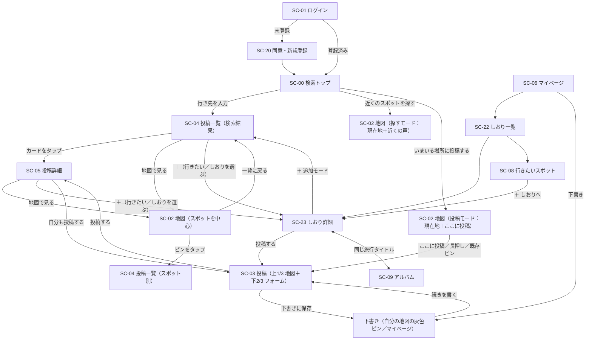

<!-- markdownlint-disable MD013 -->

# ワイヤーフレーム「タビコエ（tabikoe）」v2

> 出典: [request.md](request.md) v2（0章 主導線・画面一覧、3-1 機能要求、3-1-10 UI共通ルール）
> 位置づけ: 要件定義書 4.3「画面遷移図」・4.4「画面項目定義」の**別紙**。要件定義書 v3 改訂時に本書を参照する。
> 2026-09-16 更新: 検討中の変更（下記「本版で先行して描いた内容」）を含む。要求定義書 v2 への反映は未了。

スマートフォン幅（約 390px）を基準に描く。パソコン幅では、メニューバーが左サイドバーになり、投稿一覧・しおりは中央 520px 幅に収める（地図は全幅）。画面 ID は要件定義書 4.1 に揃える。

凡例: `[ボタン]` 押せる要素、`( )` ラジオ／タブ、`▢` 写真・サムネイル、`★☆` 星評価（黄色）、`…` 省略、`→ SC-xx` 遷移先。

## 本版で先行して描いた内容（要求定義書 v2 に未反映）

| # | 内容 | 該当画面 |
| --- | --- | --- |
| 1 | 検索トップを「さがす・近くを見る・ここに投稿」の 3 つを持つ**ハブ**にする。「近くのスポットを探す」は地図を探すモードで、「いまいる場所に投稿する」は地図を投稿モードで開く | SC-00, SC-02 |
| 2 | **メニューバーから「地図」「投稿」を外し、さがす・通知・マイページの 3 項目にする**。地図へは検索トップの 2 ボタンとカードの「地図で見る」から入る | メニューバー |
| 3 | 地図からの投稿の入口 3 つ：現在地の「ここに投稿」／長押しでピン／既存ピンの吹き出し「投稿する」 | SC-02 |
| 4 | 投稿画面（SC-03）は**上 1/3 地図＋下 2/3 に実装済みの投稿フォーム（`/posts/new`）をそのまま**置く。地図で指した位置がスポット欄に入った状態で開く | SC-03 |
| 5 | 投稿項目・必須は実装済みのまま（旅行タイトル・スポット・カテゴリ・滞在時間・星評価・写真が必須）。「一言」「行き方メモ」は追加しない。カードの引用は感想の冒頭 | SC-03, SC-04 |
| 6 | **下書き**：「下書きに保存」ボタン（写真も一言も無くて押せる）。途中で閉じても自動で下書きに残る。自分の地図に灰色の破線ピン、マイページ先頭に「下書き N 件」 | SC-02, SC-03, SC-06 |
| 7 | 投稿カードの見出しはスポット名。現在地があれば「徒歩 N 分」、最後に確認された日（「9月にまだあった」） | SC-04 |
| 8 | 投稿詳細に「まだあった／無くなっていた」「自分も投稿する」 | SC-05 |
| 9 | 手動登録スポット（Google マップに無い場所）に「タビコエだけの場所」ラベル | SC-04, SC-05 |
| 10 | 保存は「＋」→ 行きたいスポット／しおりの 2 択シート。しおりはアルバムと旅行タイトルでつながる（前版で反映済み） | SC-04, SC-05, SC-22/23 |

---

## 0. 画面遷移図（主導線）



---

## 共通メニューバー（全画面下部。SC-00 未ログイン・SC-01・SC-20・管理画面では非表示）

```
┌──────────────────────────────────────┐
│      🔍            🔔¹           👤      │
│     さがす         通知        マイページ  │
└──────────────────────────────────────┘
       SC-00         SC-14          SC-06
```

- **3 項目だけ。「地図」「投稿」は置かない**。地図へは検索トップ（SC-00）の「近くのスポットを探す」「いまいる場所に投稿する」と、投稿カード・詳細の「地図で見る」から入る
- 「さがす」は常に検索トップ（ハブ）へ戻る。どの画面からでも 1 タップでハブ、そこから 1 タップで地図
- 「通知」には未読件数バッジ（¹）。パソコンでは同じ 3 項目を左サイドバーに縦に並べる

---

## SC-00 検索トップ（ログイン後の着地点）

### ログイン後

```
┌──────────────────────────────────────┐
│                                      │
│              (ロゴ)                   │
│             タビコエ                  │
│                                      │
│  ┌──────────────────────────────┐    │
│  │ 🔍 どこへ行く？                │    │  → 入力で候補 → SC-04（さがす）
│  └──────────────────────────────┘    │
│                                      │
│  ┌──────────────────────────────┐    │
│  │ ◎ 近くのスポットを探す         │    │  → SC-02 探すモード（近くを見る）
│  └──────────────────────────────┘    │
│  ┌──────────────────────────────┐    │
│  │ ＋ いまいる場所に投稿する       │    │  → SC-02 投稿モード（ここに投稿）
│  └──────────────────────────────┘    │
│                                      │
├──────────────────────────────────────┤
│      🔍         🔔         👤        │
└──────────────────────────────────────┘
```

- 検索トップは**「さがす・近くを見る・ここに投稿」の 3 つを持つハブ**。このアプリでできることが着地点だけで分かる
- 3 つの並びは「行き先を決めている人」→「今いる場所で探す人」→「今いる場所で投稿する人」の順。「いまいる場所に投稿する」はアクセント色（オレンジ）で、他 2 つより一段目立たせる
- 下 2 つは位置情報の許可を求め、拒否されたら「行き先を入力してください」と検索窓にフォーカスする（投稿の場合は地図を東京駅周辺で開き、長押しで場所を指す案内を出す）

### 入力中（候補表示）

```
┌──────────────────────────────────────┐
│  ┌──────────────────────────────┐    │
│  │ 🔍 おおさ|                    │    │
│  └──────────────────────────────┘    │
│  ┌──────────────────────────────┐    │
│  │ 📍 大阪府            都道府県  │ → SC-04（都道府県一致）
│  │ 📍 大阪駅            駅        │ → SC-04（周辺 5km）
│  │ 🏷 大阪城            スポット   │ → SC-04（スポット別）
│  │ 🏷 大阪たこ焼き〇〇   スポット   │
│  └──────────────────────────────┘    │
└──────────────────────────────────────┘
```

- 候補は「都道府県 → 駅・市区町村（Geocoding）→ 登録済みスポット」の順、最大 8 件

### 未ログイン

```
┌──────────────────────────────────────┐
│              (ロゴ)                   │
│             タビコエ                  │
│   まだ知られていない場所の、           │
│   行った人のリアルな声                │
│                                      │
│      [ Google でログイン ]           │ → SC-01
└──────────────────────────────────────┘
```

---

## SC-01 ログイン ／ SC-20 同意・新規登録

```
SC-01                                    SC-20（SC-01 で未登録と判定された時のみ）
┌──────────────────────────────┐         ┌──────────────────────────────┐
│          (ロゴ)               │         │  ← 戻る                       │
│         タビコエ              │         │  アカウントを作成します        │
│   [ Google でログイン ]      │  未登録  │  Google: yamada@…            │
│                              │ ──────▶ │  ☐ 利用規約 と                │
│  エラー時のみ:               │         │    個人情報保護方針 に同意する │
│  「ログインに失敗しました…」  │         │   [ 同意してはじめる ]        │ → SC-00
└──────────────────────────────┘         └──────────────────────────────┘
```

- SC-01 に「新規登録」ボタンは**置かない**。ログイン後にアカウントが無ければ自動で SC-20 へ

---

## SC-02 地図

同じ画面を 3 つのモードで開く。置く要素は「タブ・凡例・現在地・ここに投稿・（必要なときだけ）戻る」に限る。

### 投稿モード（SC-00「いまいる場所に投稿する」から。現在地中心、「ここに投稿」が待機）

```
┌──────────────────────────────────────┐
│   (みんなの投稿)  ( 保存済み ▾ )  凡例 ⓘ │
│                                      │
│          ●                           │
│                     ◌ ← 下書き（自分だけ・灰色破線）
│              ◎ ← 現在地（青い円。精度が悪いと円が大きい）
│                          ●           │
│                                      │
│                                      │
│  位置がずれていたら地図を長押し        │  ← 精度が悪いときだけ 1 行出す
│                              [◎現在地]│
│         ┌────────────────────┐       │
│         │  ＋ ここに投稿       │       │  ← 投稿モードでは大きく中央寄せ
│         └────────────────────┘       │
├──────────────────────────────────────┤
│      🔍         🔔         👤        │
└──────────────────────────────────────┘
```

- 初めて地図を開いたときだけ、「ここに投稿」の上に吹き出しで「今いる場所や気になる場所を指して、ここから投稿できます」を 1 回出す（メニューバーに「投稿」の文字が無くなるため）
- 「ここに投稿」は**どのモードでも常に表示**する（探すモード・スポット中心・しおり表示でも右下に置く）。投稿できる場所が地図だけになるので隠さない

地図から投稿する入口は 3 つ（いずれも SC-03 へ）。

```
① 現在地                 ② 長押しでピン               ③ 既存のピンをタップ
   [＋ ここに投稿]           ┌──────────────┐            ┌──────────────────┐
   （現在地の点をタップでも可）  │ 📍 この地点     │            │ たこ焼き〇〇        │
                            │ [ここに投稿]   │            │ ★4 ・ 7件         │
                            └──────┬───────┘            │ [一覧] [投稿する]  │
                                   ▼                     └────────┬─────────┘
                                                                  ▼
```

- ①：目の前の場所（最頻）。②：現在地とずれている・さっき通った場所。③：誰かが登録済みの場所に自分も行った
- 下書きの灰色ピン（◌）をタップ → 「続きを書く」で SC-03

### 探すモード（SC-00「近くのスポットを探す」から。現在地中心、近くの声を下に出す）

```
┌──────────────────────────────────────┐
│ ← さがす   (みんなの投稿)( 保存済み ▾ ) │
│                                      │
│        ●                             │
│              ◎ ← 現在地              │
│                    ●        [＋ ここに投稿]│  ← 探すモードでも右下に常時表示
│   ●                                  │
├──────────────────────────────────────┤
│ 近くの声                    徒歩圏 ▾ │  ← 下 1/3 に近い順のカード（横スクロール）
│ ┌────────────┐ ┌────────────┐        │
│ │ 〇〇展望台   │ │ 無人の直売所 │        │  ← 見出し＝スポット名
│ │ 駐車場から  │ │ トマトが   │        │  ← 感想の冒頭
│ │ 見える夕日  │ │ 100円      │        │
│ │ ▢ 徒歩 6分  │ │ ▢ 徒歩 12分 │        │
│ └────────────┘ └────────────┘        │
├──────────────────────────────────────┤
│      🔍         🔔         👤        │
└──────────────────────────────────────┘
```

- カードの見出しはスポット名、その下に感想の冒頭。タップで SC-05。「徒歩圏 ▾」で 500m／1km／3km を切替
- カードを横にめくると地図のピンが連動して強調される

### 投稿一覧の「地図で見る」から開いた表示（スポットを中心）

```
┌──────────────────────────────────────┐
│ ← 一覧に戻る                          │  ← 直前の SC-04 に位置・条件を保って戻る
│   (みんなの投稿)  ( 保存済み ▾ )  凡例 ⓘ │
│                ┌───────────────┐     │
│                │ たこ焼き〇〇    │     │  ← 対象スポットを中心に、吹き出しで強調
│                │ ★4 ・ 7件      │     │
│                │ [一覧] [投稿する]│     │
│                └───────┬───────┘     │
│                        ●             │
│         ●                    ●       │
│                              [◎現在地]│
│                          [＋ ここに投稿]│
└──────────────────────────────────────┘
```

### しおりの「地図で見る」から開いた表示

```
┌──────────────────────────────────────┐
│ ← しおりに戻る    大阪旅行             │
│        ①                             │  ← しおりの全スポットに訪問順の番号
│                    ②                 │     全体が収まる範囲で表示
│              ③          ④           │
│                    ⑤                 │
│                              [◎現在地]│
└──────────────────────────────────────┘
```

- 「保存済み ▾」は「すべて／行きたいスポット／各しおり」を選べる

---

## SC-03 投稿作成・編集（上 1/3 地図＋下 2/3 に実装済みのフォーム）

どの入口から入っても同じ画面。下 2/3 は **v1 で実装済みの `/posts/new`（`PostForm`）をそのまま**置き、項目・順序・必須条件は変えない。変わるのは「上に地図が付く」ことと「スポット欄に地図で指した位置が入った状態で開く」ことだけ。

```
┌──────────────────────────────────────┐
│ ← 戻る                                │
│           （地図：上 1/3、約 280px）    │
│                  📍                   │  ← 指した位置。ドラッグで微調整のみ
│                        [地図で選び直す]│  ← 大きく直すときはシートを畳む
├──────────────────────────────────────┤  ← ここから下 2/3（約 560px）。既存フォームがスクロール
│ 新規投稿                              │
│                                      │
│ 旅行タイトル *                        │
│ ┌──────────────────────────────┐     │
│ │ 今日の投稿（9/16）        ▾  │     │  ← 仮タイトルで自動作成。候補から選び直せる
│ └──────────────────────────────┘     │
│ スポット名 *                          │
│ ┌──────────────────────────────┐     │
│ │ 📍 この場所（新しい場所） [変更] │     │  ← 地図の位置が入っている。50m 以内に登録済みが
│ └──────────────────────────────┘     │     あれば「〇〇直売所 12m」を選択済みにする
│  近くの登録済み: ( 〇〇直売所 12m )    │  ← 候補があるときだけ 1 行
│ カテゴリ *  (グルメ)( 観光 )( 体験 )( 宿泊 )( イベント )│
│ 日付（任意） [2026/09/16 ▾]           │  ← 今日を初期値に
│ 滞在時間 *  ( 30分 )(1時間)(2時間)(3時間)(それ以上)│
│ 費用（任意・1人あたり／円） [        ] │
│ 星評価 *    ☆☆☆☆☆                    │  ← 黄色
│ 写真 *                                │
│ ┌────┐┌────┐┌ ─ ─┐                   │
│ │ ▢  ││ ▢  │  ＋  │                   │
│ └────┘└────┘└ ─ ─┘                   │
│ ⚠ 他人が写り込んだ写真は本人の同意を… │
│ 感想（任意）                          │
│ ┌──────────────────────────────┐     │
│ │                              │     │
│ └──────────────────────────────┘ 残り4,000文字│
│ 公開設定  [ 公開 ▾ ]                  │
│                                      │
├──────────────────────────────────────┤
│   [ 投稿する ]      [ 下書きに保存 ]   │  ← 下に固定。「下書きに保存」だけ v2 で追加
└──────────────────────────────────────┘
```

- 既存フォームからの変更点は 3 つだけ：①スポット名欄が地図の位置で埋まっている（「変更」で従来どおり検索もできる）、②旅行タイトルが空なら仮タイトル「今日の投稿（日付）」で自動作成、③「下書きに保存」ボタン
- **「下書きに保存」は必須項目が埋まっていなくても押せる**（位置だけの下書きが成立）。戻る・閉じるで離れた場合も自動で下書きに残す
- 「投稿する」の有効条件は既存どおり（必須項目がすべて埋まっていること）
- シートを上に引くと全画面（地図は隠れる）、下に引くと 1：2 に戻る

### 入口ごとの初期状態

| 入口 | 地図に出るもの | スポット名欄 | その他 |
| --- | --- | --- | --- |
| 地図の「ここに投稿」 | 現在地のピン | 「この場所（新しい場所）」。近くに登録済みがあればそれを選択済み | 日付＝今日 |
| 地図の長押し | 指した点のピン | 同上 | 同上 |
| 既存ピン／SC-05「自分も投稿する」／スポット別一覧 | そのスポットのピン | そのスポット | — |
| しおりの「投稿する」 | そのスポットのピン | そのスポット | 旅行タイトル＝しおりのタイトル |
| 下書きの「続きを書く」 | 下書きの位置 | 保存していた内容 | 保存していた内容 |
| 編集 | 投稿のスポットのピン | 投稿のスポット | 投稿の内容。地図をタップでスポットを選び直せる |

### パソコン幅

```
┌──────────┬────────────────┬──────────────────────────────────┐
│ サイドバー│   地図（1）      │   既存フォーム（2）                │
│          │      📍         │   旅行タイトル * …                │
│          │                 │   スポット名 * 📍 この場所 …       │
│          │                 │   …                              │
│          │                 │   [投稿する] [下書きに保存]        │
└──────────┴────────────────┴──────────────────────────────────┘
```

---

## SC-04 投稿一覧（タイムライン形式）

### 検索結果（行き先：大阪府）

```
┌──────────────────────────────────────┐
│ ← さがす      大阪府           [絞り込み ²]│
│ (● 投稿)( ○ 写真 ⁸ )   新着順 ▾   128件 │  ← ⁸ 写真だけを見る切替（v1 の SC-13 と同じ見え方）
├──────────────────────────────────────┤
│ ┌──────────────────────────────────┐ │
│ │ 👤 たろう          訪問 9/3 ・ 徒歩 8分│  ← 徒歩は現在地があるときだけ
│ │ たこ焼き〇〇   タビコエだけの場所 ⁶ │ │  ← 見出し＝スポット名。⁶ 手動登録スポットに付くラベル
│ │ 外はカリッと中はとろとろ。行列は  │ │  ← 感想の冒頭 2 行（既存どおり）
│ │ 15分ほどで入れた。…              │ │
│ │ ★★★★☆ 星4   ¥1,200/人   グルメ  │ │
│ │ ┌────────────┬───────────┐       │ │
│ │ │    ▢       │   ▢       │       │ │
│ │ │            ├───────────┤       │ │
│ │ │            │   ▢  +2   │       │ │
│ │ └────────────┴───────────┘       │ │
│ │ 9月にまだあった ⁷                 │ │  ← ⁷ 最後に「まだあった」報告があった月
│ │ ♥ 12   💬 3      [🗺 地図で見る]   (＋)  │
│ └──────────────────────────────────┘ │
│ ┌──────────────────────────────────┐ │
│ │ 👤 みさき          訪問 8/28        │ │
│ │ 中之島 △△カフェ                  │ │
│ │ 川沿いのテラス席が気持ちいい。     │ │
│ │ ★★★☆☆ 星3   ¥900/人   グルメ    │ │
│ │ ┌──────────────────────────────┐ │ │
│ │ │              ▢               │ │ │
│ │ └──────────────────────────────┘ │ │
│ │ ♥ 4    💬 0      [🗺 地図で見る]   (＋)  │
│ └──────────────────────────────────┘ │
│ …（スクロールで 20 件ずつ追加）        │
├──────────────────────────────────────┤
│      🔍         🔔         👤        │
└──────────────────────────────────────┘
```

- 感想は冒頭 2 行だけ。詳しくは SC-05
- 「地図で見る」→ SC-02（そのスポットを中心）。「＋」→ 保存先を選ぶシート。追加モード中は「＋」でそのしおりに直接入る

### 写真だけを見る（⁸「写真」に切り替えた状態）

```
┌──────────────────────────────────────┐
│ ← さがす      大阪府           [絞り込み]│
│ (○ 投稿)( ● 写真 )   新着順 ▾   312点 │  ← 絞り込み条件はそのまま効く
├──────────────────────────────────────┤
│ ┌────┐┌────┐┌────┐                   │
│ │ ▢  ││ ▢  ││ ▢ ▶│                   │  ← 正方形グリッド（列数は画面幅で可変）、動画は再生アイコン
│ └────┘└────┘└────┘                   │
│ ┌────┐┌────┐┌────┐                   │
│ │ ▢  ││ ▢  ││ ▢  │                   │
│ └────┘└────┘└────┘                   │
│ ┌────┐┌────┐┌────┐                   │
│ │ ▢  ││ ▢  ││ ▢  │                   │
│ └────┘└────┘└────┘                   │
│ …（スクロールで 40 点ずつ追加）        │
├──────────────────────────────────────┤
│      🔍         🔔         👤        │
└──────────────────────────────────────┘
```

- v1 の SC-13（スポット写真一覧）と同じ部品。検索結果でもスポット別でも同じ切替が使える
- タップで写真のモーダル（← → で前後、「この投稿を見る」で SC-05）
- 「💬 3」を押すとカードの直下にコメント欄が展開する

### 絞り込みパネル（² を押すと下からシート表示）

```
┌──────────────────────────────────────┐
│ 絞り込み                        [閉じる]│
│ 予算（1人あたり）                     │
│  ( ) 指定なし ( ) 〜1,000円 ( ) 〜3,000円 ( ) 〜5,000円 ( ) 5,000円〜│
│ 期間（訪問日）                        │
│  ( ) 指定なし ( ) 今月 ( ) 先月 ( ) 日付指定 [   ]〜[   ]│
│ カテゴリ（複数選択）                  │
│  ☐ グルメ ☐ 観光スポット ☐ 体験 ☐ 宿泊施設 ☐ イベント会場│
│  ☐ 風景・眺め ☐ 路地・散歩道 ☐ 直売所 ☐ 季節限定 ⁴ │
│ 滞在時間                              │
│  ( ) 指定なし ( ) 30分以内 ( ) 1時間以内 …│
│ 距離（駅・スポット検索・現在地のときのみ）│
│  ( ) 500m ( ) 1km ( ) 3km ( ) 5km    │
│  [条件をクリア]        [この条件で表示]│
└──────────────────────────────────────┘
```

### スポット別（地図のピン・スポット名検索から）

```
┌──────────────────────────────────────┐
│ ← 地図      たこ焼き〇〇        [絞り込み]│
│ 大阪府 ・ 投稿 7 件 ・ 9月にまだあった  │
│ [🗺 地図で見る]  (＋)  [投稿する]      │  ← 「投稿する」→ SC-03（スポット確定）
│ (● 投稿)( ○ 写真 )   新着順 ▾        │  ← 「写真」でそのスポットの写真だけ（v1 の SC-13）
├──────────────────────────────────────┤
│ （以下、検索結果と同じカード）        │
```

### カード上のコメント展開（「💬 3」を押した状態）

```
│ │ ♥ 12   💬 3 ▴     [🗺 地図で見る]   (＋)  │
│ ├──────────────────────────────────┤ │
│ │  👤 けんた  9/4  「行列すごかった」   [削除]│  ← 自分のコメントだけ右端に削除
│ │  👤 あい    9/5  「昼前が空いてる」        │
│ │  [もっと見る]                       │ │
│ │ ┌────────────────────────┐[投稿]  │ │
│ │ │ コメントを書く…         │        │ │
│ │ └────────────────────────┘        │ │
│ └──────────────────────────────────┘ │
```

### 保存先を選ぶシート（「＋」を押した時。1 枚・2 段構成）

```
┌──────────────────────────────────────┐
│ 保存先                           [完了]│
│ ☐ 🔖 行きたいスポット       12 件      │  ← 上段: 仮置き。1 タップで確定
│ ─────────────────────────────────── │
│ しおり                                │  ← 下段: 旅行タイトル別
│ ☑ 大阪旅行                5 スポット   │
│ ☐ 北海道旅行              3 スポット   │
│ ＋ 新しいしおりを作る                  │
│      ┌────────────────────────┐      │
│      │ 旅行タイトル（例: 大阪旅行）│      │  ← 作ったしおりは同名のアルバムとつながる
│      └────────────────────────┘      │
└──────────────────────────────────────┘
```

### 追加モード（しおり詳細の「＋」から来た投稿一覧）

```
┌──────────────────────────────────────┐
│ 🔖 大阪旅行 に追加中              [完了]│  ← 上部に固定。完了で SC-23 へ戻る
│ 大阪府                        [絞り込み]│  ← 行き先はしおりのスポットの都道府県を自動入力
├──────────────────────────────────────┤
│ │ たこ焼き〇〇  …  [🗺 地図で見る]  (✓) │ │  ← 入っているものは (✓)、押すと外れる
│ │ 中之島 △△カフェ … [🗺 地図で見る] (＋) │ │  ← 押すとシートを出さずに大阪旅行へ
```

---

## SC-05 投稿詳細

```
┌──────────────────────────────────────┐
│ ← 戻る                    [通報] [⋯ ⁴]│  ← ⁴ 本人のみ: 編集／削除（削除は右端）
│ たこ焼き〇〇   タビコエだけの場所       │  ← 見出し＝スポット名。タップで SC-04（スポット別）
│ 大阪府 ・ グルメ                      │
│ ★★★★☆ 星4                           │
│ 訪問日 2026/9/3 ・ 滞在 30分以内 ・ ¥1,200/人│
├──────────────────────────────────────┤
│ ┌────────────┬───────────┐           │
│ │    ▢       │   ▢       │           │  ← タップでモーダル（← → で前後、写真の説明を下に）
│ │            ├───────────┤           │
│ │            │   ▢  +2   │           │
│ └────────────┴───────────┘           │
│ 外はカリッと中はとろとろ。行列は15分  │  ← 感想（任意）
│ ほどで入れた。ソース多めがおすすめ。  │
├──────────────────────────────────────┤
│ 👤 たろう                 2026/9/4 投稿│
│ [♥ 12 いいね]  (＋)  [🗺 地図で見る]   │
│ この場所、まだありますか？             │
│ [👍 まだあった]  [👎 無くなっていた]   │  ← 最新の報告を「9月にまだあった」として表示
│ [✍ 自分も投稿する]                     │  → SC-03（スポット確定）
├──────────────────────────────────────┤
│ コメント 3件                          │
│ ┌────────────────────────┐[投稿]      │
│ │ コメントを書く…         │           │
│ └────────────────────────┘ 残り4,000文字│
│ 👤 けんた 9/4 「行列すごかった」   [削除]│
│ 👤 あい   9/5 「昼前が空いてる」  [通報]│
│ [もっと見る]                          │
├──────────────────────────────────────┤
│      🔍         🔔         👤        │
└──────────────────────────────────────┘
```

- 旅行タイトルは表示しない。非公開投稿はいいね・コメント欄なし
- 「まだあった／無くなっていた」は 1 人 1 回。投稿者本人には通知しない（場所の鮮度を保つための報告であり評価ではない）

---

## SC-22 しおり一覧 ／ SC-23 しおり詳細 ／ SC-08 行きたいスポット

```
SC-22                                     SC-23
┌──────────────────────────────┐          ┌──────────────────────────────────────┐
│ ← マイページ  しおり  [＋新規] │          │ ← しおり一覧   大阪旅行     [🗺 地図で見る]│
│ ┌──────────────────────────┐ │          │ 5 スポット ・ 予算目安 ¥6,400            │
│ │ 🔖 行きたいスポット   12件 ›│ │ → SC-08 │ [📷 アルバム「大阪旅行」を見る ⁴]  [名前を変更]│
│ └──────────────────────────┘ │          ├──────────────────────────────────────┤
│ しおり                        │          │ ① たこ焼き〇〇          ★4 ¥1,200   │
│ ┌──────────────────────────┐ │          │    メモ: 昼前に行く              [▲▼]│
│ │ 大阪旅行                 │ │ ───────▶ │    [投稿一覧] [投稿する] [削除]      │
│ │ 5 スポット ・ 更新 9/14   │ │          │ ② 大阪城                 ★5 ¥600    │
│ │ ▢ ▢ ▢ ▢ ▢               │ │          │    メモ: （なし）                 [▲▼]│
│ └──────────────────────────┘ │          │    [投稿一覧] [投稿済み ✓] [削除]    │
│ ┌──────────────────────────┐ │          │ ③ 中之島 △△カフェ       ★3 ¥900    │
│ │ 北海道旅行               │ │          │    …                                 │
│ │ 3 スポット ・ 更新 9/10   │ │          │              (＋ スポットを追加 ⁵)     │
│ └──────────────────────────┘ │          │                              [しおりを削除]│
└──────────────────────────────┘          └──────────────────────────────────────┘

SC-08
┌──────────────────────────────────────┐
│ ← しおり一覧   行きたいスポット   12件  │
│ ┌──┐ 〇〇温泉                 (＋) [解除]│  ← (＋) でしおりへ振り分け（行きたいには残る）
│ │  │ 石川県 ・ 投稿なし                │
│ └──┘                                 │
└──────────────────────────────────────┘
```

- ⁴ しおりとアルバムは同じ旅行タイトル（旅行ID）でつながる。アルバムがまだ無い間は「投稿するとアルバムになります」
- ⁵「＋ スポットを追加」→ **追加モード**で SC-04 へ。行き先はしおりのスポットの都道府県を自動入力。しおりが空なら SC-00 へ
- 「投稿する」→ SC-03（スポット・旅行タイトル「大阪旅行」が入力済み）
- 「しおりを削除」は右下。削除してもアルバム（投稿）は残る旨を確認ダイアログに書く

---

## SC-06 マイページ

```
┌──────────────────────────────────────┐
│ ┌──┐ たろう                          │
│ │👤│ [プロフィールを編集]              │
│ └──┘                                 │
│ ┌──────────────────────────────────┐ │
│ │ ✎ 下書き 3 件            続きを書く ›│ │  ← 下書きがあるときだけ、先頭に
│ │ ◌ 名前のない場所（9/16 14:02）      │ │
│ │ ◌ 無人の直売所（9/16 11:30）  ▢    │ │
│ └──────────────────────────────────┘ │
│ ┌──────────┐ ┌──────────┐            │
│ │ 投稿 12  │ │ いいね 48 │            │
│ └──────────┘ └──────────┘            │
│ [しおり] [アルバム]                   │
│ [マイマップ] [バッジ]                 │
│                                      │
│ 自分の投稿      すべての旅行 ▾        │
│ ┌──┐ 大阪旅行                        │
│ │▢ │ たこ焼き〇〇 ・ グルメ ・ 9/3 ・ ♥12│  ← マイページとアルバムだけ旅行タイトルを表示
│ └──┘                                 │
│ ┌──┐ 今日の投稿（9/16）               │  ← 仮タイトルのまま → タップで付け直しを促す
│ │▢ │ 無人の直売所 ・ 直売所 ・ 9/16    │
│ └──┘                                 │
└──────────────────────────────────────┘
```

- 下書きは他人には一切見えない（地図のピン・一覧・検索に出ない）。30 日触らなかった下書きは通知で「まだ書きますか？」（消さない）
- 遷移メニューは 4 つ（しおり・アルバム・マイマップ・バッジ）。行きたいスポットはしおり一覧の先頭から

---

## パソコン幅での配置

```
┌──────────┬───────────────────────────────────────────────────┐
│ タビコエ  │                                                   │
│          │   （投稿一覧・しおり・マイページは中央 520px に収める）│
│ 🔍 さがす │   ┌──────────────────────────────┐                │
│ 🔔 通知 ¹ │   │         投稿カード            │                │
│ 👤 マイ   │   └──────────────────────────────┘                │
│   ページ  │   （地図・管理画面は全幅。SC-03 は左 1：右 2）        │
│          │                                                   │
└──────────┴───────────────────────────────────────────────────┘
```

---

## v1 からの主な変更（実装への影響）

| 画面 | v1 | v2 | 影響 |
| --- | --- | --- | --- |
| 着地点 | SC-02 地図 | SC-00 検索トップ＝ハブ（行き先入力・近くのスポットを探す・いまいる場所に投稿する） | `/` を検索トップに |
| メニューバー | 全体マップ・新規投稿・通知・マイページ | さがす・通知・マイページの 3 項目（地図・投稿は検索トップから） | `menu-bar-config` を 3 項目に、`/map?mode=post|explore` |
| SC-02 | タブ（全体／行きたい）・検索バー・「投稿を検索」 | タブ（みんなの投稿／保存済み）・凡例・現在地・「ここに投稿」。長押しピン・既存ピンから投稿。探すモードで近くの声。下書きの灰色ピン | 検索バー撤去、`?spot=`／`?mode=` で開き分け、長押しイベント、下書きピンの取得 |
| SC-03 | 全画面フォーム | 上 1/3 地図＋下 2/3 に既存フォームをそのまま。スポット欄は地図の位置で埋まる。「下書きに保存」 | レイアウトのみ変更（`PostForm` は流用）、`posts.status`（draft/published）、仮の旅行タイトル |
| SC-04 | カード＋絞り込み＋検索窓 | タイムライン。「投稿／写真」の切替（写真は v1 の SC-13 の部品）。徒歩分・「まだあった」。カードに「＋」（保存先 2 択）。追加モード | `/search` を行き先検索に作り替え、カードを縦一列に、`SpotPhotoGalleryScreen` を検索結果にも適用、`?itinerary=` で追加モード |
| SC-05 | 詳細のみ | 「まだあった／無くなっていた」、「自分も投稿する」、「地図で見る」「＋」 | `spot_status_reports` テーブル（spot_id, user_id, status, created_at） |
| SC-06 | メニュー 4 つ | 下書き一覧を先頭に、しおり・アルバム・マイマップ・バッジ | 下書きの取得 |
| SC-08 | 行きたい一覧（マイページから） | 行きたいスポット（仮置き）。しおり一覧の先頭から。各行に「＋」でしおりへ振り分け | `/wishlist` はそのまま、導線と「＋」を追加 |
| SC-19 | 投稿フォームから開く手動登録モーダル | SC-03 の地図部分が役割を兼ねる（投稿フォームの検索欄で候補が無い→地図へ、の入口として残す） | モーダルを SC-03 の地図に統合 |
| 新設 | — | SC-22 しおり一覧、SC-23 しおり詳細 | `itineraries`（`trip_id` で `trips` と 1 対 1）・`itinerary_spots` テーブル、API、画面 |
| 共通 | — | 戻る左・削除右、星は黄色、「タビコエだけの場所」ラベル（`spots.source = 'manual'`） | 全画面の配置・色を調整 |
