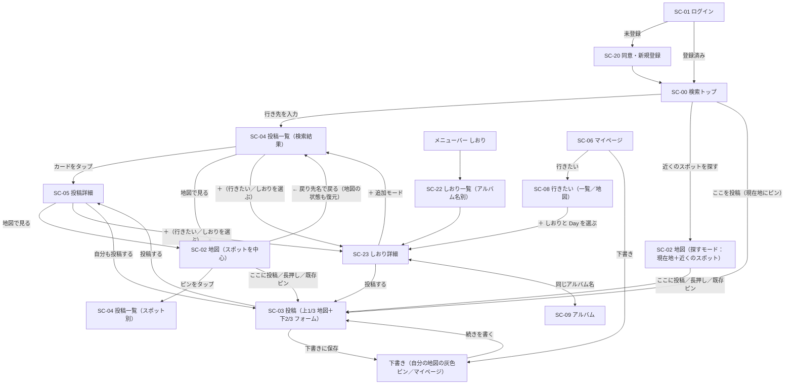
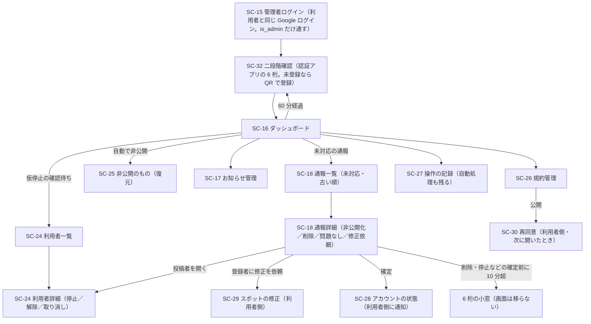

<!-- markdownlint-disable MD013 -->

# ワイヤーフレーム「タビコエ（tabikoe）」v2

> 出典: [request.md](request.md) v2（0章 主導線・画面一覧、3-1 機能要求、3-1-10 UI共通ルール）
> 位置づけ: 要件定義書 4.3「画面遷移図」・4.4「画面項目定義」の**別紙**。要件定義書 v3 改訂時に本書を参照する。
> 2026-09-16 更新: 画面を描きながら決めた変更（下記「本版で先行して描いた内容」）は、同日に要求定義書 v2「v2 改訂（2026-09-16）」へ反映済み。

スマートフォン幅（約 390px）を基準に描く。パソコン幅では、メニューバーが左サイドバーになり、投稿一覧・しおりは中央 520px 幅に収める（地図は全幅）。画面 ID は要件定義書 4.1 に揃える。

凡例: `[ボタン]` 押せる要素、`( )` ラジオ／タブ、`▢` 写真・サムネイル、`★☆` 星評価（黄色）、`…` 省略、`→ SC-xx` 遷移先。

## 配色（2026-09-16 決定）

「旅＝空」のイメージで、**空の青**をメインにする。検討した 3 案（青メイン／青下地＋暖色アクセント／空のグラデーション＋青）のうち「空のグラデーション＋青」を採用。

| 役割 | 色 | 使う場所 |
| --- | --- | --- |
| 下地 | `#FFFFFF`（白） | SC-00 以外の全画面の背景・ヘッダー |
| 空のグラデーション | `#BFDDF7` → `#E4F1FC` → `#F3F8FD`（上から下へ、画面の上 6 割まで） | **検索トップ（SC-00）のみ**。他の画面は白の単色 |
| 面 | `#FFFFFF`＋罫線 `#D9E4EF` | カード・入力欄・シート・メニューバー（下地も白なので枠線で区切る） |
| 淡い面 | `#F3F8FD`（空色寄りの白） | カテゴリチップ、選択中の並び替え、入力欄のプレースホルダ面 |
| 文字 | `#1E2A38`（紺） | 本文・見出し |
| 文字の上に載せる文字（2026-09-20 追加） | `#FFFFFF`。ダークでは `#0B1220` | 文字色を地にした黒地のボタン・帯・トースト（「この条件で表示」「閉じる」、表示切替の選択中、Day タブの選択中、番号バッジ）の文字。ダークでは地が明るくなるので暗い色にする。トースト内リンクは `#9CC8F5`（ダーク `#1F65B8`） |
| 薄い文字 | `#7B8794` | 補足・プレースホルダ・非選択のメニュー |
| 罫線 | `#D9E4EF` | カードの枠・区切り線 |
| アクセント | `#2F7FD8`（空の青）、押下時 `#1F65B8` | 主ボタン（「ここを投稿」「投稿する」「地図で見る」）、「＋」ボタン、リンク、通知バッジ、選択中のタブ・メニュー、ロゴ、**地図の現在地の点**（2026-09-26: ピンはカテゴリ色になったのでアクセント色を使わない） |
| 保存済み | `#D9414A`（赤） | 保存済みの**ハートのバッジ**と凡例。ダークでは `#F06B72`（2026-09-26: ピン全体の色ではなくバッジの色になった） |
| ピンのカテゴリ色（2026-09-26 追加） | グルメ `#E2703A` ／ 観光 `#C4478C` ／ 自然 `#3C8C5E` ／ 体験 `#7A57D1` ／ エンタメ `#D8425F` ／ ショッピング `#0E93A0` ／ 宿泊 `#9A6B33` ／ 無し `#7B8794` | 地図のピン。暗いテーマの値と記号は要件定義書 4.5.3 |
| 完了 | `#3D7A5C`（緑） | しおりのチェック済み、「投稿済み」、保存済みの「＋」 |
| 星 | `#F2B233`（黄） | 星評価 |
| 写真のプレースホルダ | `#DCE3EA` 系の青灰 | ワイヤーフレーム上のみ |

- **ロゴマーク（2026-09-26 決定）**：空の青 `#2F7FD8` の角丸四角（角丸 20／72）に、白い丸い吹き出し（中心 (36, 32.8)・半径 11.5）と下中央に伸びる尾（先端 (36, 51)）、そのまわりに広がる 2 本の輪（半径 22・白 60%／半径 30・白 28%）。吹き出し＝コエ、尾と輪＝タビと、声が伝わっていく波紋。文字は入れない（16 ピクセルでは読めないため）。ワイヤーフレーム中の `(ロゴ)` はすべてこの形。値は要件定義書 4.5.9 を正とする
- 地図上の**現在地の青い点は今までどおり**（2026-09-16 決定）。2026-09-26 にピンをしずく型＋カテゴリ色にしたので、**形（しずく ⇄ 丸）で現在地と区別する**。フォーカス中のピンは外側に淡い輪を付けて区別する
- 実装時は色をコンポーネントに直書きせず、`src/app/globals.css` の CSS 変数（`--color-*`）に集約してから置き換える
- **ダークモード（2026-09-16 対応決定）**：OS の設定（`prefers-color-scheme`）に追従する。真っ黒ではなく紺寄りの黒にする（下地 `#0B1220`、面 `#161E2B`、文字 `#E6EDF5`、薄い文字 `#8B97A6`、罫線 `#263142`、淡い面 `#1C2634`）。アクセントは暗い下地でも読めるよう一段明るい `#5AA2F0`、完了の緑は `#4CAF7D`。SC-00 のグラデーションは夜空（`#0E1E3D` → `#0B1220`）。地図は Google マップのダークスタイルを使う。キャンバスに SC-00／SC-02／SC-04 のプレビューあり（他の画面も同じ置き換え）。実装は色を CSS 変数に集約し、変数の切り替えで行う。地図は Google マップのダークスタイルを指定する

## 本版で先行して描いた内容（要求定義書 v2「v2 改訂（2026-09-16）」に反映済み）

| # | 内容 | 該当画面 |
| --- | --- | --- |
| 1 | 検索トップを「さがす・近くを見る・ここに投稿」の 3 つを持つ**ハブ**にする。「近くのスポットを探す」は地図を探すモードで開き、「ここを投稿」は**現在地にピンが刺さった SC-03 に直行**する（地図の投稿モードは設けない） | SC-00, SC-03 |
| 2 | **メニューバーは ホーム・しおり・通知・マイページ の 4 項目**（ホーム＝検索トップ、家のアイコン。9/16 に「さがす」から改称）。「地図」「投稿」は外し、地図へは検索トップの 2 ボタンとカードの「地図で見る」から入る。しおりは旅行中に開くものなので 1 タップで届く場所に置く | メニューバー |
| 3 | 地図からの投稿の入口 ~~3 つ~~ 2 つ：「ここに投稿」（現在地）／長押しでピン。~~既存ピンの吹き出し「投稿する」~~ → 09-25 に廃止し「投稿を見る」に変更（決定事項 50） | SC-02 |
| 4 | 投稿画面（SC-03）は**上 1/3 地図＋下 2/3 に実装済みの投稿フォーム（`/posts/new`）をそのまま**置く。地図は v1 の SC-19 と同じ**中央固定ピン**方式で、地図を動かすとピンの指す位置が変わる。その位置がスポット欄に入る | SC-03 |
| 5 | 投稿項目・必須は実装済みのまま（アルバム名・スポット・カテゴリ・滞在時間・星評価・写真が必須）。「一言」「行き方メモ」は追加しない。カードの引用は感想の冒頭 | SC-03, SC-04 |
| 6 | **下書き**：「下書きに保存」ボタン（写真も一言も無くて押せる）。途中で閉じても自動で下書きに残る。自分の地図に灰色の破線ピン、マイページ先頭に「下書き N 件」 | SC-02, SC-03, SC-06 |
| 7 | 投稿カードの見出しはスポット名。現在地があれば「徒歩 N 分」、最後に確認された日（「9月にまだあった」） | SC-04 |
| 8 | 投稿詳細に「まだあった／無くなっていた」「自分も投稿する」 | SC-05 |
| 9 | 手動登録スポット（Google マップに無い場所）に「タビコエだけの場所」ラベル | SC-04, SC-05 |
| 10 | 保存は「＋」→ 行きたいスポット／しおりの 2 択シート。しおりはアルバムとアルバム名でつながる | SC-04, SC-05, SC-22/23 |
| 11 | **しおりに「期間」（開始日〜終了日）を設定でき、期間に合わせた Day タブ（Day 1／Day 2／…）でスポットを日ごとに振り分ける**。日付未定のスポットは「未定」タブに置く | SC-23 |
| 12 | **マイページの「行きたい」**は保存したスポットを一覧／地図で切り替えて見られ、各スポットの「＋」からしおり（と Day）へ追加できる。しおり一覧の先頭にあった「行きたい」の入口は外す | SC-06, SC-08, SC-22 |
| 13 | しおり詳細のスポットに**到着予定時刻（任意・10 分刻み）**を付けられる。時間があるスポットは Day 内で時間順に自動で並び、無いものは手動順で末尾。Day タブの中はタイムライン風の見え方 | SC-23 |
| 14 | しおり詳細のスポットに**チェックボックス**。行った場所をチェックするとスポット名に取り消し線＋文字が薄くなる（位置は動かさない）。**自分が**この旅行でそのスポットに投稿したら自動でチェック（他のメンバーの投稿では変わらない）。Day タブに「2/4」の進捗 | SC-23 |
| 15 | しおり一覧（SC-22）には写真を置かない（タイトル・期間・スポット数だけ） | SC-22 |
| 16 | **配色を「空のグラデーション＋空の青」に変更**（下記「配色」）。v1 の生なり下地＋テラコッタは廃止 | 全画面 |
| 17 | 地図の「みんなの投稿／保存済み」タブを**廃止**し、1 つの地図に両方を出す。~~青＝みんなの投稿、赤＝保存済み~~ → 2026-09-26（決定事項 58）に**保存済みはハートのバッジ**へ変更。凡例は置く | SC-02, SC-08 |
| 18 | 投稿のカテゴリを **7 つ**（グルメ／観光スポット／自然・景勝地／体験・アクティビティ／エンタメ・イベント／ショッピング／宿泊施設）に変更 | SC-03, SC-04 |
| 19 | **ダークモードに対応する**（OS 設定に追従。配色は「配色」参照） | 全画面 |
| 20 | **しおりを共有できる**。アルバムと同じくオーナーが招待リンクを発行してメンバーを招待する（ルーム方式）。アルバムのメンバーであってもしおりに招待されていなければ見えない | SC-22, SC-23 |
| 21 | 写真ごとの説明文は**付けない**（要確認事項 2 の回答） | SC-03, SC-05 |
| 22 | ~~「一覧に戻る」は直前の投稿一覧に位置・条件を保って戻る。地図の表示位置は保持しない~~ → 09-18 に反転（32）。戻るは戻り先の画面名を出し、地図に戻ったときは直前の地図の状態も復元する | SC-02, SC-04 |
| 24 | メニューバーの左端を「さがす」から**「ホーム」（家のアイコン）**に改称 | メニューバー、SC-02・SC-04 の戻る |
| 23 | 帰宅後の投稿の道（しおり／下書き／スポット名検索）を明記し、**自宅の保護の確認**と「この付近の新しい場所」（遠隔で登録の無い場所を決める）を追加 | SC-03 |

## メンタリング 7 回目（2026-09-18）で決めたこと（要求定義書 v2「v2 改訂（2026-09-18）」・要件定義書 v3.1 に反映済み）

| # | 内容 | 該当画面 |
| --- | --- | --- |
| 25 | **用語の統一**：「旅行タイトル」→「アルバム」、「マイマップ」→「あしあと」、「近くの声」→「近くのスポット」、「いまいる場所に投稿する」→「ここを投稿」、しおりの「未定」タブ→左端の「ALL」 | 全画面 |
| 26 | 検索トップの下のグレーの案内文を削除 | SC-00 |
| 27 | 仮タイトル「今日の投稿（M/D）」を廃止し、アルバム欄が空の投稿は**「日常」アルバム**（1 人 1 つ、自動作成、変更・削除・招待・しおり不可）へ | SC-03, SC-06, SC-09 |
| 28 | **検索結果はスポット単位のカード**（スポット名・代表写真・★の平均・投稿件数・徒歩 N 分・まだあった・最新の感想 1 行・「＋」）。並び替えは 新着順／評価順／投稿数順。タップでスポット別の投稿一覧へ | SC-04 |
| 29 | **スポット別の投稿一覧と投稿詳細は上 1/3 に地図（見るだけ）、下 2/3 に内容**（SC-03 と同じシート構成、1：2）。「地図で見る」ボタンは廃止し、上の地図をタップすると SC-02 へ | SC-04, SC-05 |
| 30 | 写真タブ：検索結果は **1 スポットにつき新しい投稿から 5 枚まで**、スポット別は全部。写真（カード内の写真も）のタップは**投稿詳細へ直接**。モーダルは投稿詳細の中だけ | SC-04, SC-05 |
| 31 | 地図の吹き出しから「一覧」ボタンを廃止（本体タップで一覧へ）。左上の戻るは「一覧に戻る」ではなく**戻り先の画面名**（「← 大阪府」「← たこ焼き〇〇」） | SC-02 |
| 32 | **地図に戻ったときは直前の地図の状態（中心・ズーム・モード・徒歩圏）を復元する**（22 を反転） | SC-02 |
| 33 | しおり詳細：左端に **ALL** タブ（未定タブは廃止。日付なしは ALL にだけ出る）。期間は**年つき**で、期間・タイトルは**表示をタップして編集**（ボタン廃止、鉛筆マーク可）。**値段の表示を削除**。並べ替えは**ドラッグ**（上下ボタン廃止）。「地図で見る」は上 1/3 に地図を出し下に一覧を残す | SC-23 |
| 34 | しおり一覧：終わったしおりは薄くせず「済」の印。先頭に「行きたいスポット」の入口を戻す（12 の一部を撤回） | SC-22 |
| 35 | 名前はアルバムとしおりで 1 つ。アルバム画面の「名前を変更」は廃止（しおり詳細のタイトルから変更。しおりが無いアルバムはアルバム画面のタイトルをタップ） | SC-09, SC-23 |
| 36 | マイページ：下書きは 3 件＋「すべて見る」。「行きたい」の「解除」はゴミ箱マーク | SC-06, SC-08 |
| 37 | しおり（予定）とアルバム（記録）の画面統合は**次回のメンタリングで決める**（未決定） | SC-09, SC-23 |

## 画面遷移マップの見直し（2026-09-19）で決めたこと（要求定義書 v2「v2 改訂（2026-09-19）」・要件定義書 v3.2 に反映済み）

| # | 内容 | 該当画面 |
| --- | --- | --- |
| 38 | **スポット登録バッジ**（タビコエだけの場所を最初に登録した件数。1／3／5／10／20／30／50 件） | SC-10 |
| 39 | **滞在時間は 7 択**（30分以内／1時間以内／2時間以内／3時間以内／半日／1日／宿泊。必須のまま）。カテゴリ「宿泊施設」で未選択なら「宿泊」を自動入力（変更可）。絞り込みも 7 択 | SC-03, SC-04 |
| 40 | 写真タブの写真は**モーダル**で開く（30 の一部を戻す）。下部に**情報バー**（スポット名・★・滞在時間・費用）と**「この投稿を見る →」**。投稿詳細内のモーダルは拡大だけ | SC-04, SC-05 |
| 41 | しおり・アルバムに**アプリ内招待**（一緒だった人の候補＋ユーザー名検索 → 通知の「参加する」）。招待リンクは残す | SC-23, SC-09, SC-14 |
| 42 | 探すモードの「徒歩圏 ▾」→**「移動手段 ▾」**（徒歩 1km／自転車 3km／車 10km。「車で約 N 分」の目安。経路 API なし） | SC-02 |
| 43 | 上 1/3 地図＋下 2/3 シートの画面は**シートを上にスライドで全画面、下で 1：2**（2 段階スナップ）。共通部品 → 09-25 に **3 段階**へ（決定事項 54） | SC-03, SC-04, SC-05, SC-23 |
| 44 | **コメントへの返信**（X 方式。1 段の字下げ、「@名前 への返信」、3 件超は折りたたみ、返信通知、親削除は「削除されたコメント」の枠） | SC-04, SC-05 |
| 45 | スポット別の投稿カードに**最新コメント 1 件のプレビュー**と「コメント N 件をすべて見る」（返信を含む件数） | SC-04 |
| 46 | （2026-09-20）**戻るは全画面で直前の画面に戻る**。左上の戻るは戻り先の画面名（「← 東京都」「← マイページ」「← 行きたい」「← アルバム」「← 写真」「← 通知」「← あしあと」「← 地図」「← しおり」「← 投稿」）。リンクに `back=` を付けて数珠つなぎに渡す。無ければ各画面の既定（スポット別＝地図、投稿詳細＝投稿一覧、アルバム＝アルバム一覧、しおり＝しおり一覧、行きたい＝マイページ） | 全画面 |
| 47 | （2026-09-22）**SC-01 から「新規登録」の導線を撤去**（未登録者はログイン後に自動で SC-20）。SC-20 の同意は**利用規約・個人情報保護方針の 2 チェック**で両方必須。作成後はログイン画面を挟まず SC-00 へ | SC-01, SC-20 |
| 63 | （2026-09-29）**管理画面に入るときだけ認証アプリの 6 桁を必須にする**（要件 3.10.1）。`is_admin` の判定に加えて二段階確認（Supabase Auth の MFA。JWT の `aal` が `aal2`）を通す。未登録の管理者には **SC-32** で QR コードを出して登録させる。一度通ったら 30 日のセッションが切れるまで開けてしまうため **60 分で聞き直し**、**削除・停止・解除・仮停止の確定・ストライクの取り消し・規約の公開の前には 10 分以内の再確認**を求める（GitHub の sudo mode と同じ）。SC-32 はメニューバーを出さない（利用者向けも管理用も）。認証アプリを失ったときは開発者が Supabase 側で登録をやり直す（画面に解除の導線は作らない）。~~パスキーは Supabase Auth では experimental かつ主たる認証手段のため第 2 要素に使えず、採用しない~~ → **同日に訂正**。パスキーは `aal2` に上がる第 2 要素として SDK に実装されている（`FactorTypes` に `webauthn`）。今回採らないのは、公式の MFA ガイドに手順が無い・パスキーの API が実験的機能・関連ドメインの登録が本番と開発で別に必要、の 3 点による（提出後に検討。要件 9 章 未決定事項 No.13） | SC-32, SC-15〜18, SC-24〜27 |
| 62 | （2026-09-29）**投稿画面の自動保存を廃止し、「下書きに保存」を押したときだけ下書きを作る**（要件 3.3.7）。自動保存は「地図を動かした」だけでも走っていたため、ピンを合わせて画面を離れるたびに空の下書きが増えていた。あわせて **アルバム名を任意**に直し（要件 3.3.1。入力欄には前から「空なら『日常』に入ります」と出ているのに投稿ボタンが押せなかった）、**ホーム（SC-00）は上下に動かさない**（要件 3.4.1。置く要素は 3 つだけで元から画面に収まっているため） | SC-00, SC-03 |
| 61 | （2026-09-29）**規約の本文（/terms・/privacy）と再同意（SC-30）ではメニューバーを出さない**。規約は未ログインでも開ける「読むだけ」の画面、再同意は同意するまで先に進めない画面で、どちらも他の画面への導線を持たない。メニューバーは未読件数の取得などログイン前提の通信をするため、置くと同意前の利用者が締め出される（実際に「全文を読む」からログイン画面へ飛ばされる不具合が出た）。あわせて規約の本文に画面 ID **SC-31** を与えた（要件定義書 4.1・4.2） | SC-30, SC-31 |
| 60 | （2026-09-27）**管理画面を作り直す**。パソコン前提の共通の枠（左メニュー 7 項目、スマホは下のバー 5 項目）。ダッシュボードに対応が要るもの・数字・最近の動き。違反は**ストライク制**（人が確定した違反だけ数える。90 日で失効、5 つで仮停止）、投稿は異なる通報者 3 人で自動非公開。利用者の管理・非公開の復元・規約管理（版と再同意）・操作の記録を新設。本人に理由を通知し、マイページに「アカウントの状態」。管理画面の見た目は別キャンバス（https://claude.ai/artifact/KoY91teZdaTPQahdk2LEhM）を正とする（要件定義書 3.10） | SC-16〜18, SC-24〜30, SC-06 |
| 59 | （2026-09-26）**探すモードのバスの半径を 5km → 8km に広げる**。半径は「移動にかけてよい時間」で揃えており、バスだけ約 25 分と短かったため約 40 分ぶんに合わせる（要件定義書 3.4.6） | SC-02（探すモード） |
| 58 | （2026-09-26）**地図のピンをしずく型にし、色と中の記号でカテゴリ 7 つを表す**。色が表していた状態（保存済み・自分の投稿）は**右肩の小さなバッジ**に移す。スポットのカテゴリは「公開投稿でいちばん多いカテゴリ、同数なら新しい方」。凡例は状態だけにし、カテゴリ名は吹き出しに出す。**しおりの番号ピンも形だけ しずく型**にする（Day の色と番号はそのまま。1 番目の色が現在地と同じ青のため）。**あしあと（SC-12）もカテゴリ色**にする（値は要件定義書 4.5.3） | SC-02, SC-08, SC-12 |
| 57 | （2026-09-26）**全画面の地図はモードを問わず現在地を出す**（地図は動かさず点を出すだけ）。スポット一覧の上の地図から全画面にしても青い点が出なかったため。**あしあと・投稿作成/編集・上部の地図・スポット手動登録モーダルには出さない**（要件定義書 4.5.10） | SC-02 |
| 56 | （2026-09-26）**ロゴとファビコンを決めた**。空の青 `#2F7FD8` の角丸四角に、**白い丸い吹き出し（下中央に尾）**と**広がる 2 本の輪**（波紋）。文字は入れない。ロゴ・ファビコン・ホーム画面のアイコン・ログイン画面はすべて同じ形にする（値は要件定義書 4.5.9） | 共通, SC-00, SC-01, SC-20 |
| 55 | （2026-09-25）地図の**拡大縮小ボタン（＋ −）は指で触れる端末では出さない**（ピンチで操作。パソコンでは出す）。上部の地図では端末を問わず出さない | SC-02, SC-03, SC-04, SC-05, SC-23 |
| 54 | （2026-09-25）**上部の地図を 2 本指で拡大・縮小・移動できる**ようにし、全画面の地図への入口は**右下のボタンだけ**に（地図全体のタップは廃止）。あわせて**シートを 3 段階**（地図 2/3・地図 1/3・全画面）に。SC-03 は 2 段階のまま | SC-04, SC-05, SC-23 |
| 53 | （2026-09-25）探すモードの**カードのタップを 2 段階**に。選ばれていないカード＝中央へ寄せて地図を動かし**吹き出しを開く**、選ばれているカード＝**そのスポットの投稿一覧**へ。戻ったときは吹き出しまで復元し、**ホームを開いたらリセット**（現在地・徒歩の初期値に戻る） | SC-02（探すモード） |
| 52 | （2026-09-25）**未ログインのホーム（SC-00）は SC-01 と同じ内容をその場に出す**。「はじめる」→ ログインの 2 段階を廃止。文言はキャッチフレーズ「あなたのコエが、だれかのタビへ。」に統一。空のグラデーションはホームだけに残す（`/login` は白地のまま） | SC-00, SC-01 |
| 51 | （2026-09-25）**地図に戻ったら「詳細を見る前に見ていた画面」をそのまま出す**。探すモードでは現在地の取り直しを待たず、中心・ズーム・移動手段・**選んでいたカード**を復元する（毎回初期値に戻っていた） | SC-02 |
| 50 | （2026-09-25）地図の吹き出しの**「投稿する」を「投稿を見る」に変更**（そのスポットの投稿一覧へ）。吹き出しからの投稿は廃止し、投稿は右下の「ここに投稿」と長押しから | SC-02 |
| 49 | （2026-09-25）探すモードの移動手段に**電車・バス**を追加（半径 15km／~~5km~~ → 2026-09-26 に **8km**。決定事項 59）。**車・電車・バスは Routes API の実測**（渋滞・時刻表）。徒歩は直線距離 ÷ **60m/分**（80 から変更）、自転車は ÷ **180m/分**。表示は**「〈移動手段〉 約 N 分」で統一**。スポットカードの徒歩も同じ基準に | SC-02（探すモード）, SC-04 |
| 48 | （2026-09-22）**入口は「Google で続ける」1 つ、Google のアカウント選択は 1 回だけ**（X と同じ）。未登録なら認証状態を保持したまま SC-20 へ進み、「〈メール〉として登録します」＋2 チェック＋「同意してはじめる」「やめる」。SC-20 に Google のボタンは置かない。未ログインの SC-00 は「はじめる」1 ボタン | SC-00, SC-01, SC-20 |

---

## 0. 画面遷移図（主導線）



---

## 共通メニューバー（全画面下部。SC-00 未ログイン・SC-01・SC-20・**SC-30 規約の再同意**・**SC-31 規約の本文（/terms・/privacy）**・**SC-32 管理者の二段階確認** では非表示。管理画面は利用者向けのバーの代わりに管理用のバーを出す：下記「管理画面」。SC-32 は管理用のバーも出さない）

```
┌──────────────────────────────────────┐
│    🏠         🔖         🔔¹        👤    │
│   ホーム      しおり      通知     マイページ │
└──────────────────────────────────────┘
    SC-00       SC-22      SC-14       SC-06
```

- **4 項目**。「地図」「投稿」は置かない。地図へは検索トップ（SC-00）の「近くのスポットを探す」「ここを投稿」と、投稿カード・詳細の「地図で見る」から入る
- 左端は「ホーム」（家のアイコン。検索トップ＝ハブに戻る）。「さがす」ではなく「ホーム」にしたのは、ハブが さがす・近くを見る・ここに投稿 の 3 つを持つため。「ホーム」（旅行前）と「しおり」（旅行前〜旅行中）を隣に並べる。しおりは旅行中に次の場所を確かめる用途があるので、どの画面からも 1 タップで届くようにする
- 「通知」には未読件数バッジ（¹）。パソコンでは同じ 4 項目を左サイドバーに縦に並べる

---

## SC-00 検索トップ（ログイン後の着地点）

### ログイン後

```
┌──────────────────────────────────────┐
│                                      │
│              (ロゴ)                   │
│             タビコエ                  │
│                                      │
│  ┌──────────────────────────────┐    │
│  │ 🔍 どこへ行く？                │    │  → 入力で候補 → SC-04（さがす）
│  └──────────────────────────────┘    │
│                                      │
│  ┌──────────────────────────────┐    │
│  │ ◎ 近くのスポットを探す         │    │  → SC-02 探すモード（近くを見る）
│  └──────────────────────────────┘    │
│  ┌──────────────────────────────┐    │
│  │ ＋ ここを投稿                  │    │  → SC-03（現在地にピンが刺さった状態）
│  └──────────────────────────────┘    │
│                                      │  ← 案内文（グレー文字）は置かない（09-18）
├──────────────────────────────────────┤
│   🔍      🔖      🔔      👤       │
└──────────────────────────────────────┘
```

- 検索トップは**「行き先の入力・近くのスポットを探す・ここを投稿」の 3 つを持つハブ**。このアプリでできることが着地点だけで分かる。ボタンの下に説明の文字は置かない
- 3 つの並びは「行き先を決めている人」→「今いる場所で探す人」→「今いる場所で投稿する人」の順。「ここを投稿」はアクセント色（空の青）で、他 2 つより一段目立たせる。この画面だけ背景の上部に空のグラデーションを敷く（「配色」参照）
- 「ここを投稿」は現在地にピンを刺した状態で SC-03 を開く（地図画面は挟まない）。下 2 つは位置情報の許可を求め、拒否されたら「行き先を入力してください」と検索窓にフォーカスする（投稿の場合は東京駅周辺を中心に SC-03 を開き、上の地図を動かして場所を合わせる案内を出す）

### 入力中（候補表示）

```
┌──────────────────────────────────────┐
│  ┌──────────────────────────────┐    │
│  │ 🔍 おおさ|                    │    │
│  └──────────────────────────────┘    │
│  ┌──────────────────────────────┐    │
│  │ 📍 大阪府            都道府県  │ → SC-04（都道府県一致）
│  │ 📍 大阪駅            駅        │ → SC-04（周辺 5km）
│  │ 🏷 大阪城            スポット   │ → SC-04（スポット別）
│  │ 🏷 大阪たこ焼き〇〇   スポット   │
│  └──────────────────────────────┘    │
└──────────────────────────────────────┘
```

- 候補は「都道府県 → 駅・市区町村（Geocoding）→ 登録済みスポット」の順、最大 8 件

### 未ログイン（2026-09-25: SC-01 と同じ内容をその場に出す）

```
┌──────────────────────────────────────┐
│              (ロゴ)                   │
│             タビコエ                  │
│  あなたのコエが、だれかのタビへ。      │
│                                      │
│                                      │
│      [ G Google で続ける ]           │ → 認証 →（未登録なら SC-20）→ SC-00
└──────────────────────────────────────┘
```

---

## SC-01 ログイン ／ SC-20 同意・新規登録

```
SC-01                                    SC-20（SC-01 で未登録と判定された時のみ）
┌──────────────────────────────┐         ┌──────────────────────────────┐
│          (ロゴ)               │         │          (ロゴ)               │
│         タビコエ              │         │  yamada@gmail.com として      │
│ あなたのコエが、だれかのタビへ。│  未登録  │  登録します                   │
│   [ Google で続ける ]        │ ──────▶ │  ☐ 利用規約 に同意する        │
│                              │         │  ☐ 個人情報保護方針 に同意する │
│  エラー時のみ:               │         │   [ 同意してはじめる ]        │ → SC-00
│  「ログインに失敗しました…」  │         │        やめる                 │ → SC-01
└──────────────────────────────┘         └──────────────────────────────┘
```

- 入口は SC-01 の「**Google で続ける**」1 つ（X と同じ。ログインと新規登録を区別しない。2026-09-22）。「新規登録」の導線は置かない
- Google のアカウント選択は **1 回だけ**。未登録なら認証状態を保持したまま SC-20 へ。SC-20 に Google のボタンは置かない
- SC-20 の同意は**利用規約**と**個人情報保護方針**の 2 つのチェックに分け、両方にチェックするまで「同意してはじめる」を押せない。作成後はログイン画面を挟まず SC-00 へ。「やめる」で認証状態を破棄して SC-01 へ
- 「認証済みだが未登録」の間は SC-20 以外の画面を開けない（開くと SC-20 へ戻る）

---

## SC-02 地図

同じ画面を「探すモード」と「スポット中心」の 2 つで開く。置く要素は「凡例・現在地・ここに投稿・（必要なときだけ）戻る」に限る。**タブは置かず、1 つの地図に「みんなの投稿」と「保存済み」（行きたい・しおりのスポット）を同時に出す**（2026-09-26: 見分けは色ではなく**ハートのバッジ**。決定事項 58）。**投稿専用のモードは設けない**（投稿は SC-03 に直行する）。

地図から投稿する入口は 3 つ（いずれも SC-03 へ直行。どのモードでも使える）。

```
① 現在地                 ② 長押しでピン               ③ 既存のピンをタップ
   [＋ ここに投稿]           ┌──────────────┐            ┌──────────────────┐
   （右下に常時表示）         │ 📍 この地点     │            │ たこ焼き〇〇      › │  ← 本体をタップ → SC-04（スポット別）
                            │ [ここに投稿]   │            │ ★4 ・ 7件 ・ 9月にまだあった│
                            └──────┬───────┘            │ [投稿する]         │  ← 「一覧」ボタンは置かない（09-18）
                                   ▼                     └────────┬─────────┘
                              SC-03（その点にピン）                 ▼
                                                          SC-03（そのスポットにピン）
```

- ①：目の前の場所（最頻）。②：現在地とずれている・さっき通った場所。③：誰かが登録済みの場所に自分も行った
- 自分の下書きは灰色の破線ピン（◌）で表示（自分だけに見える）。タップ →「続きを書く」で SC-03
- 現在地は青い円。精度が悪いと円が大きくなる。**モードを問わず出す**（2026-09-26 決定事項 57。地図は動かさず点を出すだけ）
- ピン（2026-09-26 決定事項 58 で全面改訂）：形は**しずく型**（先端が座標を指す）。**色と中の記号がカテゴリ**（グルメ＝オレンジ・フォーク／観光＝ピンク・カメラ／自然＝緑・山／体験＝紫・旗／エンタメ＝赤・チケット／ショッピング＝青緑・袋／宿泊＝茶・ベッド／無し＝灰・点）。**保存済みは右肩に赤いハートのバッジ**、自分の投稿は緑のチェックのバッジ（両方ならハート）。灰の破線のしずく＝自分の下書き。しおり表示（下記）のときだけ番号ピン。スポットのカテゴリは「公開投稿でいちばん多いカテゴリ、同数なら新しい方」

### 探すモード（SC-00「近くのスポットを探す」から。現在地中心、近くのスポットを下に出す）

```
┌──────────────────────────────────────┐
│ ← ホーム    ▾ みんなの投稿  ♥ 保存済み  │  ← タブではなく凡例（状態だけ。色はカテゴリなので凡例に出さない）
│                                      │
│        ●                             │
│              ◎ ← 現在地              │
│                    ●        [＋ ここに投稿]│  ← 探すモードでも右下に常時表示
│   ●                                  │
├──────────────────────────────────────┤
│ 近くのスポット            移動手段 ▾ │  ← 下 1/3 に近い順のカード（横スクロール）。移動手段＝徒歩／自転車／車（09-19）
│ ┌────────────┐ ┌────────────┐        │
│ │ 〇〇展望台   │ │ 無人の直売所 │        │  ← 見出し＝スポット名
│ │ 駐車場から  │ │ トマトが   │        │  ← 感想の冒頭
│ │ 見える夕日  │ │ 100円      │        │
│ │ ▢ 徒歩 6分  │ │ ▢ 徒歩 12分 │        │  ← 自転車なら「自転車で約 8 分」、車なら「車で約 12 分」
│ └────────────┘ └────────────┘        │
├──────────────────────────────────────┤
│   🔍      🔖      🔔      👤       │
└──────────────────────────────────────┘
```

- カードの見出しはスポット名、その下に感想の冒頭。タップで SC-05。「移動手段 ▾」で 徒歩（半径 1km）／自転車（3km）／車（10km）／電車（15km）／バス（8km）を切替（09-19、09-25 に電車・バスを追加）。車・電車・バスは Routes API の実測（渋滞・時刻表を反映）、徒歩は直線距離 ÷ 60m/分、自転車は ÷ 180m/分。表示は「徒歩 約 6 分」「自転車 約 12 分」「車 約 12 分」で統一
- カードを横にめくると地図のピンが連動して強調される

### 投稿一覧・投稿詳細の上部の地図をタップして開いた表示（スポットを中心）

```
┌──────────────────────────────────────┐
│ ← たこ焼き〇〇                        │  ← 戻り先の画面名を出す（「← 大阪府」「← ホーム」「← しおり」も同様）。押すと直前の画面に位置・条件を保って戻る
│   ▾ みんなの投稿  ♥ 保存済み  ◌ 下書き   │  ← 凡例（状態だけ。▾＝しずく型のピン）
│                ┌───────────────┐     │
│                │ たこ焼き〇〇  › │     │  ← 対象スポットを中心に、吹き出しで強調。本体タップで SC-04（スポット別）
│                │ ★4 ・ 7件      │     │
│                │ (＋) [投稿を見る]│     │  ← 09-25: 「投稿する」→「投稿を見る」（投稿は右下のボタンと長押しから）
│                └───────┬───────┘     │
│                        ●             │
│         ●                    ●       │
│                              [◎現在地]│
│                          [＋ ここに投稿]│
└──────────────────────────────────────┘
```

- **地図の状態の復元（09-18）**：この地図から詳細（SC-04／SC-05）へ行き、戻る（左上・ブラウザの戻る）で地図に帰ってきたときは、直前に見ていた中心・ズーム・モード（探すモードなら徒歩圏も）をそのまま出す。別の入口から新しく開いたときだけ初期位置で開く

### しおりの地図をタップして全画面にした表示

```
┌──────────────────────────────────────┐
│ ← しおり          大阪旅行             │  ← 戻るとしおり詳細（上 1/3 の地図つき）へ
│        ①                             │  ← しおりの全スポットに訪問順の番号
│                    ②                 │     全体が収まる範囲で表示
│              ③          ④           │
│                    ⑤                 │
│                              [◎現在地]│
└──────────────────────────────────────┘
```

---

## SC-03 投稿作成・編集（上 1/3 地図＋下 2/3 に実装済みのフォーム）

どの入口から入っても同じ画面。下 2/3 は **v1 で実装済みの `/posts/new`（`PostForm`）をそのまま**置き、項目・順序・必須条件は変えない。変わるのは「上に地図が付く」ことと「スポット欄に地図の位置が入った状態で開く」ことだけ。

上 1/3 の地図は **v1 の手動登録モーダル（SC-19）と同じ中央固定ピン方式**。ピンは画面中央に固定され、**地図をドラッグ・ピンチで動かすと、ピンが指す位置（＝投稿の位置）が変わる**。微調整も大きな移動もこれ一つで済む。

```
┌──────────────────────────────────────┐
│ ← 戻る                       [◎現在地]│  ← 現在地に戻す
│           （地図：上 1/3、約 280px）    │
│  地図を動かしてピンを合わせる／現地でなければ「変更」から │  ← 初回だけ出す
│                  📍                   │  ← 中央固定ピン。地図側を動かす（SC-19 と同じ）
├──────────────────────────────────────┤  ← ここから下 2/3（約 560px）。項目は同じまま 2 列に詰めてスクロールを減らす
│ アルバム *       [ 日常               ▾ ]│  ← ラベルと入力を横並び（1 行）。空なら「日常」に入る
│ スポット名 *     [ 📍 この場所（新しい場所）変更 ]│  ← 同上。近くに登録済みがあればその名前
│ カテゴリ *       [ グルメ                ▾ ]│  ← 7 択のドロップダウン（横スクロールのチップはやめる）
│ ┌─ 日付（任意） ─────┐ ┌─ 滞在時間 * ───────┐│  ← 2 列
│ │ 2026/09/16      ▾ │ │ 1時間以内        ▾ ││     滞在時間は 7 択のドロップダウン（…3時間以内／半日／1日／宿泊。09-19）。カテゴリ「宿泊施設」で未選択なら「宿泊」が入る
│ └───────────────────┘ └───────────────────┘│
│ ┌─ 費用（任意・1人）──┐ ┌─ 星評価 * ─────────┐│  ← 2 列
│ │ ¥ [      1200 ]   │ │ ★★★★☆             ││
│ └───────────────────┘ └───────────────────┘│
│ 写真・動画 *                           │
│ ┌────┐┌────┐┌────┐┌ ─ ─┐               │  ← 選んだ写真・動画はここに並ぶ（動画は ▶ 印）。横スクロール
│ │ ▢  ││ ▢ ▶││ ▢  │  ＋  │               │     各サムネの右上に × で削除
│ └────┘└────┘└────┘└ ─ ─┘               │
│ ⚠ 写り込み・個人情報に注意 [詳しく]    │  ← 注意文は 1 行に畳み、「詳しく」で全文
│ 感想（任意）                  公開 ▾   │  ← 公開設定はラベル行の右端に
│ ┌──────────────────────────────┐     │
│ │                              │     │  ← 2 行分。入力すると伸びる
│ └──────────────────────────────┘ 残り4,000│
├──────────────────────────────────────┤
│   [ 投稿する ]      [ 下書きに保存 ]   │  ← 下に固定
└──────────────────────────────────────┘
```

- **入力項目は既存と同じ**（アルバム名・スポット名・カテゴリ・日付・滞在時間・費用・星評価・写真・動画・感想・公開設定）。変えたのは配置だけ
- スクロールを減らす手立て：①ラベルと入力欄を横並びに（アルバム名・スポット名）、②日付／滞在時間、費用／星評価を 2 列に、③滞在時間はチップ 5 個からドロップダウンに、④カテゴリもチップ 5 個からドロップダウンに、⑤注意文を 1 行に畳む、⑥感想は 2 行から始めて入力で伸びる、⑦公開設定を感想のラベル行に寄せる
- 写真・動画は「＋」で選ぶとその場でサムネイルが並ぶ（動画は先頭フレームに ▶）。× で外せる。既存の `PostForm` の写真表示と同じ部品
- この配置で、写真を 1〜3 点選んだ状態なら**下 2/3 の中でスクロールなしに全項目が見える**（感想が長い場合のみ伸びる）

- 既存フォームからの変更点は 3 つだけ：①スポット名欄が地図の中心位置で埋まっている（「変更」で従来どおり検索もできる。検索で選ぶと地図がそのスポットへ移動する）、②アルバムが空なら「日常」アルバムに入る（1 人 1 つ、自動作成）、③「下書きに保存」ボタン
- 既存スポット（③既存ピンやしおりから来た場合）を選んでいるときは、地図を動かしても位置は変わらない（そのスポットにピンが固定される）。「変更」→「新しい場所」を選ぶと中央固定ピンに戻る
- **現地にいないとき**（帰宅後の投稿）：入口は しおりの「投稿する」／下書きの「続きを書く」／検索トップでスポット名を検索 → スポット別一覧の「投稿する」。登録の無い場所は「変更」の名前検索で近くの候補を選び、吹き出しの「この付近の新しい場所」で固定を外して地図を動かす
- **自宅の保護**：現在地から開いて、地図を動かさず登録スポットも選ばずに「新しい場所」のまま「投稿する」を押すと、「この位置に新しいスポットを登録して公開します。自宅など公開したくない場所ではありませんか？」［投稿する］［場所を変える］の確認を出す
- **「下書きに保存」は必須項目が埋まっていなくても押せる**（位置だけの下書きが成立）。戻る・閉じるで離れた場合も自動で下書きに残す
- 「投稿する」の有効条件は既存どおり（必須項目がすべて埋まっていること）
- シートを上に引くと全画面（地図は隠れる）、下に引くと 1：2 に戻る

### 入口ごとの初期状態

| 入口 | 地図に出るもの | スポット名欄 | その他 |
| --- | --- | --- | --- |
| SC-00「ここを投稿」／地図の「ここに投稿」 | 現在地を中心に開く（中央固定ピン） | 「この場所（新しい場所）」。近くに登録済みがあればそれを選択済み | 日付＝今日 |
| 地図の長押し | 指した点を中心に開く | 同上 | 同上 |
| 既存ピン／SC-05「自分も投稿する」／スポット別一覧 | そのスポットのピン | そのスポット | — |
| しおりの「投稿する」 | そのスポットのピン | そのスポット | アルバム名＝しおりのタイトル |
| 下書きの「続きを書く」 | 下書きの位置 | 保存していた内容 | 保存していた内容 |
| 編集 | 投稿のスポットのピン | 投稿のスポット | 投稿の内容。「変更」→「新しい場所」で地図を動かして選び直せる |

### パソコン幅

```
┌──────────┬────────────────┬──────────────────────────────────┐
│ サイドバー│   地図（1）      │   既存フォーム（2）                │
│          │      📍         │   アルバム名 * …                │
│          │                 │   スポット名 * 📍 この場所 …       │
│          │                 │   …                              │
│          │                 │   [投稿する] [下書きに保存]        │
└──────────┴────────────────┴──────────────────────────────────┘
```

---

## SC-04 投稿一覧（検索結果はスポット単位、スポット別は上 1/3 地図＋投稿カード）

### 検索結果（行き先：大阪府）— スポットカードの縦一列（09-18 改訂）

```
┌──────────────────────────────────────┐
│ ← ホーム      大阪府           [絞り込み ²]│
│ (● 投稿)( ○ 写真 ⁸ )   [新着順 ▾]  32スポット│  ← ⁸ 写真だけを見る切替
│                        ┌─────────┐   │
│                        │ ● 新着順  │   │  ← 並び替えは 1 つのボタン。押すとドロップダウンで
│                        │ ○ 評価順  │   │     評価順・投稿数順を選ぶ（3 つを横に並べない）
│                        │ ○ 投稿数順│   │
│                        └─────────┘   │
├──────────────────────────────────────┤
│ ┌──────────────────────────────────┐ │
│ │ ┌──────┐ たこ焼き〇〇   タビコエだけの場所 ⁶│  ← 見出し＝スポット名。⁶ 手動登録スポットに付くラベル
│ │ │  ▢   │ ★4.2 ・ 投稿 7 件 ・ 徒歩 8分  │  ← 徒歩は現在地があるときだけ
│ │ │      │ 「外はカリッと中はとろとろ。…」 │  ← 最新の投稿の感想 1 行
│ │ └──────┘ 9月にまだあった ⁷          (＋)│  ← ⁷ 最後に「まだあった」報告があった月
│ └──────────────────────────────────┘ │  ← カード全体をタップ → スポット別の投稿一覧（下記）
│ ┌──────────────────────────────────┐ │
│ │ ┌──────┐ 中之島 △△カフェ              │
│ │ │  ▢   │ ★3.5 ・ 投稿 3 件             │
│ │ │      │ 「川沿いのテラス席が気持ちいい」│
│ │ └──────┘                        (＋)│
│ └──────────────────────────────────┘ │
│ …（スクロールで 20 件ずつ追加）        │
├──────────────────────────────────────┤
│   🔍      🔖      🔔      👤       │
└──────────────────────────────────────┘
```

- 検索結果は**投稿ではなくスポットのカード**を並べる（同じスポットの投稿が何件も並ばず、行き先にどんな場所があるかが一目で分かる）
- スポットカード：スポット名（見出し）・代表写真（最新の投稿の 1 枚目）・★の平均・投稿件数・徒歩 N 分・最新の感想 1 行・まだあった・「＋」
- 並び替えは「新着順（最新の投稿）／評価順（★の平均）／投稿数順」。絞り込みは「条件に合う投稿があるスポット」を出す
- 追加モード中はカードの「＋」でそのしおりに直接入る

### スポット別（スポットカード・地図のピン・スポット名検索から）— 上 1/3 地図＋投稿カード（09-18 改訂）

```
┌──────────────────────────────────────┐
│ ← 大阪府                              │  ← 戻り先の画面名（検索結果へ。地図から来たときは「← 地図」）
│                                      │
│              📍 たこ焼き〇〇          │  ← 上 1/3 は地図（見るだけ。そのスポットのピン 1 本）
│                                      │     タップすると SC-02（このスポット中心）へ
├──────────────────────────────────────┤  ← ここから下 2/3 はシート。上に引くと全画面、下に引くと 1：2 に戻る
│ たこ焼き〇〇   タビコエだけの場所   [絞り込み]│
│ 大阪府 ・ 投稿 7 件 ・ 9月にまだあった  │
│ (＋)  [投稿する]                      │  ← 「投稿する」→ SC-03（スポット確定）。「地図で見る」は置かない
│ (● 投稿)( ○ 写真 )   [新着順 ▾]      │  ← 「写真」でそのスポットの写真を全部。並び替えは 新着順／評価順／いいね順
│ ┌──────────────────────────────────┐ │
│ │ 👤 たろう               訪問 9/3   │ │
│ │ 外はカリッと中はとろとろ。行列は  │ │  ← 感想の冒頭 2 行
│ │ 15分ほどで入れた。…              │ │
│ │ ★★★★☆ 星4   ¥1,200/人   グルメ  │ │
│ │ ┌────────────┬───────────┐       │ │
│ │ │    ▢       │   ▢       │       │ │  ← 写真をタップ → SC-05（モーダルは出さない）
│ │ │            ├───────────┤       │ │
│ │ │            │   ▢  +2   │       │ │
│ │ └────────────┴───────────┘       │ │
│ │ ♥ 12   💬 3                  (＋)  │ │  ← 💬 の件数は返信を含む
│ │ けんた 行列すごかった              │ │  ← 最新のコメント 1 件のプレビュー（09-19）
│ │ コメント 3 件をすべて見る           │ │  ← 押すとカードの直下にコメント欄が展開
│ └──────────────────────────────────┘ │
│ …（スクロールで 20 件ずつ追加）        │
├──────────────────────────────────────┤
│   🔍      🔖      🔔      👤       │
└──────────────────────────────────────┘
```

- 投稿カードの見出し（スポット名）は置かない（上の見出しにある）。カード全体（写真を含む）のタップで SC-05
- 「💬 3」または「コメント 3 件をすべて見る」を押すとカードの直下にコメント欄が展開する。コメントが無いカードにはプレビューの行を出さない

### 写真だけを見る（⁸「写真」に切り替えた状態）

```
┌──────────────────────────────────────┐
│ ← ホーム      大阪府           [絞り込み]│
│ (○ 投稿)( ● 写真 )   [新着順 ▾]        │  ← 絞り込み・並び替えはそのまま効く
├──────────────────────────────────────┤
│ ┌────┐┌────┐┌────┐                   │
│ │ ▢  ││ ▢  ││ ▢ ▶│                   │  ← 正方形グリッド（列数は画面幅で可変）、動画は再生アイコン
│ └────┘└────┘└────┘                   │
│ ┌────┐┌────┐┌────┐                   │
│ │ ▢  ││ ▢  ││ ▢  │                   │
│ └────┘└────┘└────┘                   │
│ …（スクロールで 40 点ずつ追加）        │
├──────────────────────────────────────┤
│   🔍      🔖      🔔      👤       │
└──────────────────────────────────────┘
```

- 検索結果の写真は **1 スポットにつき新しい投稿から 5 枚まで**（人気スポットの写真だけで埋まらないように）。スポット別の写真はそのスポットの全部
- 並び順は投稿タブと同じ（検索結果はスポットの順、スポット別は投稿の順。同じ投稿の写真は添付順にまとまる）
- **タップでモーダル**（09-19。09-18 の「投稿詳細へ直接」を戻す）。左右で同じグリッドの前後へ送れる

### 写真タブのモーダル（写真をタップした状態。09-19）

```
┌──────────────────────────────────────┐
│ [×]                          3 / 18 │
│                                      │
│                                      │
│  ‹          ▢（写真・動画）        ›  │  ← 左右・スワイプで前後。動画はここで再生
│                                      │
│                                      │
├──────────────────────────────────────┤
│ たこ焼き〇〇  タビコエだけの場所       │  ← 情報バー：スポット名
│ ★★★★☆ 星4 ・ 滞在 30分以内 ・ ¥1,200/人│  ← ★・滞在時間・費用
│ 👤 たろう  訪問 9/3   [この投稿を見る →]│  → SC-05
└──────────────────────────────────────┘
```

- 情報バーは写真タブのモーダルだけ。SC-05 の中のモーダルは写真の拡大だけ（情報は下にあるため）
- 投稿カードの写真（スポット別一覧の中）のタップは SC-05 へ直接のまま

### 絞り込みパネル（² を押すと下からシート表示）

```
┌──────────────────────────────────────┐
│ 絞り込み                        [閉じる]│
│ 予算（1人あたり）                     │
│  ( ) 指定なし ( ) 〜1,000円 ( ) 〜3,000円 ( ) 〜5,000円 ( ) 5,000円〜│
│ 期間（訪問日）                        │
│  ( ) 指定なし ( ) 今月 ( ) 先月 ( ) 日付指定 [   ]〜[   ]│
│ カテゴリ（複数選択）                  │
│  ☐ グルメ ☐ 観光スポット ☐ 自然・景勝地 ☐ 体験・アクティビティ│
│  ☐ エンタメ・イベント ☐ ショッピング ☐ 宿泊施設      │  ← 7 カテゴリ（2026-09-16 決定）
│ 滞在時間                              │
│  ( ) 指定なし ( ) 30分以内 ( ) 1時間以内 ( ) 2時間以内│
│  ( ) 3時間以内 ( ) 半日 ( ) 1日 ( ) 宿泊     │  ← 投稿と同じ 7 択（09-19）。旧「それ以上」は半日／1日／宿泊のどれでも含める
│ 距離（駅・スポット検索・現在地のときのみ）│
│  ( ) 500m ( ) 1km ( ) 3km ( ) 5km    │
│  [条件をクリア]        [この条件で表示]│
└──────────────────────────────────────┘
```

### カード上のコメント展開（「💬 3」を押した状態）

```
│ │ ♥ 12   💬 3 ▴     [🗺 地図で見る]   (＋)  │
│ ├──────────────────────────────────┤ │
│ │  👤 けんた  9/4  「行列すごかった」   [削除]│  ← 自分のコメントだけ右端に削除
│ │     ↳ 👤 あい 9/5 @けんた への返信      │  ← 返信は 1 段だけ字下げ（09-19）。返信への返信も同じ段
│ │       「私は 30 分待ちました」  [返信] [通報]│
│ │     [返信をさらに 2 件見る]             │  ← 3 件を超えたら折りたたみ
│ │  👤 あい    9/5  「昼前が空いてる」  [返信]│
│ │  [もっと見る]                       │ │
│ │ ┌────────────────────────┐[投稿]  │ │
│ │ │ @けんた ×  返信を書く…   │        │ │  ← 「返信」を押すと @名前 が入る。× で通常のコメントに戻る
│ │ └────────────────────────┘        │ │
│ └──────────────────────────────────┘ │
```

- 親コメントを削除すると「削除されたコメント」の枠だけ残り、返信は読める（返信が無ければ枠も消える）

### 保存先を選ぶシート（「＋」を押した時。1 枚・2 段構成）

```
┌──────────────────────────────────────┐
│ 保存先                           [完了]│
│ ☐ 🔖 行きたいスポット       12 件      │  ← 上段: 仮置き。1 タップで確定
│ ─────────────────────────────────── │
│ しおり                                │  ← 下段: アルバム名別
│ ☑ 大阪旅行                5 スポット   │
│ ☐ 北海道旅行              3 スポット   │
│ ＋ 新しいしおりを作る                  │
│      ┌────────────────────────┐      │
│      │ アルバム名（例: 大阪旅行）│      │  ← 作ったしおりは同名のアルバムとつながる
│      └────────────────────────┘      │
└──────────────────────────────────────┘
```

- チェックを付ける／外すだけで保存・削除が確定する。行きたいスポットとしおりの両方に入れてもよい
- しおりにチェックすると、そのしおりに期間があれば Day の選択（Day 1／Day 2／…／日付なし）が展開する。省略時は「日付なし」
- 閉じると「大阪旅行 に保存しました [しおりを見る]」のトーストを出す

### 追加モード（しおり詳細の「＋」から来た投稿一覧）

```
┌──────────────────────────────────────┐
│ 🔖 大阪旅行 に追加中              [完了]│  ← 上部に固定。完了で SC-23 へ戻る
│ 大阪府                        [絞り込み]│  ← 行き先はしおりのスポットの都道府県を自動入力
├──────────────────────────────────────┤
│ │ たこ焼き〇〇  …  [🗺 地図で見る]  (✓) │ │  ← 入っているものは (✓)、押すと外れる
│ │ 中之島 △△カフェ … [🗺 地図で見る] (＋) │ │  ← 押すとシートを出さずに大阪旅行へ
```

---

## SC-05 投稿詳細（上 1/3 地図＋下 2/3 内容。09-18 改訂）

```
┌──────────────────────────────────────┐
│ ← たこ焼き〇〇              [通報] [⋯ ⁴]│  ← 戻り先の画面名。⁴ 本人のみ: 編集／削除（削除は右端）
│                                      │
│              📍 たこ焼き〇〇          │  ← 上 1/3 は地図（見るだけ。そのスポットのピン 1 本）
│                                      │     タップすると SC-02（このスポット中心）へ。「地図で見る」ボタンは置かない
├──────────────────────────────────────┤  ← ここから下 2/3 はシート。上に引くと全画面、下に引くと 1：2 に戻る
│ たこ焼き〇〇   タビコエだけの場所       │  ← 見出し＝スポット名。タップで SC-04（スポット別）
│ 大阪府 ・ グルメ                      │
│ ★★★★☆ 星4                           │
│ 訪問日 2026/9/3 ・ 滞在 30分以内 ・ ¥1,200/人│
├──────────────────────────────────────┤
│ ┌────────────┬───────────┐           │
│ │    ▢       │   ▢       │           │  ← タップでモーダル（← → で前後）。モーダルを使うのはこの画面だけ
│ │            ├───────────┤           │
│ │            │   ▢  +2   │           │
│ └────────────┴───────────┘           │  ← ここのモーダルは写真の拡大だけ（情報バーは写真タブのモーダルだけ。09-19）
│ 外はカリッと中はとろとろ。行列は15分  │  ← 感想（任意）
│ ほどで入れた。ソース多めがおすすめ。  │
├──────────────────────────────────────┤
│ 👤 たろう                 2026/9/4 投稿│
│ [♥ 12 いいね]  (＋)                    │
│ この場所、まだありますか？             │
│ [👍 まだあった]  [👎 無くなっていた]   │  ← 最新の報告を「9月にまだあった」として表示
│ [✍ 自分も投稿する]                     │  → SC-03（スポット確定）
├──────────────────────────────────────┤
│ コメント 3件                          │
│ ┌────────────────────────┐[投稿]      │
│ │ コメントを書く…         │           │
│ └────────────────────────┘ 残り4,000文字│
│ 👤 けんた 9/4 「行列すごかった」   [削除]│
│    ↳ 👤 あい 9/5 @けんた への返信       │  ← 返信は 1 段だけ字下げ（09-19）
│      「私は 30 分待ちました」 [返信][通報]│
│    [返信をさらに 2 件見る]               │
│ 👤 あい   9/5 「昼前が空いてる」 [返信][通報]│
│ [もっと見る]                          │
├──────────────────────────────────────┤
│   🔍      🔖      🔔      👤       │
└──────────────────────────────────────┘
```

- アルバム名は表示しない。非公開投稿はいいね・コメント欄なし
- 「まだあった／無くなっていた」は 1 人 1 回。投稿者本人には通知しない（場所の鮮度を保つための報告であり評価ではない）
- パソコン幅は SC-03 と同じ左右分割（左 1：右 2）

---

## SC-22 しおり一覧（メニューバー「しおり」）

```
┌──────────────────────────────────────┐
│ しおり                        [＋ 新規]│
│ ┌──────────────────────────────────┐ │
│ │ 🔖 行きたいスポット        12 件  › │ │  ← 先頭に「行きたい」の入口（09-18 で戻した）→ SC-08
│ └──────────────────────────────────┘ │
│ ┌──────────────────────────────────┐ │
│ │ 大阪旅行      2026/9/20 〜 9/22    │ │  ← アルバム名＋期間（年つき。未設定なら「期間未設定」）
│ │ 5 スポット ・ 3 日間 ・ 2/5 済     │ │  ← 写真は置かない（スポットは詳細で見る）
│ └──────────────────────────────────┘ │
│ ┌──────────────────────────────────┐ │
│ │ 北海道旅行           期間未設定    │ │
│ │ 3 スポット                         │ │
│ └──────────────────────────────────┘ │
│ ┌──────────────────────────────────┐ │
│ │ 金沢 日帰り   2026/8/10   [済]     │ │  ← 期間を過ぎたしおりは下に。薄くはせず「済」の印。アルバムへの導線
│ │ 2 スポット ・ [📷 アルバムを見る]   │ │
│ └──────────────────────────────────┘ │
│                                      │
│ しおりがありません（0件時）           │
│ 投稿一覧の「＋」から作れます          │
├──────────────────────────────────────┤
│   🔍      🔖      🔔      👤       │
└──────────────────────────────────────┘
```

- 並び順：期間が近い順（未設定は更新日時順）。期間を過ぎたものは末尾に「済」の印を付けて「アルバムを見る」を出す（薄くしない）
- 「＋ 新規」でアルバム名と期間（任意）を入力して作る。作ると同名の旅行 ID ができ、アルバムとつながる（名前はアルバムと共通で 1 つ）
- 「行きたいスポット」への入口は先頭に置く（マイページの「行きたい」からも開ける）

## SC-23 しおり詳細（ALL と Day タブ。09-18 改訂）

```
┌──────────────────────────────────────┐
│ ← しおり   大阪旅行 ✎        [🗺 地図で見る]│  ← タイトルをタップ（✎）で名前を変更（アルバム側にも反映）
│ 📅 2026/9/20（金）〜 2026/9/22（日） ✎   │  ← 期間の表示をタップするとカレンダー（開始日・終了日）。年つき。未設定なら「📅 期間を設定」
│ 5 スポット                            │  ← 値段（予算目安）は出さない
│ [📷 アルバム「大阪旅行」を見る]        │  ← 「名前を変更」ボタンは置かない
├──────────────────────────────────────┤
│ (● ALL 5)( ○ Day 1 9/20 2/4 )( ○ Day 2 )( ○ Day 3 )│  ← 左端は ALL（全スポット）。「未定」タブは無い。「2/4」は済んだ数
├──────────────────────────────────────┤
│ 10:00 │ ① ~~たこ焼き〇〇~~                │  ← 済み: 取り消し線＋薄い文字。位置は動かない。値段は出さない
│  ☑    │   メモ: 昼前に行く      [Day 1 ▾] ≡│  ← 左の列は「時刻／その下にチェック」。≡ はドラッグの取っ手（時刻の無い行だけ）
│       │   [投稿一覧] [投稿済み ✓] [削除]  │  ← 自分がこの旅行で投稿していれば自動でチェック
│ 12:30 │ ② ~~大阪城~~                      │
│  ☑    │   [投稿一覧] [投稿する ⁶] [削除]  │  ← ⁶ チェック直後は「投稿する」を一段目立たせる
│ 15:00 │ ③ 中之島 △△カフェ                │  ← 時刻を押すと 10 分刻みのピッカー
│  ☐    │   メモ: テラス席        [Day 1 ▾] ≡│
│       │   [投稿一覧] [投稿する] [削除]    │
│  ──   │ ④ 海遊館                         │  ← 時間なし。手動順（ドラッグ）で末尾。「──」を押すと時間を入れられる
│  ☐    │   [投稿一覧] [投稿する] [削除]  ≡│
│                                      │
│           (＋ スポットを追加 ⁵)        │  ← 追加モード。追加先はいま開いている Day（ALL なら日付なし）
│                              [しおりを削除]│
├──────────────────────────────────────┤
│   🔍      🔖      🔔      👤       │
└──────────────────────────────────────┘
```

### 「地図で見る」を押した状態（上 1/3 に地図、下 2/3 に一覧。別画面に飛ばない）

```
┌──────────────────────────────────────┐
│ ← しおり   大阪旅行          [地図を閉じる]│
│        ①            ②                │  ← 開いている Day のスポットに訪問順の番号ピン（済みは灰色）
│              ③          ④           │     ALL では全日を Day の色で色分け。全体が収まる範囲
│                                      │     地図をタップ → 全画面（SC-02 のしおり表示。「← しおり」で戻る）
├──────────────────────────────────────┤  ← 下 2/3 はシート。上に引くと全画面
│ (● ALL 5)( ○ Day 1 )( ○ Day 2 )( ○ Day 3 )│  ← タブを切り替えると上のピンも入れ替わる
│ 10:00 │ ① ~~たこ焼き〇〇~~                │
│ …（上と同じ一覧）                     │
└──────────────────────────────────────┘
```

- **期間**：開始日〜終了日（年つきで表示）。設定すると日数分の Day タブができる（1 日なら ALL と Day 1）。期間を縮めて日が消える場合、その日のスポットは日付なしにする（消さない）。「期間を変更」ボタンは無く、期間の表示をタップするとカレンダーが開く
- **ALL タブ**：左端に常にある。全スポット（Day の順 → 日付なしの順）。日付を決めていないスポットは ALL にだけ出る。期間未設定のしおりは ALL だけ
- **名前**：アルバムと共通で 1 つ。タイトルをタップ（✎）して変更すると、アルバムにも反映される。「名前を変更」ボタンは置かない
- **到着予定時刻（任意）**：スポットごとに 1 つ。時・分の 2 列を回すピッカーで、分は 00／10／20／30／40／50 の 10 分刻み（ブラウザ標準の時刻入力は iPhone が刻みを無視するため自前）。時間があるスポットは **Day 内で時間順に自動で並び**、無いものは**ドラッグ**（≡）の手動順でその日の末尾にまとめる。上下ボタンは置かない
- **チェックボックス**：行った場所をタップでチェック。スポット名に取り消し線＋文字が薄くなる。位置は動かさない（「次はどこ」が分かるように）。もう一度タップで外せる（確認は出さない）。**自分が**この旅行（同じ旅行 ID）でそのスポットに投稿したら自動でチェック。共同アルバムの他メンバーの投稿では変わらない（しおりは個人の計画のため）。手でチェックしただけでは投稿は作らない。地図の番号ピンも済みは灰色
- 「Day 1 ▾」を押すと Day 2／Day 3／日付なし が出て、選ぶと**そのスポットがその Day のタブへ移る**（時間があれば時間順の位置、無ければ末尾）。画面はいまの Day に留まり、「Day 2 に移動しました [Day 2 を見る]」のトーストを出す（続けて振り分けやすいように）。Day をまたぐドラッグはしない
- 「地図で見る」→ 上 1/3 に地図が出て、下に一覧が残る（上記）。**開いている Day のスポットだけ**に番号ピンを出し、ALL では全日を色分け。地図をタップすると全画面（SC-02 のしおり表示）
- ⁵「＋ スポットを追加」→ 追加モードで SC-04 へ。追加先は開いている Day（ALL なら日付なし）。行き先はしおりのスポットの都道府県を自動入力。しおりが空なら SC-00 へ
- 「投稿する」→ SC-03（スポット・アルバム「大阪旅行」が入力済み、訪問日＝その Day の日付）
- 行に値段（★の横の金額・予算目安）は出さない
- **共有（招待）**：アルバムと同じ方式。オーナーが「招待」から**アプリ内で相手を選んで送る**か、招待リンク（7 日間有効）を発行してリンクを開いた人がメンバーになる（09-19）。アプリ内招待の相手は「一緒だった人」の候補とユーザー名の検索から選び、相手の通知一覧に「〈名前〉さんがしおり『大阪旅行』に招待しました [参加する] [辞退]」が届く。メンバーはスポットの追加・Day と時刻の変更・メモ・チェックができる。アルバムのメンバーであってもしおりに招待されていなければ見えない（しおりとアルバムのメンバーは別）。ヘッダーの「⋯」に「招待」「メンバー」「しおりを削除」（本人＝オーナーのみ）
- 「しおりを削除」は右下。削除してもアルバム（投稿）は残る旨を確認ダイアログに書く
- しおり（予定）とアルバム（記録）を 1 つの画面にまとめるかは次回のメンタリングで決める（決定事項 37）

### 招待（「⋯」→「招待」。アプリ内招待＋リンク。09-19。アルバム SC-09 も同じ構成で権限の選択が付く）

```
┌──────────────────────────────────────┐
│ 招待                            [閉じる]│
│ 🔍 [ ユーザー名で探す              ]  │  ← 2 文字以上で部分一致、最大 20 件
│ 一緒だった人                          │  ← 同じアルバム・しおりに入ったことがある人（既存メンバー・ブロックは除く）
│  👤 あい          [招待を送る]          │
│  👤 けんた        送信済み              │  ← 未回答の招待がある相手には送れない
│ ──────────────────────────────────── │
│ リンクで招待（アプリを使っていない人向け）│
│  [招待リンクを発行]（7 日間有効）       │
│  https://…/itinerary-invitations/abc  [コピー] [無効化]│
└──────────────────────────────────────┘
```

- 送った招待は相手の通知一覧（SC-14）に届き、「参加する」でメンバーになる。「辞退」もできる（オーナーには通知しない）。オーナーは「メンバー」のシートから未回答の招待を取り消せる

## SC-08 行きたい（マイページ「行きたい」。一覧／地図の切替）

```
一覧                                          地図
┌──────────────────────────────────────┐    ┌──────────────────────────────────────┐
│ ← マイページ   行きたい          12件  │    │ ← マイページ   行きたい          12件  │
│ (● 一覧)( ○ 地図 )                    │    │ (○ 一覧)( ● 地図 )                    │
├──────────────────────────────────────┤    ├──────────────────────────────────────┤
│ ┌──┐ 〇〇温泉                 (＋)  🗑 │    │          ◆                           │  ← 行きたいのピン（ひし形）
│ │  │ 石川県 ・ 投稿なし                │    │                    ◆                 │
│ └──┘                                 │    │      ◆                               │
│ ┌──┐ △△ラーメン               (＋)  🗑 │    │                          [◎現在地]    │
│ │▢ │ 北海道 ・ 投稿 3 件               │    │                      [＋ ここに投稿]  │
│ └──┘                                 │    └──────────────────────────────────────┘
│ ┌──┐ たこ焼き〇〇              (＋)  🗑 │      ピンをタップ → 吹き出し「〇〇温泉 › (＋)」（本体タップで SC-04）
│ │▢ │ 大阪府 ・ 投稿 7 件 ・ 大阪旅行 Day 1│  ← 既にしおりに入っていれば、しおり名と Day を表示
│ └──┘                                 │
└──────────────────────────────────────┘
```

- 一覧は**スポット**の一覧（投稿の一覧ではない）。カードはスポット名・代表写真・都道府県・投稿件数。押すと SC-04（スポット別）
- **「＋」→ しおりと Day を選ぶシート**（下記）。追加しても「行きたい」からは消えない。不要になったら 🗑（ゴミ箱マーク。「解除」の文字は置かない）
- 地図は SC-02 と同じ地図に、行きたいスポットの赤ピンだけを出す。ピンの吹き出しからも「＋ しおりへ」

### 行きたい → しおりへ追加するシート（「＋」を押した時）

```
┌──────────────────────────────────────┐
│ 〇〇温泉 をしおりへ              [完了]│
│ ( ) 大阪旅行      9/20〜9/22          │
│     └ ( ) Day 1 ( ) Day 2 ( ) Day 3 (●) 日付なし│  ← しおりを選ぶと Day が展開。既定は「日付なし」
│ ( ) 北海道旅行    期間未設定          │
│ ＋ 新しいしおりを作る                  │
└──────────────────────────────────────┘
```

- 投稿カード・投稿詳細の「＋」（保存先の 2 択シート）でしおりを選んだときも、同じように Day を選べる（省略時は「日付なし」）

---

## SC-06 マイページ

```
┌──────────────────────────────────────┐
│ ┌──┐ たろう                          │
│ │👤│ [プロフィールを編集]              │
│ └──┘                                 │
│ ┌──────────────────────────────────┐ │
│ │ ✎ 下書き 5 件            すべて見る ›│ │  ← 下書きがあるときだけ、先頭に。最新 3 件＋「すべて見る」（4 件以上のとき）
│ │ ◌ 名前のない場所（9/16 14:02）[続きを書く]│
│ │ ◌ 無人の直売所（9/16 11:30）  ▢ [続きを書く]│
│ │ ◌ 〇〇展望台（9/15 18:40）  ▢ [続きを書く]│
│ └──────────────────────────────────┘ │
│ ┌──────────┐ ┌──────────┐            │
│ │ 投稿 12  │ │ いいね 48 │            │
│ └──────────┘ └──────────┘            │
│ [行きたい 12] [アルバム]              │  ← 行きたい → SC-08（一覧／地図）
│ [あしあと] [バッジ]                   │  ← 「あしあと」は「あしあと」に改称
│                                      │
│ 自分の投稿      すべてのアルバム ▾    │
│ ┌──┐ 大阪旅行                        │
│ │▢ │ たこ焼き〇〇 ・ グルメ ・ 9/3 ・ ♥12│  ← マイページとアルバムだけアルバム名を表示
│ └──┘                                 │
│ ┌──┐ 日常                            │  ← アルバム欄を空で投稿したものは「日常」に入る（仮タイトルは廃止）
│ │▢ │ 無人の直売所 ・ 直売所 ・ 9/16    │
│ └──┘                                 │
└──────────────────────────────────────┘
```

- 下書きは他人には一切見えない（地図のピン・一覧・検索に出ない）。30 日触らなかった下書きは通知で「まだ書きますか？」（消さない）
- 遷移メニューは 4 つ（行きたい・アルバム・あしあと・バッジ）。しおりはメニューバーへ移した。「旅行と結びつくもの（しおり）はメニューバー、自分の手元にあるもの（行きたい・アルバム・あしあと・バッジ）はマイページ」という分け方
- 下書きは 3 件まで見せ、4 件以上あれば「すべて見る」で全部の一覧へ

---

## 管理画面（SC-15〜18、SC-24〜27、SC-32。2026-09-27 に作り直し／2026-09-29 に二段階確認を追加）



パソコン前提。左に共通のメニュー、上に画面名と管理者名、右が本体。**見た目の正はキャンバス** https://claude.ai/artifact/KoY91teZdaTPQahdk2LEhM （利用者向けのキャンバスとは別）。数字はすべて見本。

### 共通の枠

```
┌──────────┬────────────────────────────────────────────────────────────────┐
│ タビコエ  │ 〈画面名〉                              たろう（管理者） ログアウト │
│  管理     ├────────────────────────────────────────────────────────────────┤
│ ダッシュ  │                                                                │
│ 通報   ③│   本体（絞り込み → 表 → 行を押して詳細 → 詳細で操作）           │
│ 利用者   │                                                                │
│ 非公開 ②│                                                                │
│ お知らせ  │                                                                │
│ 規約     │                                                                │
│ 記録     │                                                                │
│ ←サイトへ │                                                                │
└──────────┴────────────────────────────────────────────────────────────────┘
```

- 赤い丸は未対応の件数（通報）・確認待ちの件数（非公開）。どの画面にいても気づける
- スマホは利用者向けと同じ**下のメニューバー**に 5 項目：ダッシュボード／通報／利用者／お知らせ／その他（非公開のもの・規約管理・操作の記録・サイトへ戻る）

### SC-32 管理者の二段階確認（2026-09-29 で新設）

`is_admin` が true の人にしか出さない（false・未ログインは 404）。メニューバーは出さない。

**登録（認証アプリをまだ登録していない管理者）**

```
┌────────────────────────────────────────────┐
│ タビコエ 管理                                │
│                                            │
│ 管理画面に入るには認証アプリの登録が必要です     │
│                                            │
│  ┌──────────────┐                          │
│  │ ▓▓ ▓  ▓▓▓ ▓ │  ① 認証アプリで読み取る    │
│  │ ▓  ▓▓  ▓  ▓ │     （Google Authenticator │
│  │ ▓▓▓ ▓ ▓▓▓▓ │      1Password など）      │
│  └──────────────┘                          │
│  読み取れないとき: JBSW Y3DP EHPK 3PXP      │
│                                            │
│ ② 表示された 6 桁を入れる                    │
│  ┌───┬───┬───┬───┬───┬───┐               │
│  │   │   │   │   │   │   │               │
│  └───┴───┴───┴───┴───┴───┘               │
│  [ 登録して管理画面へ ]                      │
│                                            │
│ 端末を失うと自分では戻せません。              │
│ 認証アプリは 2 か所に登録してください。        │
│                                  ← サイトへ │
└────────────────────────────────────────────┘
```

**確認（登録済み。ログインし直した・60 分が過ぎた）**

```
┌────────────────────────────────────────────┐
│ タビコエ 管理                                │
│                                            │
│ 認証アプリの 6 桁を入れてください              │
│  ┌───┬───┬───┬───┬───┬───┐               │
│  │ 4 │ 8 │ 1 │ 2 │ 9 │   │               │
│  └───┴───┴───┴───┴───┴───┘               │
│  [ 管理画面へ ]                              │
│                                            │
│ 番号が合いません。もう一度入れてください。 ←誤り時 │
│                                  ← サイトへ │
└────────────────────────────────────────────┘
```

- QR コードは**登録のときだけ**出す（登録済みの人に secret を再表示しない）
- 誤りのときは画面にとどまり、入力欄を消さない
- 通ったら元の行き先へ戻す（既定は SC-16）

**重い操作の前の再確認（10 分。画面は移らない）**

```
┌────────────────────────────────────────────┐
│ 通報詳細                            ×       │
│ ┌────────────────────────────────────────┐ │
│ │ この操作には確認が必要です                │ │
│ │ 投稿「たこ焼き」（はなこ）を削除します     │ │
│ │ 削除は取り消せません。                    │ │
│ │ 認証アプリの 6 桁                         │ │
│ │ ┌───┬───┬───┬───┬───┬───┐             │ │
│ │ │   │   │   │   │   │   │             │ │
│ │ └───┴───┴───┴───┴───┴───┘             │ │
│ │ [ 確認して削除する ]  [ やめる ]          │ │
│ └────────────────────────────────────────┘ │
│ （後ろの画面と入力した理由メモはそのまま残る）  │
└────────────────────────────────────────────┘
```

- 求めるのは**削除／停止・解除・仮停止の確定・取り消し／ストライクの取り消し／規約の公開**だけ
- **非公開化・問題なしでは求めない**（復元できるため）

### SC-16 ダッシュボード

```
│ ⚠ 3 件 未対応の通報  [対応→] │ ⚠ 2 件 自動で非公開・確認待ち [確認→] │ ⚠ 1 人 仮停止の確認待ち [確認→] │
│ 利用者 128 人（今週+12）│ 投稿 340 件（今週+25）│ スポット 96 件（うち 41 タビコエだけ）│ 使った人 今日 12／今週 45 │
│ ┌ 最近の投稿 ─────────────────┐ ┌ 通報が集中している対象 ────────────┐ │
│ │ 時刻 スポット/投稿者 ｶﾃｺﾞﾘ 公開 │ │ 対象            通報者数  直近      │ │
│ │ 2時間前 かっぱ橋… ｼｮｯﾋﾟﾝｸﾞ 公開 │ │ たこ焼き〇〇の感想  3 人   今日  [開く]│ │
│ │ 昨日   神楽坂…  観光  非公開 │ │ じろう（ユーザー）  2 人   昨日  [開く]│ │
│ └──────────────────────────┘ ├ 最近のスポット ─────────────────┤ │
│                                │ 2時間前 かっぱ橋… 東京都 [だけ]     │ │
```

- 上段が無いときは緑の帯「ありません」。帯は消さない
- 「見る」は利用者向けの画面（SC-05 など）を新しいタブで開く

### SC-18 通報一覧

```
│ 状態[未対応（未確認+確認中）▾] 理由[すべて▾] 対象[すべて▾] 期間[9/01]〜[9/26] [この条件で表示] [条件を消す] │
│ 状態    対象        理由           メモ        通報日時       │
│ 未確認  感想テキスト 個人情報の掲載  本文に電話… 9/21 5日前 [開く]│
│ 未確認  ユーザー    なりすまし     有名店の…  9/24 2日前 [開く]│
│ 確認中  写真        著作権・肖像権  他サイト…  9/23 3日前 [開く]│
│ 対応済み 感想テキスト スパム        —          9/20 6日前 [開く]│
```

- ダッシュボードから来たときは未対応で絞られ、**古い順**

### SC-18 通報詳細（投稿への通報）

```
┌ 通報の内容 ──────────────────────┐ ┌ 対応 ─────────────────────────┐
│ 状態 未確認 ／ 対象 感想テキスト     │ │ 対応理由（メモ・必須）              │
│ 理由 個人情報の掲載 ／ 9/21（5日前）│ │ [                            ] │
│ 通報者のメモ 本文に電話番号が…     │ │ [ 非公開化する（元に戻せる） ]      │
│ この通報者 直近90日 問題なし0/全2  │ │ [ 削除する（元に戻せない） ]        │
├ 通報された対象 ──────────────────┤ │ [ 問題なし（そのまま表示） ]        │
│ 投稿 たこ焼き〇〇（グルメ）の感想    │ │ ・確定で本人に 1 ストライク         │
│ 投稿者 はなこ（有効ストライク 1）   │ │   （有効 1→2：3日間 投稿禁止）     │
│ ┌ 店主の〇〇さんは 090-… ┐         │ │ ・個人情報・なりすましは 1回で仮停止 │
│ ▢ ▢  ↗利用者向けの画面で見る       │ │ ・削除だけ確認ダイアログ＋通報者通知 │
│ この対象への通報 ほかに 2 件         │ │ 対応の記録 —                     │
│ （異なる通報者 3人→自動非公開）      │ └───────────────────────────────┘
```

### SC-18 通報詳細（スポット情報の誤り）

対象がスポットで理由が「スポット情報の誤り」のときだけ、主ボタンが **[登録者に修正を依頼する]** になり、[スポットを非公開化する] [問題なし] が続く。依頼は登録者に通知（→ SC-29）、直すと通報は自動で対応済み。直せるのは「タビコエだけの場所」だけ。依頼はストライクにならない。

### SC-24 利用者一覧

```
│ 検索[表示名・メールで探す] 状態[すべて▾] 並び[最終利用が新しい順▾] [表示]          │
│ 利用者       登録日   最終利用 投稿 通報された ストライク  状態                  │
│ はなこ       8/12    今日     23   3        ●○○○○    通常            [開く]│
│ じろう       9/02    2日前    4    2        ●●○○○    3日間 投稿禁止（〜9/28）[開く]│
│ けんじ       7/30    9日前    41   6        ●●●●●    仮停止（確認待ち）  [開く]│
```

### SC-24 利用者詳細

```
┌ じろう  jiro@… 登録 9/02 最終利用 2日前      [3日間 投稿禁止（〜9/28）] ┐ ┌ アカウントへの操作 ──────────┐
│ 投稿 4 ｜ コメント 11 ｜ 通報された 2 ｜ 有効なストライク 2/5             │ │ 理由（メモ・必須） [        ] │
├ ストライクの履歴 ──────────────────────────────────────────────┤ │ ☑ この人の公開投稿をすべて非公開 │
│ 9/25 不適切な表現（非公開化） 感想「…」 12/24まで有効 [取り消す]         │ │ [ アカウントを停止する ]        │
│ 9/10 スパム（削除）          コメント   12/09まで有効 [取り消す]         │ │ [ 停止を解除する ]（灰色）      │
│ 6/02 不適切な表現            感想      失効（90日経過）                │ ├ この人が受ける制限（今） ─────┤
├ [投稿 4][コメント 11][通報された 2][この人への操作 3] ─────────────┤ │ 投稿・コメント 禁止（9/28まで） │
│ 9/25 〇〇ラーメン グルメ 非公開 [見る]                                 │ │ 次のストライクで 7日間 投稿禁止  │
└──────────────────────────────────────────────────────────────┘ └───────────────────────────┘
```

- 停止・解除・取り消しは理由必須。管理者も停止の対象（守りは付けない）

### SC-25 非公開のもの

```
│ [自動で非公開（確認待ち） ②] [管理者が非公開にしたもの 7] [停止で非公開になったもの 12] │
│ 非公開になった  対象              理由                      投稿者                 │
│ 今日 08:50    たこ焼き〇〇の感想  異なる通報者 3人（個人情報×2） はなこ [通報を見る][問題なし・元に戻す]│
│ 昨日 22:14    「最高でした！！」   異なる通報者 3人（スパム×3）   けんじ [通報を見る][問題なし・元に戻す]│
```

- 復元は理由必須、操作の記録に残る。削除したものは出ない

### SC-26 規約管理

```
┌ 利用規約 を編集  (利用規約 | 個人情報保護方針) ─────┐ ┌ 版の一覧 ────────────────────────┐
│ 版 [1.3（下書き）]                                 │ │ 版   公開日     同意済み             │
│ 変更の要点 [・違反の記録を90日保持… ]               │ │ 1.3  下書き    —          [編集]   │
│ 本文（Markdown）[ 第1条… 第8条（違反への対応）… ]   │ │ 1.2  9/10 公開中 121/128人 [見る]   │
│ [下書きを保存] [この版を公開する]                   │ │ 1.1  8/01      —          [見る]   │
│ 公開すると全員に再同意画面（SC-30）が出る            │ │ 公開ページ /terms /privacy           │
└──────────────────────────────────────────────┘ └──────────────────────────────┘
```

### SC-27 操作の記録

```
│ 管理者[すべて▾] 操作[すべて▾] 期間[9/01]〜[9/26] [表示]                          │
│ 日時        誰が   操作          対象                         理由              │
│ 9/26 09:12  たろう 非公開化      投稿「たこ焼き〇〇の感想」（はなこ） 電話番号を含むため │
│ 9/26 08:50  自動   自動で非公開   同上                         異なる通報者 3人   │
│ 9/25 18:03  たろう ストライク付与  じろう（1→2）                 不適切な表現      │
│ 9/24 10:30  たろう 停止を解除     さぶろう                      誤判定           │
```

- 自動で行われたものも「自動」として残す。消せない

### スマホでの管理画面

```
┌──────────────────────────────┐
│ ダッシュボード                │
│ ⚠ 3件 未対応の通報   [対応→] │
│ ⚠ 2件 自動で非公開   [確認→] │
│ 利用者 128 ｜ 使った人 12     │
│ 最近の投稿 …                 │
├──────────────────────────────┤
│ ﾀﾞｯｼｭ  通報③  利用者  お知らせ その他│  ← 本体と同じ下のバー。その他＝非公開・規約・記録
└──────────────────────────────┘
```

## 利用者側に追加する画面（SC-28〜30。2026-09-27）

### SC-28 アカウントの状態（マイページから）

```
┌──────────────────────────────┐
│ ‹ マイページ  アカウントの状態  │
│ ┌ いま、投稿とコメントができません ┐│
│ │ 9/28 09:10 まで。閲覧・保存・  ││
│ │ しおりはこれまでどおり使えます  ││
│ └────────────────────────────┘│
│ 有効な違反の記録 2/5  ●●○○○    │
│ 記録は90日で消えます。5つで停止。 │
│ 次の記録で 7日間 投稿できません   │
│ 履歴                           │
│  9/25 感想「…」を非公開。理由：   │
│       不適切な表現。利用規約 第8条 │
│  9/10 コメントを削除。理由：スパム │
│  6/02 （90日経過のため失効）       │
└──────────────────────────────┘
```

### SC-29 スポットの修正（修正依頼の通知から）

```
┌──────────────────────────────┐
│ ‹ 通知  スポットの修正          │
│ 「路地裏の喫茶店」の情報に指摘が │
│ あります：住所の確認をお願いします│
│ スポット名 [路地裏の喫茶店]      │
│ 都道府県   [京都府]            │
│ 位置 ┌ 地図：ピンをドラッグ ┐   │
│      └────────────────┘   │
│ [ 直した内容を保存する ]         │
│ 自分が登録した「タビコエだけの   │
│ 場所」だけ直せる。保存で通報は   │
│ 対応済みになる                  │
└──────────────────────────────┘
```

### SC-30 規約の再同意（新しい版が公開された後、最初に開いたとき）

```
┌──────────────────────────────┐
│ 利用規約が変わりました（1.3）    │
│ 変更の要点                     │
│  ・違反の記録（ストライク）を     │
│    90日保持することを追加       │
│  ・自動で非公開になる条件を追加  │
│ 全文を読む → /terms            │
│ ☐ 利用規約 に同意する           │
│ [ 同意して続ける ]              │
│ 同意するまで他の画面には進めない │
└──────────────────────────────┘
```

## パソコン幅での配置

```
┌──────────┬───────────────────────────────────────────────────┐
│ タビコエ  │                                                   │
│          │   （投稿一覧・しおり・マイページは中央 520px に収める）│
│ 🏠 ホーム │   ┌──────────────────────────────┐                │
│ 🔖 しおり │   │         投稿カード            │                │
│ 🔔 通知 ¹ │   └──────────────────────────────┘                │
│ 👤 マイ   │   （地図・管理画面は全幅。SC-03 は左 1：右 2）        │
│   ページ  │                                                   │
└──────────┴───────────────────────────────────────────────────┘
```

---

## v1 からの主な変更（実装への影響）

| 画面 | v1 | v2 | 影響 |
| --- | --- | --- | --- |
| 着地点 | SC-02 地図 | SC-00 検索トップ＝ハブ（行き先入力・近くのスポットを探す・ここを投稿） | `/` を検索トップに |
| メニューバー | 全体マップ・新規投稿・通知・マイページ | ホーム・しおり・通知・マイページの 4 項目（地図・投稿は検索トップから） | `menu-bar-config` を差し替え、`/map?mode=explore`、`/posts/new?lat&lng` |
| SC-02 | タブ（全体／行きたい）・検索バー・「投稿を検索」 | タブなし。1 つの地図に青（みんなの投稿）・赤（保存済み）のピン、凡例・現在地・「ここに投稿」。長押しピン・既存ピンから SC-03 へ直行。探すモードで近くのスポット。下書きの灰色ピン | 検索バー・タブ撤去、ピンを色で出し分け、`?spot=`／`?mode=explore` で開き分け、長押しイベント、下書きピンの取得 |
| SC-03 | 全画面フォーム | 上 1/3 地図（中央固定ピン。SC-19 の方式）＋下 2/3 に既存フォームをそのまま。スポット欄は地図の中心で埋まる。「下書きに保存」 | レイアウト変更（`PostForm` は流用、`ManualSpotRegistrationModal` の地図部分を上 1/3 に移す）、`posts.status`（draft/published）、仮のアルバム名 |
| SC-04 | カード＋絞り込み＋検索窓 | タイムライン。「投稿／写真」の切替（写真は v1 の SC-13 の部品）。徒歩分・「まだあった」。カードに「＋」（保存先 2 択）。追加モード | `/search` を行き先検索に作り替え、カードを縦一列に、`SpotPhotoGalleryScreen` を検索結果にも適用、`?itinerary=` で追加モード |
| SC-05 | 詳細のみ | 「まだあった／無くなっていた」、「自分も投稿する」、「地図で見る」「＋」 | `spot_status_reports` テーブル（spot_id, user_id, status, created_at） |
| SC-06 | メニュー 4 つ | 下書き一覧を先頭に、行きたい・アルバム・あしあと・バッジ | 下書きの取得 |
| SC-08 | 行きたい一覧（マイページから） | 行きたい（一覧／地図の切替）。各行の「＋」でしおりと Day を選んで追加 | `/wishlist` に一覧／地図切替と「＋」シートを追加 |
| SC-19 | 投稿フォームから開く手動登録モーダル | 廃止。SC-03 上部の中央固定ピンの地図がそのまま手動登録を兼ねる | モーダルを SC-03 の地図に統合 |
| 新設 | — | SC-22 しおり一覧（メニューバー）、SC-23 しおり詳細（期間・Day タブ・到着時刻・チェック） | `itineraries`（`trip_id` で `trips` と 1 対 1、`start_date`・`end_date`）・`itinerary_spots`（`day_index` null＝未定、`arrival_time` null 可、`sort_order`、`memo`、`checked_at`）・`itinerary_members`／`itinerary_invitations`（アルバムと同じ招待リンク方式）テーブル、API、画面。10 分刻みの時刻ピッカー部品 |
| 共通（シート） | — | 上 1/3 地図＋下 2/3 シートの画面（SC-03・SC-04 スポット別・SC-05・SC-23）は、シートを上にスライドで全画面、先頭で下にスライドで 1：2、途中で離しても近い方に吸い付く（09-19 決定 43） | `MapSheetLayout` を共通部品として 1 つ作り 4 画面で使う |
| 共通 | — | 戻る左・削除右、星は黄色、「タビコエだけの場所」ラベル（`spots.source = 'manual'`）、配色（空の青）とダークモード、カテゴリ 7 つ | 全画面の配置・色を調整、色を CSS 変数に集約して `prefers-color-scheme` で切替、`posts.category` の値を移行（「イベント会場」→「エンタメ・イベント」） |
